# EDA Output Documentation

## Scope
Comprehensive exploratory diagnostics, label consistency checks, key inventory, and visual QA panels for all assets.

## Producer Scripts
- `scripts/01_eda.py`
- `scripts/01b_label_comparison.py`

## Consumer Scripts
- `Human QA (manual decisions)`
- `scripts/02_preprocessing.py (conceptual guidance only)`

## Naming Rules and Lineage
- `_experimentb`: artifact generated for Experiment B (domain adaptation split behavior).
- `_smoothed`: post-processed prediction file produced by hyperbolic smoothing stage.
- `_latest`: convenience naming for current default track metrics in evaluation outputs.
- `stalta_*`: baseline-only evaluation artifacts (pure STA/LTA method, no LightGBM).
- `predictions_{split}*.csv`: row-level per-trace prediction artifacts (`train`, `val`, `test`).
- `metrics_*_global_threshold*.csv`: classification/regression summary under one global threshold.
- `metrics_*_asset_threshold*.csv`: same metrics with per-asset thresholds.
- `holdout_report_by_asset*.csv`: per-asset holdout-focused summary diagnostics.

## Artifact Inventory
- Total files documented: `55`
- Source directory: `outputs/eda`

### `all_keys_all_assets.csv`
- Path: `outputs/eda/all_keys_all_assets.csv`
- Size: `8,674` bytes
- Produced by stage/script: `scripts/01_eda.py`
- Consumed by: Human QA and dataset understanding; not required by training runtime.
- Purpose: structured tabular artifact for downstream QA/metrics/reporting
- Rows: `422`
- Columns: `2`
- Exact column list:
```text
asset, key_name
```
- Inferred dtypes:
| column   | inferred_dtype   |
|:---------|:-----------------|
| asset    | str              |
| key_name | str              |
- Null profile:
| column   |   null_count |   null_pct |
|:---------|-------------:|-----------:|
| asset    |            0 |          0 |
| key_name |            0 |          0 |
- Sample preview (first rows, summarized):
| asset     | key_name    |
|:----------|:------------|
| brunswick | ALIAS_FREQ  |
| brunswick | ALIAS_SLOPE |
| brunswick | AZIMUTH     |
- Caveats: dtype inference is from parsed chunks; mixed-type columns are shown with combined dtype signatures.

### `all_keys_all_assets.txt`
- Path: `outputs/eda/all_keys_all_assets.txt`
- Size: `5,229` bytes
- Produced by stage/script: `scripts/01_eda.py`
- Consumed by: Human QA and dataset understanding; not required by training runtime.
- Purpose: narrative report or runtime log artifact.
- Line count: `429`
- Content preview:
```text
[brunswick]
ALIAS_FREQ
ALIAS_SLOPE
AZIMUTH
CDP
CDPTRACE
CDP_X
CDP_Y
```

### `amplitude_hist_all_assets.png`
- Path: `outputs/eda/amplitude_hist_all_assets.png`
- Size: `128,874` bytes
- Produced by stage/script: `scripts/01_eda.py`
- Consumed by: Human QA and dataset understanding; not required by training runtime.
- Purpose: visualization artifact (`Amplitude distribution histogram`).
- How to read: Amplitude distribution histogram.
- Common failure signatures: Unexpected clipping, heavy spikes, or bimodal artifacts can indicate scaling issues or mixed acquisition regimes.
- Embedded image:
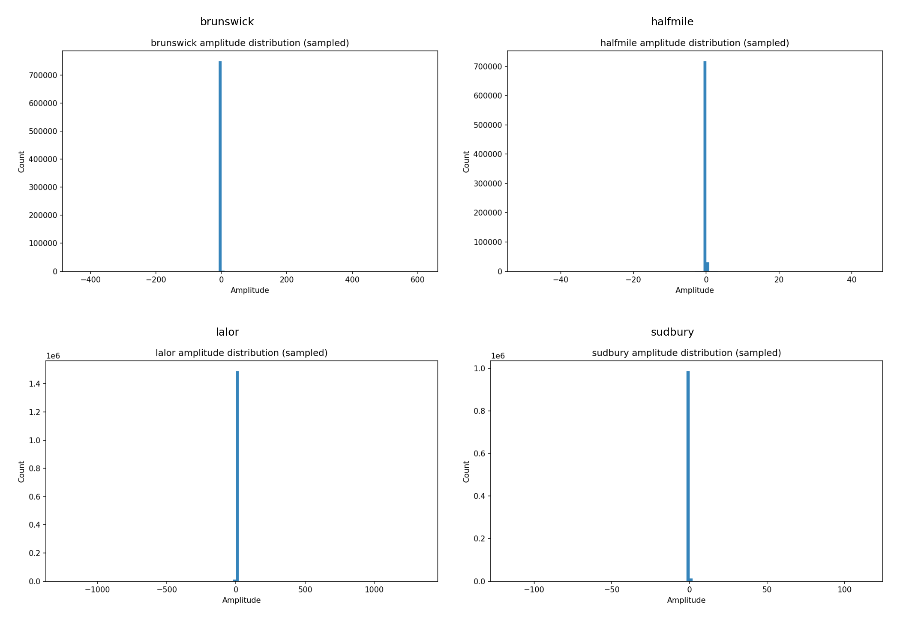

### `amplitude_sample_stats_all_assets.csv`
- Path: `outputs/eda/amplitude_sample_stats_all_assets.csv`
- Size: `735` bytes
- Produced by stage/script: `scripts/01_eda.py`
- Consumed by: Human QA and dataset understanding; not required by training runtime.
- Purpose: structured tabular artifact for downstream QA/metrics/reporting
- Rows: `4`
- Columns: `10`
- Exact column list:
```text
asset, sample_trace_count, mean, std, min, max, p05, p25, p75, p95
```
- Inferred dtypes:
| column             | inferred_dtype   |
|:-------------------|:-----------------|
| asset              | str              |
| sample_trace_count | int64            |
| mean               | float64          |
| std                | float64          |
| min                | float64          |
| max                | float64          |
| p05                | float64          |
| p25                | float64          |
| p75                | float64          |
| p95                | float64          |
- Null profile:
| column             |   null_count |   null_pct |
|:-------------------|-------------:|-----------:|
| asset              |            0 |          0 |
| sample_trace_count |            0 |          0 |
| mean               |            0 |          0 |
| std                |            0 |          0 |
| min                |            0 |          0 |
| max                |            0 |          0 |
| p05                |            0 |          0 |
| p25                |            0 |          0 |
| p75                |            0 |          0 |
| p95                |            0 |          0 |
- Sample preview (first rows, summarized):
| asset     |   sample_trace_count |         mean |     std |        min |       max |        p05 |         p25 |        p75 |       p95 |
|:----------|---------------------:|-------------:|--------:|-----------:|----------:|-----------:|------------:|-----------:|----------:|
| brunswick |                 1000 | -6.05933e-06 | 1.54037 |  -433.317  |  608.893  | -0.071559  | -0.00919156 | 0.00915915 | 0.0708307 |
| halfmile  |                 1000 |  3.06698e-05 | 0.28356 |   -49.9071 |   43.7422 | -0.0337973 | -0.00448508 | 0.00443174 | 0.0338179 |
| lalor     |                 1000 | -0.000279364 | 2.85171 | -1244.12   | 1328.08   | -0.132924  | -0.0143059  | 0.0139372  | 0.132212  |
- Caveats: dtype inference is from parsed chunks; mixed-type columns are shown with combined dtype signatures.

### `column_inventory_all_assets.csv`
- Path: `outputs/eda/column_inventory_all_assets.csv`
- Size: `27,935` bytes
- Produced by stage/script: `scripts/01_eda.py`
- Consumed by: Human QA and dataset understanding; not required by training runtime.
- Purpose: structured tabular artifact for downstream QA/metrics/reporting
- Rows: `422`
- Columns: `8`
- Exact column list:
```text
asset, key_name, dtype, shape, is_constant, min_value, max_value, null_count
```
- Inferred dtypes:
| column      | inferred_dtype   |
|:------------|:-----------------|
| asset       | str              |
| key_name    | str              |
| dtype       | str              |
| shape       | str              |
| is_constant | object           |
| min_value   | str              |
| max_value   | str              |
| null_count  | float64          |
- Null profile:
| column      |   null_count |   null_pct |
|:------------|-------------:|-----------:|
| asset       |            0 |     0      |
| key_name    |            0 |     0      |
| dtype       |            0 |     0      |
| shape       |            0 |     0      |
| is_constant |          414 |    98.1043 |
| min_value   |          414 |    98.1043 |
| max_value   |          414 |    98.1043 |
| null_count  |          414 |    98.1043 |
- Sample preview (first rows, summarized):
| asset     | key_name    | dtype   | shape        |   is_constant |   min_value |   max_value |   null_count |
|:----------|:------------|:--------|:-------------|--------------:|------------:|------------:|-------------:|
| brunswick | ALIAS_FREQ  | uint32  | (4496540, 1) |           nan |         nan |         nan |          nan |
| brunswick | ALIAS_SLOPE | int32   | (4496540, 1) |           nan |         nan |         nan |          nan |
| brunswick | AZIMUTH     | int32   | (4496540, 1) |           nan |         nan |         nan |          nan |
- Caveats: dtype inference is from parsed chunks; mixed-type columns are shown with combined dtype signatures.

### `coordinate_offset_stats_all_assets.csv`
- Path: `outputs/eda/coordinate_offset_stats_all_assets.csv`
- Size: `2,150` bytes
- Produced by stage/script: `scripts/01_eda.py`
- Consumed by: Human QA and dataset understanding; not required by training runtime.
- Purpose: structured tabular artifact for downstream QA/metrics/reporting
- Rows: `28`
- Columns: `7`
- Exact column list:
```text
asset, variable, min, max, mean, std, zero_count
```
- Inferred dtypes:
| column     | inferred_dtype   |
|:-----------|:-----------------|
| asset      | str              |
| variable   | str              |
| min        | float64          |
| max        | float64          |
| mean       | float64          |
| std        | float64          |
| zero_count | int64            |
- Null profile:
| column     |   null_count |   null_pct |
|:-----------|-------------:|-----------:|
| asset      |            0 |          0 |
| variable   |            0 |          0 |
| min        |            0 |          0 |
| max        |            0 |          0 |
| mean       |            0 |          0 |
| std        |            0 |          0 |
| zero_count |            0 |          0 |
- Sample preview (first rows, summarized):
| asset     | variable   |               min |               max |              mean |       std |   zero_count |
|:----------|:-----------|------------------:|------------------:|------------------:|----------:|-------------:|
| brunswick | SOURCE_X   | -287692           | -282028           | -284850           | 1721.57   |            0 |
| brunswick | SOURCE_Y   |      -5.25949e+06 |      -5.25246e+06 |      -5.25595e+06 | 1930.08   |            0 |
| brunswick | SOURCE_HT  |    -226           |    -109           |    -173.526       |   24.2224 |            0 |
- Caveats: dtype inference is from parsed chunks; mixed-type columns are shown with combined dtype signatures.

### `correlation_table_all_assets.csv`
- Path: `outputs/eda/correlation_table_all_assets.csv`
- Size: `7,347` bytes
- Produced by stage/script: `scripts/01_eda.py`
- Consumed by: Human QA and dataset understanding; not required by training runtime.
- Purpose: structured tabular artifact for downstream QA/metrics/reporting
- Rows: `196`
- Columns: `4`
- Exact column list:
```text
asset, row_variable, column_variable, correlation
```
- Inferred dtypes:
| column          | inferred_dtype   |
|:----------------|:-----------------|
| asset           | str              |
| row_variable    | str              |
| column_variable | str              |
| correlation     | float64          |
- Null profile:
| column          |   null_count |   null_pct |
|:----------------|-------------:|-----------:|
| asset           |            0 |     0      |
| row_variable    |            0 |     0      |
| column_variable |            0 |     0      |
| correlation     |           52 |    26.5306 |
- Sample preview (first rows, summarized):
| asset     | row_variable   | column_variable   |   correlation |
|:----------|:---------------|:------------------|--------------:|
| brunswick | offset         | offset            |    1          |
| brunswick | SOURCE_X       | offset            |    0.00283132 |
| brunswick | SOURCE_Y       | offset            |   -0.0211166  |
- Caveats: dtype inference is from parsed chunks; mixed-type columns are shown with combined dtype signatures.

### `corrupted_label_stats_all_assets.csv`
- Path: `outputs/eda/corrupted_label_stats_all_assets.csv`
- Size: `119` bytes
- Produced by stage/script: `scripts/01b_label_comparison.py`
- Consumed by: Human QA and target-selection decisions; not required by training runtime.
- Purpose: structured tabular artifact for downstream QA/metrics/reporting
- Rows: `4`
- Columns: `3`
- Exact column list:
```text
asset, corrupted_spare1_count, corrupted_spare1_percentage
```
- Inferred dtypes:
| column                      | inferred_dtype   |
|:----------------------------|:-----------------|
| asset                       | str              |
| corrupted_spare1_count      | int64            |
| corrupted_spare1_percentage | float64          |
- Null profile:
| column                      |   null_count |   null_pct |
|:----------------------------|-------------:|-----------:|
| asset                       |            0 |          0 |
| corrupted_spare1_count      |            0 |          0 |
| corrupted_spare1_percentage |            0 |          0 |
- Sample preview (first rows, summarized):
| asset     |   corrupted_spare1_count |   corrupted_spare1_percentage |
|:----------|-------------------------:|------------------------------:|
| brunswick |                        0 |                             0 |
| halfmile  |                        0 |                             0 |
| lalor     |                        0 |                             0 |
- Caveats: dtype inference is from parsed chunks; mixed-type columns are shown with combined dtype signatures.

### `dataset_roles_summary.json`
- Path: `outputs/eda/dataset_roles_summary.json`
- Size: `683` bytes
- Produced by stage/script: `scripts/01_eda.py`
- Consumed by: Human QA and dataset understanding; not required by training runtime.
- Purpose: structured configuration/summary payload.
- Top-level type: `dict`
- Top-level keys (4): `brunswick, halfmile, lalor, sudbury`
- Key type preview:
```json
{
  "brunswick": "dict",
  "halfmile": "dict",
  "lalor": "dict",
  "sudbury": "dict"
}
```
- Content preview (truncated):
```json
{
  "brunswick": {
    "file_name": "Brunswick_orig_1500ms_V2.hdf5",
    "role": "train",
    "total_traces": 4496540,
    "labeled_pct_phase45_report": 83.02
  },
  "halfmile": {
    "file_name": "Halfmile3D_add_geom_sorted.hdf5",
    "role": "train",
    "total_traces": 1099559,
    "labeled_pct_phase45_report": 90.33
  },
  "lalor": {
    "file_name": "Lalor_raw_z_1500ms_norp_geom_v3.hdf5",
    "role": "validate",
    "total_traces": 2424923,
    "labeled_pct_phase45_report": 49.98
  },
  "sudbury": {
    "file_name": "preprocessed_Sudbury3D.hdf",
    "role": "stress_test",
    "total_traces": 1810220,
    "labeled_pct_phase45_report": 11.07
  }
}
```

### `dead_trace_stats_all_assets.csv`
- Path: `outputs/eda/dead_trace_stats_all_assets.csv`
- Size: `160` bytes
- Produced by stage/script: `scripts/01_eda.py`
- Consumed by: Human QA and dataset understanding; not required by training runtime.
- Purpose: structured tabular artifact for downstream QA/metrics/reporting
- Rows: `4`
- Columns: `3`
- Exact column list:
```text
asset, dead_trace_count, dead_trace_percentage
```
- Inferred dtypes:
| column                | inferred_dtype   |
|:----------------------|:-----------------|
| asset                 | str              |
| dead_trace_count      | int64            |
| dead_trace_percentage | float64          |
- Null profile:
| column                |   null_count |   null_pct |
|:----------------------|-------------:|-----------:|
| asset                 |            0 |          0 |
| dead_trace_count      |            0 |          0 |
| dead_trace_percentage |            0 |          0 |
- Sample preview (first rows, summarized):
| asset     |   dead_trace_count |   dead_trace_percentage |
|:----------|-------------------:|------------------------:|
| brunswick |                  2 |             4.44786e-05 |
| halfmile  |              15109 |             1.3741      |
| lalor     |                381 |             0.0157118   |
- Caveats: dtype inference is from parsed chunks; mixed-type columns are shown with combined dtype signatures.

### `eda_report_all_assets.txt`
- Path: `outputs/eda/eda_report_all_assets.txt`
- Size: `7,034` bytes
- Produced by stage/script: `scripts/01_eda.py`
- Consumed by: Human QA and dataset understanding; not required by training runtime.
- Purpose: narrative report or runtime log artifact.
- Line count: `263`
- Content preview:
```text
===== BRUNSWICK =====
Asset: brunswick
File: Brunswick_orig_1500ms_V2.hdf5
Total keys in TRACE_DATA/DEFAULT: 106
All keys saved to all_keys_<asset>.txt
data_array sample amplitude stats (1000 traces or fewer):
  sample_trace_count: 1000
  mean: -6.0593315538426396e-06
```

### `first_break_auxiliary_stats_all_assets.csv`
- Path: `outputs/eda/first_break_auxiliary_stats_all_assets.csv`
- Size: `520` bytes
- Produced by stage/script: `scripts/01b_label_comparison.py`
- Consumed by: Human QA and target-selection decisions; not required by training runtime.
- Purpose: structured tabular artifact for downstream QA/metrics/reporting
- Rows: `6`
- Columns: `9`
- Exact column list:
```text
field_name, count, min, max, mean, median, std, asset, use_as_training_feature
```
- Inferred dtypes:
| column                  | inferred_dtype   |
|:------------------------|:-----------------|
| field_name              | str              |
| count                   | int64            |
| min                     | float64          |
| max                     | float64          |
| mean                    | float64          |
| median                  | float64          |
| std                     | float64          |
| asset                   | str              |
| use_as_training_feature | str              |
- Null profile:
| column                  |   null_count |   null_pct |
|:------------------------|-------------:|-----------:|
| field_name              |            0 |          0 |
| count                   |            0 |          0 |
| min                     |            0 |          0 |
| max                     |            0 |          0 |
| mean                    |            0 |          0 |
| median                  |            0 |          0 |
| std                     |            0 |          0 |
| asset                   |            0 |          0 |
| use_as_training_feature |            0 |          0 |
- Sample preview (first rows, summarized):
| field_name           |   count |   min |   max |   mean |   median |   std | asset     | use_as_training_feature   |
|:---------------------|--------:|------:|------:|-------:|---------:|------:|:----------|:--------------------------|
| FIRST_BREAK_AMPLIT   | 3733221 |     0 |     0 |      0 |        0 |     0 | brunswick | no_label_adjacent         |
| FIRST_BREAK_VELOCITY | 3733221 |     0 |     0 |      0 |        0 |     0 | brunswick | no_label_adjacent         |
| FIRST_BREAK_AMPLIT   | 1211857 |     0 |     0 |      0 |        0 |     0 | lalor     | no_label_adjacent         |
- Caveats: dtype inference is from parsed chunks; mixed-type columns are shown with combined dtype signatures.

### `first_break_auxiliary_stats_brunswick.csv`
- Path: `outputs/eda/first_break_auxiliary_stats_brunswick.csv`
- Size: `226` bytes
- Produced by stage/script: `scripts/01b_label_comparison.py`
- Consumed by: Human QA and target-selection decisions; not required by training runtime.
- Purpose: structured tabular artifact for downstream QA/metrics/reporting
- Rows: `2`
- Columns: `9`
- Exact column list:
```text
field_name, count, min, max, mean, median, std, asset, use_as_training_feature
```
- Inferred dtypes:
| column                  | inferred_dtype   |
|:------------------------|:-----------------|
| field_name              | str              |
| count                   | int64            |
| min                     | float64          |
| max                     | float64          |
| mean                    | float64          |
| median                  | float64          |
| std                     | float64          |
| asset                   | str              |
| use_as_training_feature | str              |
- Null profile:
| column                  |   null_count |   null_pct |
|:------------------------|-------------:|-----------:|
| field_name              |            0 |          0 |
| count                   |            0 |          0 |
| min                     |            0 |          0 |
| max                     |            0 |          0 |
| mean                    |            0 |          0 |
| median                  |            0 |          0 |
| std                     |            0 |          0 |
| asset                   |            0 |          0 |
| use_as_training_feature |            0 |          0 |
- Sample preview (first rows, summarized):
| field_name           |   count |   min |   max |   mean |   median |   std | asset     | use_as_training_feature   |
|:---------------------|--------:|------:|------:|-------:|---------:|------:|:----------|:--------------------------|
| FIRST_BREAK_AMPLIT   | 3733221 |     0 |     0 |      0 |        0 |     0 | brunswick | no_label_adjacent         |
| FIRST_BREAK_VELOCITY | 3733221 |     0 |     0 |      0 |        0 |     0 | brunswick | no_label_adjacent         |
- Caveats: dtype inference is from parsed chunks; mixed-type columns are shown with combined dtype signatures.

### `first_break_auxiliary_stats_halfmile.csv`
- Path: `outputs/eda/first_break_auxiliary_stats_halfmile.csv`
- Size: `2` bytes
- Produced by stage/script: `scripts/01b_label_comparison.py`
- Consumed by: Human QA and target-selection decisions; not required by training runtime.
- Purpose: structured tabular artifact for downstream QA/metrics/reporting
- Rows: `0`
- Columns: `0`
- Exact column list:
```text

```
- Inferred dtypes:
_No rows_
- Null profile:
_No rows_
- Sample preview (first rows, summarized):
_No rows_
- Caveats: dtype inference is from parsed chunks; mixed-type columns are shown with combined dtype signatures.

### `first_break_auxiliary_stats_lalor.csv`
- Path: `outputs/eda/first_break_auxiliary_stats_lalor.csv`
- Size: `218` bytes
- Produced by stage/script: `scripts/01b_label_comparison.py`
- Consumed by: Human QA and target-selection decisions; not required by training runtime.
- Purpose: structured tabular artifact for downstream QA/metrics/reporting
- Rows: `2`
- Columns: `9`
- Exact column list:
```text
field_name, count, min, max, mean, median, std, asset, use_as_training_feature
```
- Inferred dtypes:
| column                  | inferred_dtype   |
|:------------------------|:-----------------|
| field_name              | str              |
| count                   | int64            |
| min                     | float64          |
| max                     | float64          |
| mean                    | float64          |
| median                  | float64          |
| std                     | float64          |
| asset                   | str              |
| use_as_training_feature | str              |
- Null profile:
| column                  |   null_count |   null_pct |
|:------------------------|-------------:|-----------:|
| field_name              |            0 |          0 |
| count                   |            0 |          0 |
| min                     |            0 |          0 |
| max                     |            0 |          0 |
| mean                    |            0 |          0 |
| median                  |            0 |          0 |
| std                     |            0 |          0 |
| asset                   |            0 |          0 |
| use_as_training_feature |            0 |          0 |
- Sample preview (first rows, summarized):
| field_name           |   count |   min |   max |   mean |   median |   std | asset   | use_as_training_feature   |
|:---------------------|--------:|------:|------:|-------:|---------:|------:|:--------|:--------------------------|
| FIRST_BREAK_AMPLIT   | 1211857 |     0 |     0 |      0 |        0 |     0 | lalor   | no_label_adjacent         |
| FIRST_BREAK_VELOCITY | 1211857 |     0 |     0 |      0 |        0 |     0 | lalor   | no_label_adjacent         |
- Caveats: dtype inference is from parsed chunks; mixed-type columns are shown with combined dtype signatures.

### `first_break_auxiliary_stats_sudbury.csv`
- Path: `outputs/eda/first_break_auxiliary_stats_sudbury.csv`
- Size: `220` bytes
- Produced by stage/script: `scripts/01b_label_comparison.py`
- Consumed by: Human QA and target-selection decisions; not required by training runtime.
- Purpose: structured tabular artifact for downstream QA/metrics/reporting
- Rows: `2`
- Columns: `9`
- Exact column list:
```text
field_name, count, min, max, mean, median, std, asset, use_as_training_feature
```
- Inferred dtypes:
| column                  | inferred_dtype   |
|:------------------------|:-----------------|
| field_name              | str              |
| count                   | int64            |
| min                     | float64          |
| max                     | float64          |
| mean                    | float64          |
| median                  | float64          |
| std                     | float64          |
| asset                   | str              |
| use_as_training_feature | str              |
- Null profile:
| column                  |   null_count |   null_pct |
|:------------------------|-------------:|-----------:|
| field_name              |            0 |          0 |
| count                   |            0 |          0 |
| min                     |            0 |          0 |
| max                     |            0 |          0 |
| mean                    |            0 |          0 |
| median                  |            0 |          0 |
| std                     |            0 |          0 |
| asset                   |            0 |          0 |
| use_as_training_feature |            0 |          0 |
- Sample preview (first rows, summarized):
| field_name           |   count |   min |   max |   mean |   median |   std | asset   | use_as_training_feature   |
|:---------------------|--------:|------:|------:|-------:|---------:|------:|:--------|:--------------------------|
| FIRST_BREAK_AMPLIT   |  200338 |     0 |     0 |      0 |        0 |     0 | sudbury | no_label_adjacent         |
| FIRST_BREAK_VELOCITY |  200338 |     0 |     0 |      0 |        0 |     0 | sudbury | no_label_adjacent         |
- Caveats: dtype inference is from parsed chunks; mixed-type columns are shown with combined dtype signatures.

### `label_comparison_all_assets.csv`
- Path: `outputs/eda/label_comparison_all_assets.csv`
- Size: `836` bytes
- Produced by stage/script: `scripts/01b_label_comparison.py`
- Consumed by: Human QA and target-selection decisions; not required by training runtime.
- Purpose: structured tabular artifact for downstream QA/metrics/reporting
- Rows: `4`
- Columns: `15`
- Exact column list:
```text
asset, labeled_trace_count, first_break_time_nonzero_count_on_labeled, modelled_break_time_nonzero_count_on_labeled, difference_mean, difference_std, difference_min, difference_max, absolute_difference_mean, absolute_difference_median, count_identical_zero_difference, count_nonzero_difference, fraction_identical, recommended_label_column, unlabeled_sentinels
```
- Inferred dtypes:
| column                                       | inferred_dtype   |
|:---------------------------------------------|:-----------------|
| asset                                        | str              |
| labeled_trace_count                          | int64            |
| first_break_time_nonzero_count_on_labeled    | int64            |
| modelled_break_time_nonzero_count_on_labeled | int64            |
| difference_mean                              | float64          |
| difference_std                               | float64          |
| difference_min                               | float64          |
| difference_max                               | float64          |
| absolute_difference_mean                     | float64          |
| absolute_difference_median                   | float64          |
| count_identical_zero_difference              | int64            |
| count_nonzero_difference                     | int64            |
| fraction_identical                           | float64          |
| recommended_label_column                     | str              |
| unlabeled_sentinels                          | str              |
- Null profile:
| column                                       |   null_count |   null_pct |
|:---------------------------------------------|-------------:|-----------:|
| asset                                        |            0 |          0 |
| labeled_trace_count                          |            0 |          0 |
| first_break_time_nonzero_count_on_labeled    |            0 |          0 |
| modelled_break_time_nonzero_count_on_labeled |            0 |          0 |
| difference_mean                              |            0 |          0 |
| difference_std                               |            0 |          0 |
| difference_min                               |            0 |          0 |
| difference_max                               |            0 |          0 |
| absolute_difference_mean                     |            0 |          0 |
| absolute_difference_median                   |            0 |          0 |
| count_identical_zero_difference              |            0 |          0 |
| count_nonzero_difference                     |            0 |          0 |
| fraction_identical                           |            0 |          0 |
| recommended_label_column                     |            0 |          0 |
| unlabeled_sentinels                          |            0 |          0 |
- Sample preview (first rows, summarized):
  - Note: preview shows first `12` columns only; `3` additional columns are omitted from preview.
| asset     |   labeled_trace_count |   first_break_time_nonzero_count_on_labeled |   modelled_break_time_nonzero_count_on_labeled |   difference_mean |   difference_std |   difference_min |   difference_max |   absolute_difference_mean |   absolute_difference_median |   count_identical_zero_difference |   count_nonzero_difference |
|:----------|----------------------:|--------------------------------------------:|-----------------------------------------------:|------------------:|-----------------:|-----------------:|-----------------:|---------------------------:|-----------------------------:|----------------------------------:|---------------------------:|
| brunswick |               3733221 |                                           0 |                                              0 |          -429.272 |          229.564 |            -1358 |               -4 |                    429.272 |                          384 |                                 0 |                    3733221 |
| halfmile  |                993189 |                                           0 |                                              0 |          -353.139 |          154.918 |            -1482 |              -11 |                    353.139 |                          344 |                                 0 |                     993189 |
| lalor     |               1211857 |                                           0 |                                              0 |          -249.218 |          109.295 |             -881 |               -2 |                    249.218 |                          248 |                                 0 |                    1211857 |
- Caveats: dtype inference is from parsed chunks; mixed-type columns are shown with combined dtype signatures.

### `label_comparison_brunswick.csv`
- Path: `outputs/eda/label_comparison_brunswick.csv`
- Size: `474` bytes
- Produced by stage/script: `scripts/01b_label_comparison.py`
- Consumed by: Human QA and target-selection decisions; not required by training runtime.
- Purpose: structured tabular artifact for downstream QA/metrics/reporting
- Rows: `1`
- Columns: `15`
- Exact column list:
```text
asset, labeled_trace_count, first_break_time_nonzero_count_on_labeled, modelled_break_time_nonzero_count_on_labeled, difference_mean, difference_std, difference_min, difference_max, absolute_difference_mean, absolute_difference_median, count_identical_zero_difference, count_nonzero_difference, fraction_identical, recommended_label_column, unlabeled_sentinels
```
- Inferred dtypes:
| column                                       | inferred_dtype   |
|:---------------------------------------------|:-----------------|
| asset                                        | str              |
| labeled_trace_count                          | int64            |
| first_break_time_nonzero_count_on_labeled    | int64            |
| modelled_break_time_nonzero_count_on_labeled | int64            |
| difference_mean                              | float64          |
| difference_std                               | float64          |
| difference_min                               | float64          |
| difference_max                               | float64          |
| absolute_difference_mean                     | float64          |
| absolute_difference_median                   | float64          |
| count_identical_zero_difference              | int64            |
| count_nonzero_difference                     | int64            |
| fraction_identical                           | float64          |
| recommended_label_column                     | str              |
| unlabeled_sentinels                          | str              |
- Null profile:
| column                                       |   null_count |   null_pct |
|:---------------------------------------------|-------------:|-----------:|
| asset                                        |            0 |          0 |
| labeled_trace_count                          |            0 |          0 |
| first_break_time_nonzero_count_on_labeled    |            0 |          0 |
| modelled_break_time_nonzero_count_on_labeled |            0 |          0 |
| difference_mean                              |            0 |          0 |
| difference_std                               |            0 |          0 |
| difference_min                               |            0 |          0 |
| difference_max                               |            0 |          0 |
| absolute_difference_mean                     |            0 |          0 |
| absolute_difference_median                   |            0 |          0 |
| count_identical_zero_difference              |            0 |          0 |
| count_nonzero_difference                     |            0 |          0 |
| fraction_identical                           |            0 |          0 |
| recommended_label_column                     |            0 |          0 |
| unlabeled_sentinels                          |            0 |          0 |
- Sample preview (first rows, summarized):
  - Note: preview shows first `12` columns only; `3` additional columns are omitted from preview.
| asset     |   labeled_trace_count |   first_break_time_nonzero_count_on_labeled |   modelled_break_time_nonzero_count_on_labeled |   difference_mean |   difference_std |   difference_min |   difference_max |   absolute_difference_mean |   absolute_difference_median |   count_identical_zero_difference |   count_nonzero_difference |
|:----------|----------------------:|--------------------------------------------:|-----------------------------------------------:|------------------:|-----------------:|-----------------:|-----------------:|---------------------------:|-----------------------------:|----------------------------------:|---------------------------:|
| brunswick |               3733221 |                                           0 |                                              0 |          -429.272 |          229.564 |            -1358 |               -4 |                    429.272 |                          384 |                                 0 |                    3733221 |
- Caveats: dtype inference is from parsed chunks; mixed-type columns are shown with combined dtype signatures.

### `label_comparison_halfmile.csv`
- Path: `outputs/eda/label_comparison_halfmile.csv`
- Size: `472` bytes
- Produced by stage/script: `scripts/01b_label_comparison.py`
- Consumed by: Human QA and target-selection decisions; not required by training runtime.
- Purpose: structured tabular artifact for downstream QA/metrics/reporting
- Rows: `1`
- Columns: `15`
- Exact column list:
```text
asset, labeled_trace_count, first_break_time_nonzero_count_on_labeled, modelled_break_time_nonzero_count_on_labeled, difference_mean, difference_std, difference_min, difference_max, absolute_difference_mean, absolute_difference_median, count_identical_zero_difference, count_nonzero_difference, fraction_identical, recommended_label_column, unlabeled_sentinels
```
- Inferred dtypes:
| column                                       | inferred_dtype   |
|:---------------------------------------------|:-----------------|
| asset                                        | str              |
| labeled_trace_count                          | int64            |
| first_break_time_nonzero_count_on_labeled    | int64            |
| modelled_break_time_nonzero_count_on_labeled | int64            |
| difference_mean                              | float64          |
| difference_std                               | float64          |
| difference_min                               | float64          |
| difference_max                               | float64          |
| absolute_difference_mean                     | float64          |
| absolute_difference_median                   | float64          |
| count_identical_zero_difference              | int64            |
| count_nonzero_difference                     | int64            |
| fraction_identical                           | float64          |
| recommended_label_column                     | str              |
| unlabeled_sentinels                          | str              |
- Null profile:
| column                                       |   null_count |   null_pct |
|:---------------------------------------------|-------------:|-----------:|
| asset                                        |            0 |          0 |
| labeled_trace_count                          |            0 |          0 |
| first_break_time_nonzero_count_on_labeled    |            0 |          0 |
| modelled_break_time_nonzero_count_on_labeled |            0 |          0 |
| difference_mean                              |            0 |          0 |
| difference_std                               |            0 |          0 |
| difference_min                               |            0 |          0 |
| difference_max                               |            0 |          0 |
| absolute_difference_mean                     |            0 |          0 |
| absolute_difference_median                   |            0 |          0 |
| count_identical_zero_difference              |            0 |          0 |
| count_nonzero_difference                     |            0 |          0 |
| fraction_identical                           |            0 |          0 |
| recommended_label_column                     |            0 |          0 |
| unlabeled_sentinels                          |            0 |          0 |
- Sample preview (first rows, summarized):
  - Note: preview shows first `12` columns only; `3` additional columns are omitted from preview.
| asset    |   labeled_trace_count |   first_break_time_nonzero_count_on_labeled |   modelled_break_time_nonzero_count_on_labeled |   difference_mean |   difference_std |   difference_min |   difference_max |   absolute_difference_mean |   absolute_difference_median |   count_identical_zero_difference |   count_nonzero_difference |
|:---------|----------------------:|--------------------------------------------:|-----------------------------------------------:|------------------:|-----------------:|-----------------:|-----------------:|---------------------------:|-----------------------------:|----------------------------------:|---------------------------:|
| halfmile |                993189 |                                           0 |                                              0 |          -353.139 |          154.918 |            -1482 |              -11 |                    353.139 |                          344 |                                 0 |                     993189 |
- Caveats: dtype inference is from parsed chunks; mixed-type columns are shown with combined dtype signatures.

### `label_comparison_lalor.csv`
- Path: `outputs/eda/label_comparison_lalor.csv`
- Size: `468` bytes
- Produced by stage/script: `scripts/01b_label_comparison.py`
- Consumed by: Human QA and target-selection decisions; not required by training runtime.
- Purpose: structured tabular artifact for downstream QA/metrics/reporting
- Rows: `1`
- Columns: `15`
- Exact column list:
```text
asset, labeled_trace_count, first_break_time_nonzero_count_on_labeled, modelled_break_time_nonzero_count_on_labeled, difference_mean, difference_std, difference_min, difference_max, absolute_difference_mean, absolute_difference_median, count_identical_zero_difference, count_nonzero_difference, fraction_identical, recommended_label_column, unlabeled_sentinels
```
- Inferred dtypes:
| column                                       | inferred_dtype   |
|:---------------------------------------------|:-----------------|
| asset                                        | str              |
| labeled_trace_count                          | int64            |
| first_break_time_nonzero_count_on_labeled    | int64            |
| modelled_break_time_nonzero_count_on_labeled | int64            |
| difference_mean                              | float64          |
| difference_std                               | float64          |
| difference_min                               | float64          |
| difference_max                               | float64          |
| absolute_difference_mean                     | float64          |
| absolute_difference_median                   | float64          |
| count_identical_zero_difference              | int64            |
| count_nonzero_difference                     | int64            |
| fraction_identical                           | float64          |
| recommended_label_column                     | str              |
| unlabeled_sentinels                          | str              |
- Null profile:
| column                                       |   null_count |   null_pct |
|:---------------------------------------------|-------------:|-----------:|
| asset                                        |            0 |          0 |
| labeled_trace_count                          |            0 |          0 |
| first_break_time_nonzero_count_on_labeled    |            0 |          0 |
| modelled_break_time_nonzero_count_on_labeled |            0 |          0 |
| difference_mean                              |            0 |          0 |
| difference_std                               |            0 |          0 |
| difference_min                               |            0 |          0 |
| difference_max                               |            0 |          0 |
| absolute_difference_mean                     |            0 |          0 |
| absolute_difference_median                   |            0 |          0 |
| count_identical_zero_difference              |            0 |          0 |
| count_nonzero_difference                     |            0 |          0 |
| fraction_identical                           |            0 |          0 |
| recommended_label_column                     |            0 |          0 |
| unlabeled_sentinels                          |            0 |          0 |
- Sample preview (first rows, summarized):
  - Note: preview shows first `12` columns only; `3` additional columns are omitted from preview.
| asset   |   labeled_trace_count |   first_break_time_nonzero_count_on_labeled |   modelled_break_time_nonzero_count_on_labeled |   difference_mean |   difference_std |   difference_min |   difference_max |   absolute_difference_mean |   absolute_difference_median |   count_identical_zero_difference |   count_nonzero_difference |
|:--------|----------------------:|--------------------------------------------:|-----------------------------------------------:|------------------:|-----------------:|-----------------:|-----------------:|---------------------------:|-----------------------------:|----------------------------------:|---------------------------:|
| lalor   |               1211857 |                                           0 |                                              0 |          -249.218 |          109.295 |             -881 |               -2 |                    249.218 |                          248 |                                 0 |                    1211857 |
- Caveats: dtype inference is from parsed chunks; mixed-type columns are shown with combined dtype signatures.

### `label_comparison_scatter_all_assets.png`
- Path: `outputs/eda/label_comparison_scatter_all_assets.png`
- Size: `156,082` bytes
- Produced by stage/script: `scripts/01b_label_comparison.py`
- Consumed by: Human QA and target-selection decisions; not required by training runtime.
- Purpose: visualization artifact (`SPARE1 vs FIRST_BREAK_TIME scatter`).
- How to read: SPARE1 vs FIRST_BREAK_TIME scatter.
- Common failure signatures: Deviation from the identity line indicates label-column disagreement that can impact supervised targets.
- Embedded image:
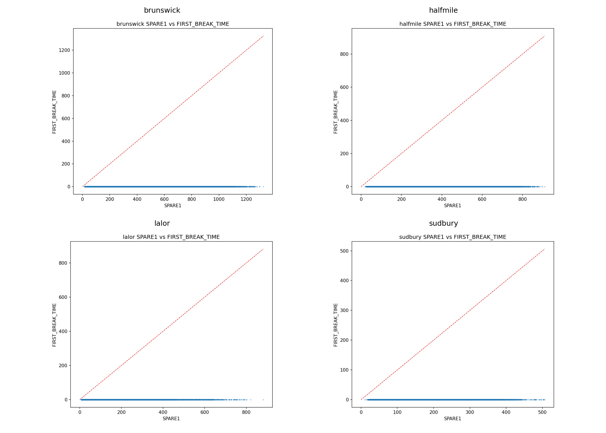

### `label_comparison_scatter_brunswick.png`
- Path: `outputs/eda/label_comparison_scatter_brunswick.png`
- Size: `46,503` bytes
- Produced by stage/script: `scripts/01b_label_comparison.py`
- Consumed by: Human QA and target-selection decisions; not required by training runtime.
- Purpose: visualization artifact (`SPARE1 vs FIRST_BREAK_TIME scatter`).
- How to read: SPARE1 vs FIRST_BREAK_TIME scatter.
- Common failure signatures: Deviation from the identity line indicates label-column disagreement that can impact supervised targets.
- Embedded image:
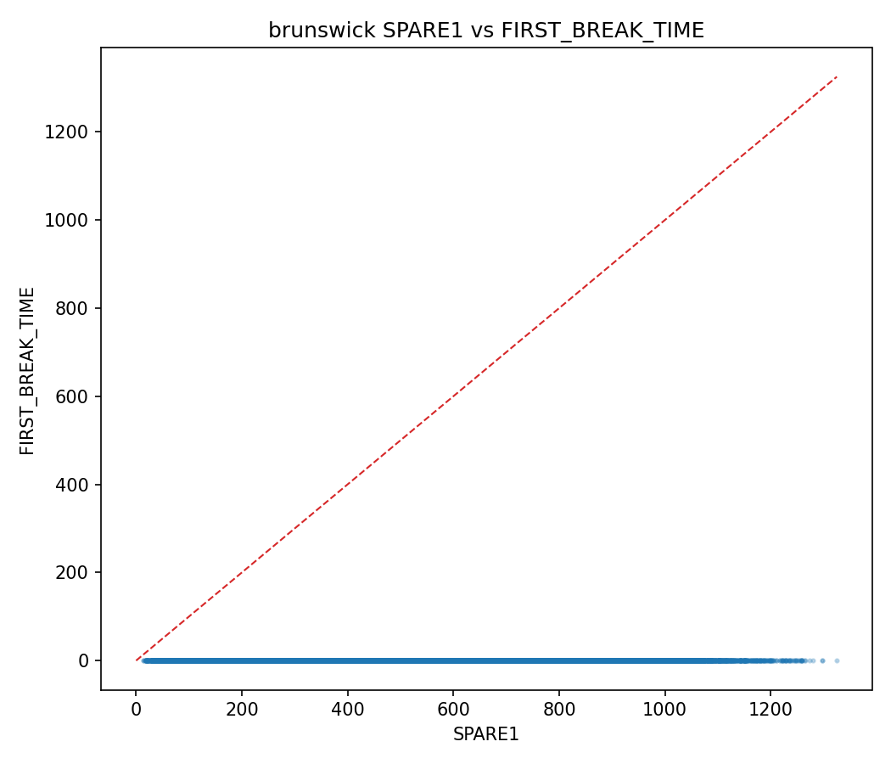

### `label_comparison_scatter_halfmile.png`
- Path: `outputs/eda/label_comparison_scatter_halfmile.png`
- Size: `43,695` bytes
- Produced by stage/script: `scripts/01b_label_comparison.py`
- Consumed by: Human QA and target-selection decisions; not required by training runtime.
- Purpose: visualization artifact (`SPARE1 vs FIRST_BREAK_TIME scatter`).
- How to read: SPARE1 vs FIRST_BREAK_TIME scatter.
- Common failure signatures: Deviation from the identity line indicates label-column disagreement that can impact supervised targets.
- Embedded image:
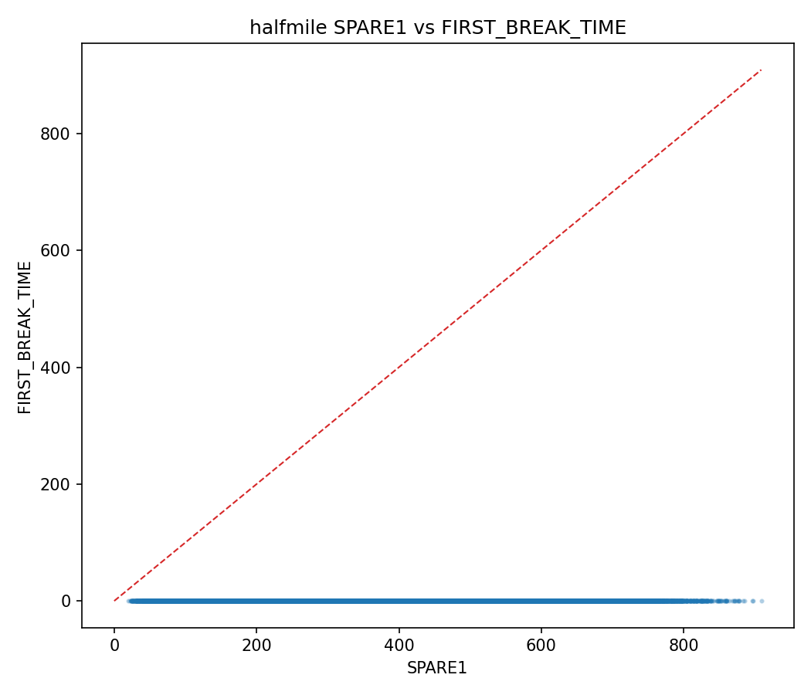

### `label_comparison_scatter_lalor.png`
- Path: `outputs/eda/label_comparison_scatter_lalor.png`
- Size: `44,960` bytes
- Produced by stage/script: `scripts/01b_label_comparison.py`
- Consumed by: Human QA and target-selection decisions; not required by training runtime.
- Purpose: visualization artifact (`SPARE1 vs FIRST_BREAK_TIME scatter`).
- How to read: SPARE1 vs FIRST_BREAK_TIME scatter.
- Common failure signatures: Deviation from the identity line indicates label-column disagreement that can impact supervised targets.
- Embedded image:
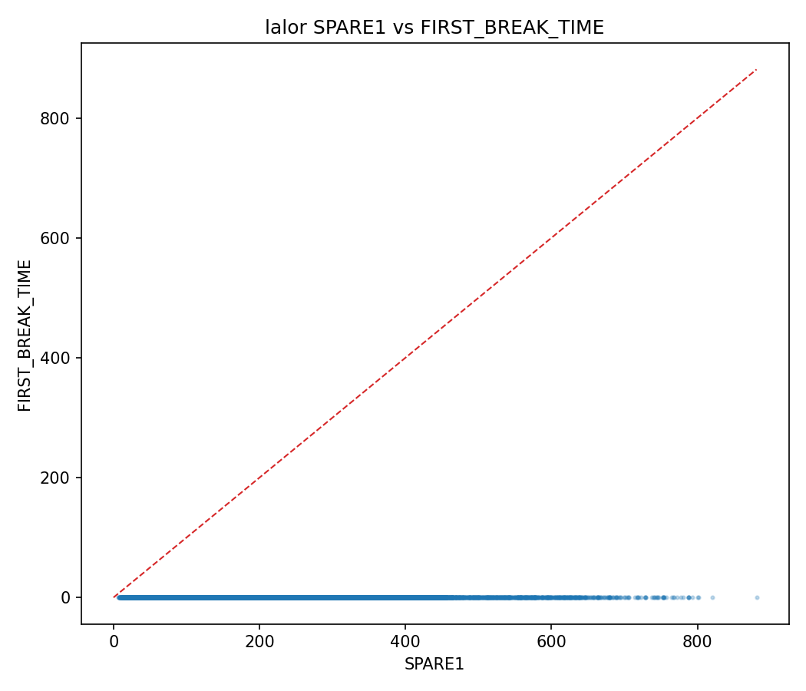

### `label_comparison_scatter_sudbury.png`
- Path: `outputs/eda/label_comparison_scatter_sudbury.png`
- Size: `44,764` bytes
- Produced by stage/script: `scripts/01b_label_comparison.py`
- Consumed by: Human QA and target-selection decisions; not required by training runtime.
- Purpose: visualization artifact (`SPARE1 vs FIRST_BREAK_TIME scatter`).
- How to read: SPARE1 vs FIRST_BREAK_TIME scatter.
- Common failure signatures: Deviation from the identity line indicates label-column disagreement that can impact supervised targets.
- Embedded image:
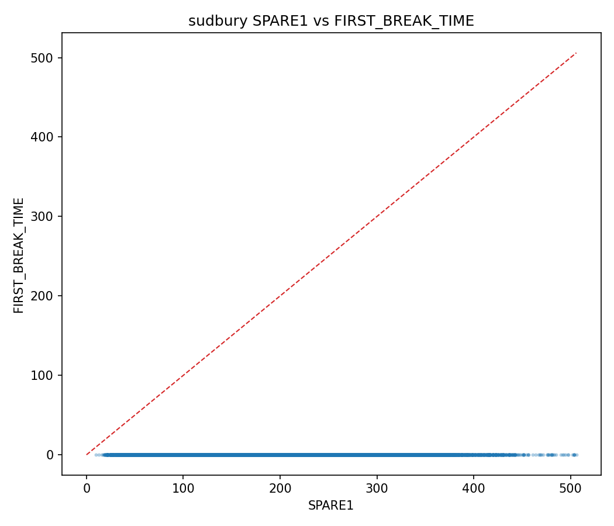

### `label_comparison_sudbury.csv`
- Path: `outputs/eda/label_comparison_sudbury.csv`
- Size: `466` bytes
- Produced by stage/script: `scripts/01b_label_comparison.py`
- Consumed by: Human QA and target-selection decisions; not required by training runtime.
- Purpose: structured tabular artifact for downstream QA/metrics/reporting
- Rows: `1`
- Columns: `15`
- Exact column list:
```text
asset, labeled_trace_count, first_break_time_nonzero_count_on_labeled, modelled_break_time_nonzero_count_on_labeled, difference_mean, difference_std, difference_min, difference_max, absolute_difference_mean, absolute_difference_median, count_identical_zero_difference, count_nonzero_difference, fraction_identical, recommended_label_column, unlabeled_sentinels
```
- Inferred dtypes:
| column                                       | inferred_dtype   |
|:---------------------------------------------|:-----------------|
| asset                                        | str              |
| labeled_trace_count                          | int64            |
| first_break_time_nonzero_count_on_labeled    | int64            |
| modelled_break_time_nonzero_count_on_labeled | int64            |
| difference_mean                              | float64          |
| difference_std                               | float64          |
| difference_min                               | float64          |
| difference_max                               | float64          |
| absolute_difference_mean                     | float64          |
| absolute_difference_median                   | float64          |
| count_identical_zero_difference              | int64            |
| count_nonzero_difference                     | int64            |
| fraction_identical                           | float64          |
| recommended_label_column                     | str              |
| unlabeled_sentinels                          | str              |
- Null profile:
| column                                       |   null_count |   null_pct |
|:---------------------------------------------|-------------:|-----------:|
| asset                                        |            0 |          0 |
| labeled_trace_count                          |            0 |          0 |
| first_break_time_nonzero_count_on_labeled    |            0 |          0 |
| modelled_break_time_nonzero_count_on_labeled |            0 |          0 |
| difference_mean                              |            0 |          0 |
| difference_std                               |            0 |          0 |
| difference_min                               |            0 |          0 |
| difference_max                               |            0 |          0 |
| absolute_difference_mean                     |            0 |          0 |
| absolute_difference_median                   |            0 |          0 |
| count_identical_zero_difference              |            0 |          0 |
| count_nonzero_difference                     |            0 |          0 |
| fraction_identical                           |            0 |          0 |
| recommended_label_column                     |            0 |          0 |
| unlabeled_sentinels                          |            0 |          0 |
- Sample preview (first rows, summarized):
  - Note: preview shows first `12` columns only; `3` additional columns are omitted from preview.
| asset   |   labeled_trace_count |   first_break_time_nonzero_count_on_labeled |   modelled_break_time_nonzero_count_on_labeled |   difference_mean |   difference_std |   difference_min |   difference_max |   absolute_difference_mean |   absolute_difference_median |   count_identical_zero_difference |   count_nonzero_difference |
|:--------|----------------------:|--------------------------------------------:|-----------------------------------------------:|------------------:|-----------------:|-----------------:|-----------------:|---------------------------:|-----------------------------:|----------------------------------:|---------------------------:|
| sudbury |                200338 |                                           0 |                                              0 |          -169.706 |          71.3341 |             -599 |              -10 |                    169.706 |                          162 |                                 0 |                     200338 |
- Caveats: dtype inference is from parsed chunks; mixed-type columns are shown with combined dtype signatures.

### `label_investigation_overview_all_assets.csv`
- Path: `outputs/eda/label_investigation_overview_all_assets.csv`
- Size: `528` bytes
- Produced by stage/script: `scripts/01b_label_comparison.py`
- Consumed by: Human QA and target-selection decisions; not required by training runtime.
- Purpose: structured tabular artifact for downstream QA/metrics/reporting
- Rows: `4`
- Columns: `8`
- Exact column list:
```text
asset, recommended_label_column, labeled_trace_count, identical_count, nonzero_difference_count, baseline_mae_recommended_ms, baseline_rmse_recommended_ms, offset_pct_abs_diff_gt_1m_best_match
```
- Inferred dtypes:
| column                               | inferred_dtype   |
|:-------------------------------------|:-----------------|
| asset                                | str              |
| recommended_label_column             | str              |
| labeled_trace_count                  | int64            |
| identical_count                      | int64            |
| nonzero_difference_count             | int64            |
| baseline_mae_recommended_ms          | float64          |
| baseline_rmse_recommended_ms         | float64          |
| offset_pct_abs_diff_gt_1m_best_match | float64          |
- Null profile:
| column                               |   null_count |   null_pct |
|:-------------------------------------|-------------:|-----------:|
| asset                                |            0 |          0 |
| recommended_label_column             |            0 |          0 |
| labeled_trace_count                  |            0 |          0 |
| identical_count                      |            0 |          0 |
| nonzero_difference_count             |            0 |          0 |
| baseline_mae_recommended_ms          |            0 |          0 |
| baseline_rmse_recommended_ms         |            0 |          0 |
| offset_pct_abs_diff_gt_1m_best_match |            0 |          0 |
- Sample preview (first rows, summarized):
| asset     | recommended_label_column   |   labeled_trace_count |   identical_count |   nonzero_difference_count |   baseline_mae_recommended_ms |   baseline_rmse_recommended_ms |   offset_pct_abs_diff_gt_1m_best_match |
|:----------|:---------------------------|----------------------:|------------------:|---------------------------:|------------------------------:|-------------------------------:|---------------------------------------:|
| brunswick | SPARE1                     |               3733221 |                 0 |                    3733221 |                       429.272 |                        486.8   |                                84.3658 |
| halfmile  | SPARE1                     |                993189 |                 0 |                     993189 |                       353.139 |                        385.625 |                                 2.9591 |
| lalor     | SPARE1                     |               1211857 |                 0 |                    1211857 |                       249.218 |                        272.131 |                                 0      |
- Caveats: dtype inference is from parsed chunks; mixed-type columns are shown with combined dtype signatures.

### `label_investigation_report_all_assets.txt`
- Path: `outputs/eda/label_investigation_report_all_assets.txt`
- Size: `11,084` bytes
- Produced by stage/script: `scripts/01b_label_comparison.py`
- Consumed by: Human QA and target-selection decisions; not required by training runtime.
- Purpose: narrative report or runtime log artifact.
- Line count: `97`
- Content preview:
```text
===== BRUNSWICK =====
Asset: brunswick
File: Brunswick_orig_1500ms_V2.hdf5
Unlabeled sentinels: [-1]

SPARE1 vs FIRST_BREAK_TIME:
    asset  labeled_trace_count  first_break_time_nonzero_count_on_labeled  modelled_break_time_nonzero_count_on_labeled  difference_mean  difference_std  difference_min  difference_max  absolute_difference_mean  absolute_difference_median  count_identical_zero_difference  count_nonzero_difference  fraction_identical recommended_label_column unlabeled_sentinels
brunswick              3733221                                          0                                             0      -429.272228      229.564476         -1358.0            -4.0                429.272228                       384.0                                0                   3733221                 0.0                   SPARE1                [-1]
```

### `label_investigation_report_brunswick.txt`
- Path: `outputs/eda/label_investigation_report_brunswick.txt`
- Size: `2,847` bytes
- Produced by stage/script: `scripts/01b_label_comparison.py`
- Consumed by: Human QA and target-selection decisions; not required by training runtime.
- Purpose: narrative report or runtime log artifact.
- Line count: `23`
- Content preview:
```text
Asset: brunswick
File: Brunswick_orig_1500ms_V2.hdf5
Unlabeled sentinels: [-1]

SPARE1 vs FIRST_BREAK_TIME:
    asset  labeled_trace_count  first_break_time_nonzero_count_on_labeled  modelled_break_time_nonzero_count_on_labeled  difference_mean  difference_std  difference_min  difference_max  absolute_difference_mean  absolute_difference_median  count_identical_zero_difference  count_nonzero_difference  fraction_identical recommended_label_column unlabeled_sentinels
brunswick              3733221                                          0                                             0      -429.272228      229.564476         -1358.0            -4.0                429.272228                       384.0                                0                   3733221                 0.0                   SPARE1                [-1]

```

### `label_investigation_report_halfmile.txt`
- Path: `outputs/eda/label_investigation_report_halfmile.txt`
- Size: `2,524` bytes
- Produced by stage/script: `scripts/01b_label_comparison.py`
- Consumed by: Human QA and target-selection decisions; not required by training runtime.
- Purpose: narrative report or runtime log artifact.
- Line count: `18`
- Content preview:
```text
Asset: halfmile
File: Halfmile3D_add_geom_sorted.hdf5
Unlabeled sentinels: [-1]

SPARE1 vs FIRST_BREAK_TIME:
   asset  labeled_trace_count  first_break_time_nonzero_count_on_labeled  modelled_break_time_nonzero_count_on_labeled  difference_mean  difference_std  difference_min  difference_max  absolute_difference_mean  absolute_difference_median  count_identical_zero_difference  count_nonzero_difference  fraction_identical recommended_label_column unlabeled_sentinels
halfmile               993189                                          0                                             0       -353.13857      154.918128         -1482.0           -11.0                 353.13857                       344.0                                0                    993189                 0.0                   SPARE1                [-1]

```

### `label_investigation_report_lalor.txt`
- Path: `outputs/eda/label_investigation_report_lalor.txt`
- Size: `2,802` bytes
- Produced by stage/script: `scripts/01b_label_comparison.py`
- Consumed by: Human QA and target-selection decisions; not required by training runtime.
- Purpose: narrative report or runtime log artifact.
- Line count: `23`
- Content preview:
```text
Asset: lalor
File: Lalor_raw_z_1500ms_norp_geom_v3.hdf5
Unlabeled sentinels: [-1]

SPARE1 vs FIRST_BREAK_TIME:
asset  labeled_trace_count  first_break_time_nonzero_count_on_labeled  modelled_break_time_nonzero_count_on_labeled  difference_mean  difference_std  difference_min  difference_max  absolute_difference_mean  absolute_difference_median  count_identical_zero_difference  count_nonzero_difference  fraction_identical recommended_label_column unlabeled_sentinels
lalor              1211857                                          0                                             0      -249.218321      109.294546          -881.0            -2.0                249.218321                       248.0                                0                   1211857                 0.0                   SPARE1                [-1]

```

### `label_investigation_report_sudbury.txt`
- Path: `outputs/eda/label_investigation_report_sudbury.txt`
- Size: `2,814` bytes
- Produced by stage/script: `scripts/01b_label_comparison.py`
- Consumed by: Human QA and target-selection decisions; not required by training runtime.
- Purpose: narrative report or runtime log artifact.
- Line count: `23`
- Content preview:
```text
Asset: sudbury
File: preprocessed_Sudbury3D.hdf
Unlabeled sentinels: [0]

SPARE1 vs FIRST_BREAK_TIME:
  asset  labeled_trace_count  first_break_time_nonzero_count_on_labeled  modelled_break_time_nonzero_count_on_labeled  difference_mean  difference_std  difference_min  difference_max  absolute_difference_mean  absolute_difference_median  count_identical_zero_difference  count_nonzero_difference  fraction_identical recommended_label_column unlabeled_sentinels
sudbury               200338                                          0                                             0      -169.706286        71.33415          -599.0           -10.0                169.706286                       162.0                                0                    200338                 0.0                   SPARE1                 [0]

```

### `missing_variables_all_assets.csv`
- Path: `outputs/eda/missing_variables_all_assets.csv`
- Size: `1,500` bytes
- Produced by stage/script: `scripts/01_eda.py`
- Consumed by: Human QA and dataset understanding; not required by training runtime.
- Purpose: structured tabular artifact for downstream QA/metrics/reporting
- Rows: `36`
- Columns: `3`
- Exact column list:
```text
asset, variable, status
```
- Inferred dtypes:
| column   | inferred_dtype   |
|:---------|:-----------------|
| asset    | str              |
| variable | str              |
| status   | str              |
- Null profile:
| column   |   null_count |   null_pct |
|:---------|-------------:|-----------:|
| asset    |            0 |          0 |
| variable |            0 |          0 |
| status   |            0 |          0 |
- Sample preview (first rows, summarized):
| asset     | variable           | status                      |
|:----------|:-------------------|:----------------------------|
| brunswick | offset             | not_stored_derived_required |
| brunswick | incidence_angle    | not_stored_derivable        |
| brunswick | trace_quality_flag | not_stored_derive_from_data |
- Caveats: dtype inference is from parsed chunks; mixed-type columns are shown with combined dtype signatures.

### `modelled_break_time_baseline_all_assets.csv`
- Path: `outputs/eda/modelled_break_time_baseline_all_assets.csv`
- Size: `1,012` bytes
- Produced by stage/script: `scripts/01b_label_comparison.py`
- Consumed by: Human QA and target-selection decisions; not required by training runtime.
- Purpose: structured tabular artifact for downstream QA/metrics/reporting
- Rows: `8`
- Columns: `11`
- Exact column list:
```text
asset, target_label_column, is_recommended_target, trace_count, mae_ms, rmse_ms, median_absolute_error_ms, pct_within_5ms, pct_within_10ms, pct_within_20ms, pct_within_50ms
```
- Inferred dtypes:
| column                   | inferred_dtype   |
|:-------------------------|:-----------------|
| asset                    | str              |
| target_label_column      | str              |
| is_recommended_target    | bool             |
| trace_count              | int64            |
| mae_ms                   | float64          |
| rmse_ms                  | float64          |
| median_absolute_error_ms | float64          |
| pct_within_5ms           | float64          |
| pct_within_10ms          | float64          |
| pct_within_20ms          | float64          |
| pct_within_50ms          | float64          |
- Null profile:
| column                   |   null_count |   null_pct |
|:-------------------------|-------------:|-----------:|
| asset                    |            0 |          0 |
| target_label_column      |            0 |          0 |
| is_recommended_target    |            0 |          0 |
| trace_count              |            0 |          0 |
| mae_ms                   |            0 |          0 |
| rmse_ms                  |            0 |          0 |
| median_absolute_error_ms |            0 |          0 |
| pct_within_5ms           |            0 |          0 |
| pct_within_10ms          |            0 |          0 |
| pct_within_20ms          |            0 |          0 |
| pct_within_50ms          |            0 |          0 |
- Sample preview (first rows, summarized):
| asset     | target_label_column   | is_recommended_target   |   trace_count |   mae_ms |   rmse_ms |   median_absolute_error_ms |   pct_within_5ms |   pct_within_10ms |   pct_within_20ms |   pct_within_50ms |
|:----------|:----------------------|:------------------------|--------------:|---------:|----------:|---------------------------:|-----------------:|------------------:|------------------:|------------------:|
| brunswick | FIRST_BREAK_TIME      | False                   |       3733221 |    0     |       0   |                          0 |    100           |     100           |       100         |        100        |
| brunswick | SPARE1                | True                    |       3733221 |  429.272 |     486.8 |                        384 |      2.67865e-05 |       0.000187506 |         0.0218846 |          0.576446 |
| halfmile  | FIRST_BREAK_TIME      | False                   |        993189 |    0     |       0   |                          0 |    100           |     100           |       100         |        100        |
- Caveats: dtype inference is from parsed chunks; mixed-type columns are shown with combined dtype signatures.

### `modelled_break_time_baseline_brunswick.csv`
- Path: `outputs/eda/modelled_break_time_baseline_brunswick.csv`
- Size: `399` bytes
- Produced by stage/script: `scripts/01b_label_comparison.py`
- Consumed by: Human QA and target-selection decisions; not required by training runtime.
- Purpose: structured tabular artifact for downstream QA/metrics/reporting
- Rows: `2`
- Columns: `11`
- Exact column list:
```text
asset, target_label_column, is_recommended_target, trace_count, mae_ms, rmse_ms, median_absolute_error_ms, pct_within_5ms, pct_within_10ms, pct_within_20ms, pct_within_50ms
```
- Inferred dtypes:
| column                   | inferred_dtype   |
|:-------------------------|:-----------------|
| asset                    | str              |
| target_label_column      | str              |
| is_recommended_target    | bool             |
| trace_count              | int64            |
| mae_ms                   | float64          |
| rmse_ms                  | float64          |
| median_absolute_error_ms | float64          |
| pct_within_5ms           | float64          |
| pct_within_10ms          | float64          |
| pct_within_20ms          | float64          |
| pct_within_50ms          | float64          |
- Null profile:
| column                   |   null_count |   null_pct |
|:-------------------------|-------------:|-----------:|
| asset                    |            0 |          0 |
| target_label_column      |            0 |          0 |
| is_recommended_target    |            0 |          0 |
| trace_count              |            0 |          0 |
| mae_ms                   |            0 |          0 |
| rmse_ms                  |            0 |          0 |
| median_absolute_error_ms |            0 |          0 |
| pct_within_5ms           |            0 |          0 |
| pct_within_10ms          |            0 |          0 |
| pct_within_20ms          |            0 |          0 |
| pct_within_50ms          |            0 |          0 |
- Sample preview (first rows, summarized):
| asset     | target_label_column   | is_recommended_target   |   trace_count |   mae_ms |   rmse_ms |   median_absolute_error_ms |   pct_within_5ms |   pct_within_10ms |   pct_within_20ms |   pct_within_50ms |
|:----------|:----------------------|:------------------------|--------------:|---------:|----------:|---------------------------:|-----------------:|------------------:|------------------:|------------------:|
| brunswick | FIRST_BREAK_TIME      | False                   |       3733221 |    0     |       0   |                          0 |    100           |     100           |       100         |        100        |
| brunswick | SPARE1                | True                    |       3733221 |  429.272 |     486.8 |                        384 |      2.67865e-05 |       0.000187506 |         0.0218846 |          0.576446 |
- Caveats: dtype inference is from parsed chunks; mixed-type columns are shown with combined dtype signatures.

### `modelled_break_time_baseline_halfmile.csv`
- Path: `outputs/eda/modelled_break_time_baseline_halfmile.csv`
- Size: `361` bytes
- Produced by stage/script: `scripts/01b_label_comparison.py`
- Consumed by: Human QA and target-selection decisions; not required by training runtime.
- Purpose: structured tabular artifact for downstream QA/metrics/reporting
- Rows: `2`
- Columns: `11`
- Exact column list:
```text
asset, target_label_column, is_recommended_target, trace_count, mae_ms, rmse_ms, median_absolute_error_ms, pct_within_5ms, pct_within_10ms, pct_within_20ms, pct_within_50ms
```
- Inferred dtypes:
| column                   | inferred_dtype   |
|:-------------------------|:-----------------|
| asset                    | str              |
| target_label_column      | str              |
| is_recommended_target    | bool             |
| trace_count              | int64            |
| mae_ms                   | float64          |
| rmse_ms                  | float64          |
| median_absolute_error_ms | float64          |
| pct_within_5ms           | float64          |
| pct_within_10ms          | float64          |
| pct_within_20ms          | float64          |
| pct_within_50ms          | float64          |
- Null profile:
| column                   |   null_count |   null_pct |
|:-------------------------|-------------:|-----------:|
| asset                    |            0 |          0 |
| target_label_column      |            0 |          0 |
| is_recommended_target    |            0 |          0 |
| trace_count              |            0 |          0 |
| mae_ms                   |            0 |          0 |
| rmse_ms                  |            0 |          0 |
| median_absolute_error_ms |            0 |          0 |
| pct_within_5ms           |            0 |          0 |
| pct_within_10ms          |            0 |          0 |
| pct_within_20ms          |            0 |          0 |
| pct_within_50ms          |            0 |          0 |
- Sample preview (first rows, summarized):
| asset    | target_label_column   | is_recommended_target   |   trace_count |   mae_ms |   rmse_ms |   median_absolute_error_ms |   pct_within_5ms |   pct_within_10ms |   pct_within_20ms |   pct_within_50ms |
|:---------|:----------------------|:------------------------|--------------:|---------:|----------:|---------------------------:|-----------------:|------------------:|------------------:|------------------:|
| halfmile | FIRST_BREAK_TIME      | False                   |        993189 |    0     |     0     |                          0 |              100 |               100 |      100          |        100        |
| halfmile | SPARE1                | True                    |        993189 |  353.139 |   385.625 |                        344 |                0 |                 0 |        0.00473223 |          0.377169 |
- Caveats: dtype inference is from parsed chunks; mixed-type columns are shown with combined dtype signatures.

### `modelled_break_time_baseline_lalor.csv`
- Path: `outputs/eda/modelled_break_time_baseline_lalor.csv`
- Size: `387` bytes
- Produced by stage/script: `scripts/01b_label_comparison.py`
- Consumed by: Human QA and target-selection decisions; not required by training runtime.
- Purpose: structured tabular artifact for downstream QA/metrics/reporting
- Rows: `2`
- Columns: `11`
- Exact column list:
```text
asset, target_label_column, is_recommended_target, trace_count, mae_ms, rmse_ms, median_absolute_error_ms, pct_within_5ms, pct_within_10ms, pct_within_20ms, pct_within_50ms
```
- Inferred dtypes:
| column                   | inferred_dtype   |
|:-------------------------|:-----------------|
| asset                    | str              |
| target_label_column      | str              |
| is_recommended_target    | bool             |
| trace_count              | int64            |
| mae_ms                   | float64          |
| rmse_ms                  | float64          |
| median_absolute_error_ms | float64          |
| pct_within_5ms           | float64          |
| pct_within_10ms          | float64          |
| pct_within_20ms          | float64          |
| pct_within_50ms          | float64          |
- Null profile:
| column                   |   null_count |   null_pct |
|:-------------------------|-------------:|-----------:|
| asset                    |            0 |          0 |
| target_label_column      |            0 |          0 |
| is_recommended_target    |            0 |          0 |
| trace_count              |            0 |          0 |
| mae_ms                   |            0 |          0 |
| rmse_ms                  |            0 |          0 |
| median_absolute_error_ms |            0 |          0 |
| pct_within_5ms           |            0 |          0 |
| pct_within_10ms          |            0 |          0 |
| pct_within_20ms          |            0 |          0 |
| pct_within_50ms          |            0 |          0 |
- Sample preview (first rows, summarized):
| asset   | target_label_column   | is_recommended_target   |   trace_count |   mae_ms |   rmse_ms |   median_absolute_error_ms |   pct_within_5ms |   pct_within_10ms |   pct_within_20ms |   pct_within_50ms |
|:--------|:----------------------|:------------------------|--------------:|---------:|----------:|---------------------------:|-----------------:|------------------:|------------------:|------------------:|
| lalor   | FIRST_BREAK_TIME      | False                   |       1211857 |    0     |     0     |                          0 |    100           |       100         |        100        |         100       |
| lalor   | SPARE1                | True                    |       1211857 |  249.218 |   272.131 |                        248 |      0.000330072 |         0.0244253 |          0.231298 |           2.12913 |
- Caveats: dtype inference is from parsed chunks; mixed-type columns are shown with combined dtype signatures.

### `modelled_break_time_baseline_sudbury.csv`
- Path: `outputs/eda/modelled_break_time_baseline_sudbury.csv`
- Size: `375` bytes
- Produced by stage/script: `scripts/01b_label_comparison.py`
- Consumed by: Human QA and target-selection decisions; not required by training runtime.
- Purpose: structured tabular artifact for downstream QA/metrics/reporting
- Rows: `2`
- Columns: `11`
- Exact column list:
```text
asset, target_label_column, is_recommended_target, trace_count, mae_ms, rmse_ms, median_absolute_error_ms, pct_within_5ms, pct_within_10ms, pct_within_20ms, pct_within_50ms
```
- Inferred dtypes:
| column                   | inferred_dtype   |
|:-------------------------|:-----------------|
| asset                    | str              |
| target_label_column      | str              |
| is_recommended_target    | bool             |
| trace_count              | int64            |
| mae_ms                   | float64          |
| rmse_ms                  | float64          |
| median_absolute_error_ms | float64          |
| pct_within_5ms           | float64          |
| pct_within_10ms          | float64          |
| pct_within_20ms          | float64          |
| pct_within_50ms          | float64          |
- Null profile:
| column                   |   null_count |   null_pct |
|:-------------------------|-------------:|-----------:|
| asset                    |            0 |          0 |
| target_label_column      |            0 |          0 |
| is_recommended_target    |            0 |          0 |
| trace_count              |            0 |          0 |
| mae_ms                   |            0 |          0 |
| rmse_ms                  |            0 |          0 |
| median_absolute_error_ms |            0 |          0 |
| pct_within_5ms           |            0 |          0 |
| pct_within_10ms          |            0 |          0 |
| pct_within_20ms          |            0 |          0 |
| pct_within_50ms          |            0 |          0 |
- Sample preview (first rows, summarized):
| asset   | target_label_column   | is_recommended_target   |   trace_count |   mae_ms |   rmse_ms |   median_absolute_error_ms |   pct_within_5ms |   pct_within_10ms |   pct_within_20ms |   pct_within_50ms |
|:--------|:----------------------|:------------------------|--------------:|---------:|----------:|---------------------------:|-----------------:|------------------:|------------------:|------------------:|
| sudbury | FIRST_BREAK_TIME      | False                   |        200338 |    0     |     0     |                          0 |              100 |     100           |       100         |         100       |
| sudbury | SPARE1                | True                    |        200338 |  169.706 |   184.089 |                        162 |                0 |       0.000998313 |         0.0274536 |           2.00262 |
- Caveats: dtype inference is from parsed chunks; mixed-type columns are shown with combined dtype signatures.

### `modelled_break_time_error_hist_all_assets.png`
- Path: `outputs/eda/modelled_break_time_error_hist_all_assets.png`
- Size: `123,530` bytes
- Produced by stage/script: `scripts/01b_label_comparison.py`
- Consumed by: Human QA and target-selection decisions; not required by training runtime.
- Purpose: visualization artifact (`MODELLED_BREAK_TIME absolute error histogram`).
- How to read: MODELLED_BREAK_TIME absolute error histogram.
- Common failure signatures: Fat right tails suggest instability or localized bad-quality shots needing robust handling.
- Embedded image:
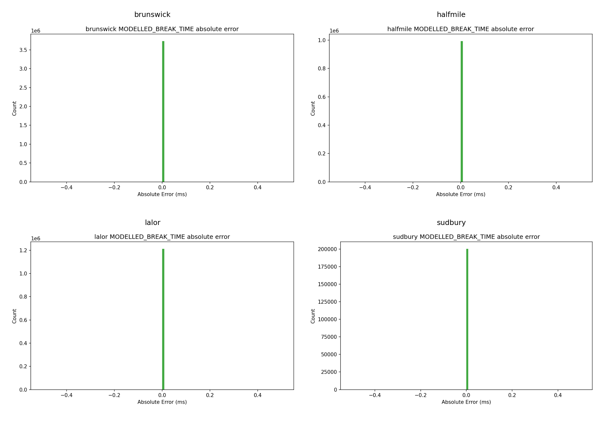

### `modelled_break_time_error_hist_brunswick.png`
- Path: `outputs/eda/modelled_break_time_error_hist_brunswick.png`
- Size: `28,103` bytes
- Produced by stage/script: `scripts/01b_label_comparison.py`
- Consumed by: Human QA and target-selection decisions; not required by training runtime.
- Purpose: visualization artifact (`MODELLED_BREAK_TIME absolute error histogram`).
- How to read: MODELLED_BREAK_TIME absolute error histogram.
- Common failure signatures: Fat right tails suggest instability or localized bad-quality shots needing robust handling.
- Embedded image:
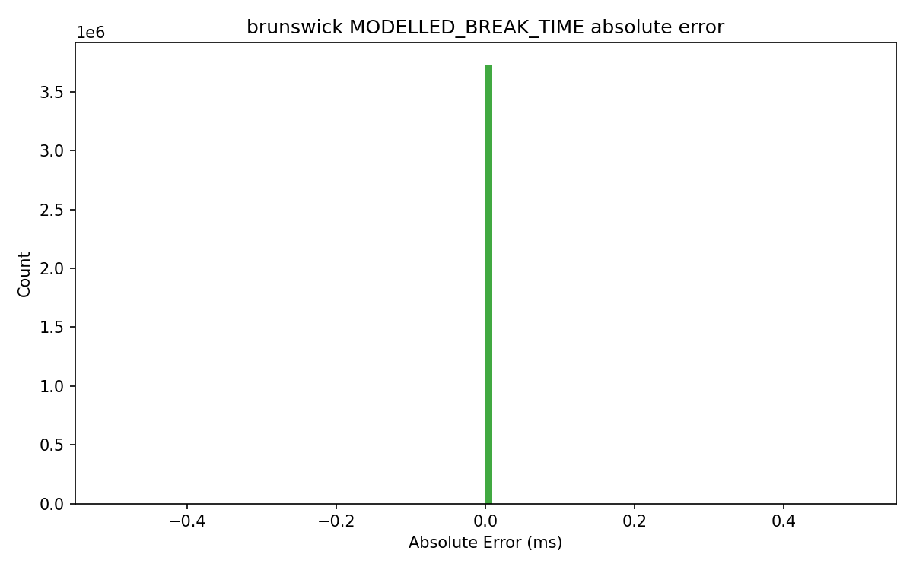

### `modelled_break_time_error_hist_halfmile.png`
- Path: `outputs/eda/modelled_break_time_error_hist_halfmile.png`
- Size: `26,556` bytes
- Produced by stage/script: `scripts/01b_label_comparison.py`
- Consumed by: Human QA and target-selection decisions; not required by training runtime.
- Purpose: visualization artifact (`MODELLED_BREAK_TIME absolute error histogram`).
- How to read: MODELLED_BREAK_TIME absolute error histogram.
- Common failure signatures: Fat right tails suggest instability or localized bad-quality shots needing robust handling.
- Embedded image:
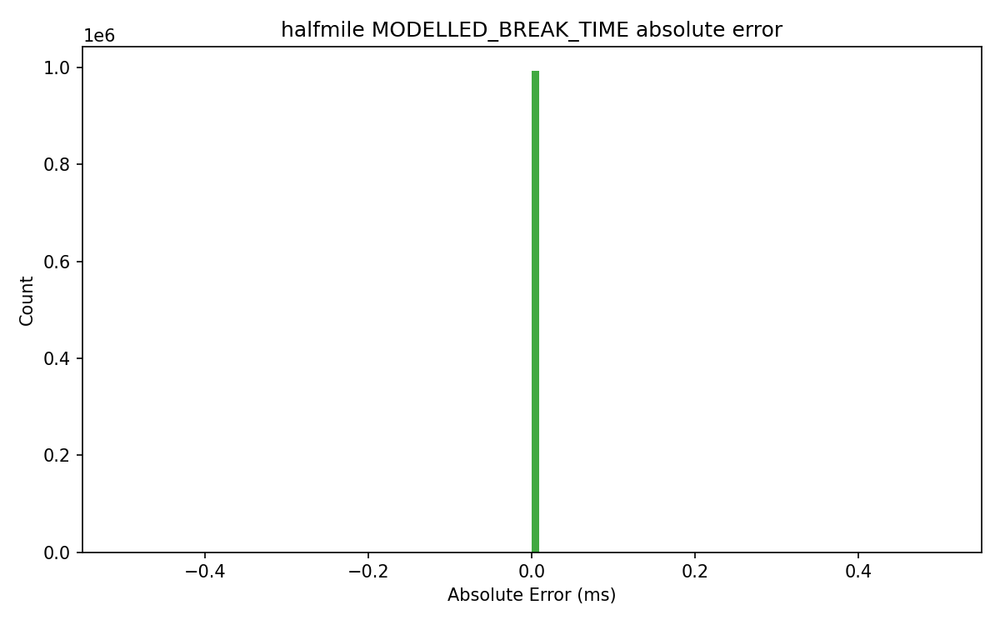

### `modelled_break_time_error_hist_lalor.png`
- Path: `outputs/eda/modelled_break_time_error_hist_lalor.png`
- Size: `26,581` bytes
- Produced by stage/script: `scripts/01b_label_comparison.py`
- Consumed by: Human QA and target-selection decisions; not required by training runtime.
- Purpose: visualization artifact (`MODELLED_BREAK_TIME absolute error histogram`).
- How to read: MODELLED_BREAK_TIME absolute error histogram.
- Common failure signatures: Fat right tails suggest instability or localized bad-quality shots needing robust handling.
- Embedded image:
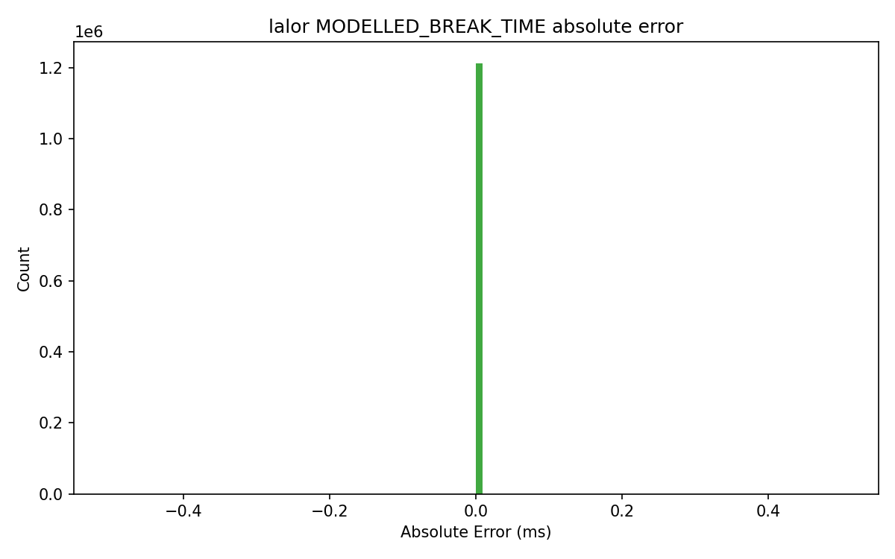

### `modelled_break_time_error_hist_sudbury.png`
- Path: `outputs/eda/modelled_break_time_error_hist_sudbury.png`
- Size: `35,098` bytes
- Produced by stage/script: `scripts/01b_label_comparison.py`
- Consumed by: Human QA and target-selection decisions; not required by training runtime.
- Purpose: visualization artifact (`MODELLED_BREAK_TIME absolute error histogram`).
- How to read: MODELLED_BREAK_TIME absolute error histogram.
- Common failure signatures: Fat right tails suggest instability or localized bad-quality shots needing robust handling.
- Embedded image:
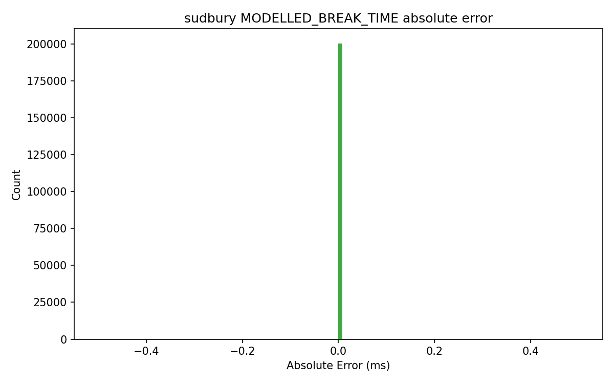

### `offset_cross_check_all_assets.csv`
- Path: `outputs/eda/offset_cross_check_all_assets.csv`
- Size: `2,526` bytes
- Produced by stage/script: `scripts/01b_label_comparison.py`
- Consumed by: Human QA and target-selection decisions; not required by training runtime.
- Purpose: structured tabular artifact for downstream QA/metrics/reporting
- Rows: `12`
- Columns: `14`
- Exact column list:
```text
asset, stored_offset_column, derived_offset_reference, trace_count, stored_nonzero_count, stored_nonzero_pct, difference_mean, difference_std, difference_min, difference_max, absolute_difference_mean, absolute_difference_median, count_abs_diff_gt_1m, pct_abs_diff_gt_1m
```
- Inferred dtypes:
| column                     | inferred_dtype   |
|:---------------------------|:-----------------|
| asset                      | str              |
| stored_offset_column       | str              |
| derived_offset_reference   | str              |
| trace_count                | int64            |
| stored_nonzero_count       | int64            |
| stored_nonzero_pct         | float64          |
| difference_mean            | float64          |
| difference_std             | float64          |
| difference_min             | float64          |
| difference_max             | float64          |
| absolute_difference_mean   | float64          |
| absolute_difference_median | float64          |
| count_abs_diff_gt_1m       | int64            |
| pct_abs_diff_gt_1m         | float64          |
- Null profile:
| column                     |   null_count |   null_pct |
|:---------------------------|-------------:|-----------:|
| asset                      |            0 |          0 |
| stored_offset_column       |            0 |          0 |
| derived_offset_reference   |            0 |          0 |
| trace_count                |            0 |          0 |
| stored_nonzero_count       |            0 |          0 |
| stored_nonzero_pct         |            0 |          0 |
| difference_mean            |            0 |          0 |
| difference_std             |            0 |          0 |
| difference_min             |            0 |          0 |
| difference_max             |            0 |          0 |
| absolute_difference_mean   |            0 |          0 |
| absolute_difference_median |            0 |          0 |
| count_abs_diff_gt_1m       |            0 |          0 |
| pct_abs_diff_gt_1m         |            0 |          0 |
- Sample preview (first rows, summarized):
  - Note: preview shows first `12` columns only; `2` additional columns are omitted from preview.
| asset     | stored_offset_column   | derived_offset_reference   |   trace_count |   stored_nonzero_count |   stored_nonzero_pct |   difference_mean |   difference_std |   difference_min |   difference_max |   absolute_difference_mean |   absolute_difference_median |
|:----------|:-----------------------|:---------------------------|--------------:|-----------------------:|---------------------:|------------------:|-----------------:|-----------------:|-----------------:|---------------------------:|-----------------------------:|
| brunswick | OFFSET_FLT             | derived_offset_scaled      |       4496540 |                      0 |                    0 |      -2369.37     |       1316.87    |       -7188.22   |          -2      |                 2369.37    |                   2123.18    |
| brunswick | OFFSET                 | derived_offset_raw         |       4496540 |                4496540 |                  100 |         -0.209024 |          5.03619 |         -18.7748 |          18.7501 |                    4.06349 |                      3.50569 |
| brunswick | OFFSET                 | derived_offset_scaled      |       4496540 |                4496540 |                  100 |      21324.1      |      11851.7     |          18      |       64701.8    |                21324.1     |                  19107.2     |
- Caveats: dtype inference is from parsed chunks; mixed-type columns are shown with combined dtype signatures.

### `offset_cross_check_brunswick.csv`
- Path: `outputs/eda/offset_cross_check_brunswick.csv`
- Size: `797` bytes
- Produced by stage/script: `scripts/01b_label_comparison.py`
- Consumed by: Human QA and target-selection decisions; not required by training runtime.
- Purpose: structured tabular artifact for downstream QA/metrics/reporting
- Rows: `3`
- Columns: `14`
- Exact column list:
```text
asset, stored_offset_column, derived_offset_reference, trace_count, stored_nonzero_count, stored_nonzero_pct, difference_mean, difference_std, difference_min, difference_max, absolute_difference_mean, absolute_difference_median, count_abs_diff_gt_1m, pct_abs_diff_gt_1m
```
- Inferred dtypes:
| column                     | inferred_dtype   |
|:---------------------------|:-----------------|
| asset                      | str              |
| stored_offset_column       | str              |
| derived_offset_reference   | str              |
| trace_count                | int64            |
| stored_nonzero_count       | int64            |
| stored_nonzero_pct         | float64          |
| difference_mean            | float64          |
| difference_std             | float64          |
| difference_min             | float64          |
| difference_max             | float64          |
| absolute_difference_mean   | float64          |
| absolute_difference_median | float64          |
| count_abs_diff_gt_1m       | int64            |
| pct_abs_diff_gt_1m         | float64          |
- Null profile:
| column                     |   null_count |   null_pct |
|:---------------------------|-------------:|-----------:|
| asset                      |            0 |          0 |
| stored_offset_column       |            0 |          0 |
| derived_offset_reference   |            0 |          0 |
| trace_count                |            0 |          0 |
| stored_nonzero_count       |            0 |          0 |
| stored_nonzero_pct         |            0 |          0 |
| difference_mean            |            0 |          0 |
| difference_std             |            0 |          0 |
| difference_min             |            0 |          0 |
| difference_max             |            0 |          0 |
| absolute_difference_mean   |            0 |          0 |
| absolute_difference_median |            0 |          0 |
| count_abs_diff_gt_1m       |            0 |          0 |
| pct_abs_diff_gt_1m         |            0 |          0 |
- Sample preview (first rows, summarized):
  - Note: preview shows first `12` columns only; `2` additional columns are omitted from preview.
| asset     | stored_offset_column   | derived_offset_reference   |   trace_count |   stored_nonzero_count |   stored_nonzero_pct |   difference_mean |   difference_std |   difference_min |   difference_max |   absolute_difference_mean |   absolute_difference_median |
|:----------|:-----------------------|:---------------------------|--------------:|-----------------------:|---------------------:|------------------:|-----------------:|-----------------:|-----------------:|---------------------------:|-----------------------------:|
| brunswick | OFFSET_FLT             | derived_offset_scaled      |       4496540 |                      0 |                    0 |      -2369.37     |       1316.87    |       -7188.22   |          -2      |                 2369.37    |                   2123.18    |
| brunswick | OFFSET                 | derived_offset_raw         |       4496540 |                4496540 |                  100 |         -0.209024 |          5.03619 |         -18.7748 |          18.7501 |                    4.06349 |                      3.50569 |
| brunswick | OFFSET                 | derived_offset_scaled      |       4496540 |                4496540 |                  100 |      21324.1      |      11851.7     |          18      |       64701.8    |                21324.1     |                  19107.2     |
- Caveats: dtype inference is from parsed chunks; mixed-type columns are shown with combined dtype signatures.

### `offset_cross_check_halfmile.csv`
- Path: `outputs/eda/offset_cross_check_halfmile.csv`
- Size: `865` bytes
- Produced by stage/script: `scripts/01b_label_comparison.py`
- Consumed by: Human QA and target-selection decisions; not required by training runtime.
- Purpose: structured tabular artifact for downstream QA/metrics/reporting
- Rows: `3`
- Columns: `14`
- Exact column list:
```text
asset, stored_offset_column, derived_offset_reference, trace_count, stored_nonzero_count, stored_nonzero_pct, difference_mean, difference_std, difference_min, difference_max, absolute_difference_mean, absolute_difference_median, count_abs_diff_gt_1m, pct_abs_diff_gt_1m
```
- Inferred dtypes:
| column                     | inferred_dtype   |
|:---------------------------|:-----------------|
| asset                      | str              |
| stored_offset_column       | str              |
| derived_offset_reference   | str              |
| trace_count                | int64            |
| stored_nonzero_count       | int64            |
| stored_nonzero_pct         | float64          |
| difference_mean            | float64          |
| difference_std             | float64          |
| difference_min             | float64          |
| difference_max             | float64          |
| absolute_difference_mean   | float64          |
| absolute_difference_median | float64          |
| count_abs_diff_gt_1m       | int64            |
| pct_abs_diff_gt_1m         | float64          |
- Null profile:
| column                     |   null_count |   null_pct |
|:---------------------------|-------------:|-----------:|
| asset                      |            0 |          0 |
| stored_offset_column       |            0 |          0 |
| derived_offset_reference   |            0 |          0 |
| trace_count                |            0 |          0 |
| stored_nonzero_count       |            0 |          0 |
| stored_nonzero_pct         |            0 |          0 |
| difference_mean            |            0 |          0 |
| difference_std             |            0 |          0 |
| difference_min             |            0 |          0 |
| difference_max             |            0 |          0 |
| absolute_difference_mean   |            0 |          0 |
| absolute_difference_median |            0 |          0 |
| count_abs_diff_gt_1m       |            0 |          0 |
| pct_abs_diff_gt_1m         |            0 |          0 |
- Sample preview (first rows, summarized):
  - Note: preview shows first `12` columns only; `2` additional columns are omitted from preview.
| asset    | stored_offset_column   | derived_offset_reference   |   trace_count |   stored_nonzero_count |   stored_nonzero_pct |   difference_mean |   difference_std |   difference_min |   difference_max |   absolute_difference_mean |   absolute_difference_median |
|:---------|:-----------------------|:---------------------------|--------------:|-----------------------:|---------------------:|------------------:|-----------------:|-----------------:|-----------------:|---------------------------:|-----------------------------:|
| halfmile | OFFSET_FLT             | derived_offset_scaled      |       1099559 |                      0 |               0      |    -1769.2        |       859.101    |       -4865.9    |          0       |                1769.2      |                  1713.47     |
| halfmile | OFFSET                 | derived_offset_raw         |       1099559 |                1099558 |              99.9999 |        0.00432027 |         0.478411 |          -1.5028 |          1.50342 |                   0.387041 |                     0.335495 |
| halfmile | OFFSET                 | derived_offset_scaled      |       1099559 |                1099558 |              99.9999 |        0.00432027 |         0.478411 |          -1.5028 |          1.50342 |                   0.387041 |                     0.335495 |
- Caveats: dtype inference is from parsed chunks; mixed-type columns are shown with combined dtype signatures.

### `offset_cross_check_lalor.csv`
- Path: `outputs/eda/offset_cross_check_lalor.csv`
- Size: `828` bytes
- Produced by stage/script: `scripts/01b_label_comparison.py`
- Consumed by: Human QA and target-selection decisions; not required by training runtime.
- Purpose: structured tabular artifact for downstream QA/metrics/reporting
- Rows: `3`
- Columns: `14`
- Exact column list:
```text
asset, stored_offset_column, derived_offset_reference, trace_count, stored_nonzero_count, stored_nonzero_pct, difference_mean, difference_std, difference_min, difference_max, absolute_difference_mean, absolute_difference_median, count_abs_diff_gt_1m, pct_abs_diff_gt_1m
```
- Inferred dtypes:
| column                     | inferred_dtype   |
|:---------------------------|:-----------------|
| asset                      | str              |
| stored_offset_column       | str              |
| derived_offset_reference   | str              |
| trace_count                | int64            |
| stored_nonzero_count       | int64            |
| stored_nonzero_pct         | float64          |
| difference_mean            | float64          |
| difference_std             | float64          |
| difference_min             | float64          |
| difference_max             | float64          |
| absolute_difference_mean   | float64          |
| absolute_difference_median | float64          |
| count_abs_diff_gt_1m       | int64            |
| pct_abs_diff_gt_1m         | float64          |
- Null profile:
| column                     |   null_count |   null_pct |
|:---------------------------|-------------:|-----------:|
| asset                      |            0 |          0 |
| stored_offset_column       |            0 |          0 |
| derived_offset_reference   |            0 |          0 |
| trace_count                |            0 |          0 |
| stored_nonzero_count       |            0 |          0 |
| stored_nonzero_pct         |            0 |          0 |
| difference_mean            |            0 |          0 |
| difference_std             |            0 |          0 |
| difference_min             |            0 |          0 |
| difference_max             |            0 |          0 |
| absolute_difference_mean   |            0 |          0 |
| absolute_difference_median |            0 |          0 |
| count_abs_diff_gt_1m       |            0 |          0 |
| pct_abs_diff_gt_1m         |            0 |          0 |
- Sample preview (first rows, summarized):
  - Note: preview shows first `12` columns only; `2` additional columns are omitted from preview.
| asset   | stored_offset_column   | derived_offset_reference   |   trace_count |   stored_nonzero_count |   stored_nonzero_pct |   difference_mean |   difference_std |   difference_min |   difference_max |   absolute_difference_mean |   absolute_difference_median |
|:--------|:-----------------------|:---------------------------|--------------:|-----------------------:|---------------------:|------------------:|-----------------:|-----------------:|-----------------:|---------------------------:|-----------------------------:|
| lalor   | OFFSET_FLT             | derived_offset_scaled      |       2424923 |                      0 |                    0 |   -2138.19        |       1024.24    |     -5782.66     |        -0.1      |                2138.19     |                  2091.67     |
| lalor   | OFFSET                 | derived_offset_raw         |       2424923 |                2424923 |                  100 |      -0.000358212 |          0.28803 |        -0.507758 |         0.509729 |                   0.249099 |                     0.248412 |
| lalor   | OFFSET                 | derived_offset_scaled      |       2424923 |                2424923 |                  100 |   19243.7         |       9218.18    |         0.9      |     52044.3      |               19243.7      |                 18825.3      |
- Caveats: dtype inference is from parsed chunks; mixed-type columns are shown with combined dtype signatures.

### `offset_cross_check_sudbury.csv`
- Path: `outputs/eda/offset_cross_check_sudbury.csv`
- Size: `826` bytes
- Produced by stage/script: `scripts/01b_label_comparison.py`
- Consumed by: Human QA and target-selection decisions; not required by training runtime.
- Purpose: structured tabular artifact for downstream QA/metrics/reporting
- Rows: `3`
- Columns: `14`
- Exact column list:
```text
asset, stored_offset_column, derived_offset_reference, trace_count, stored_nonzero_count, stored_nonzero_pct, difference_mean, difference_std, difference_min, difference_max, absolute_difference_mean, absolute_difference_median, count_abs_diff_gt_1m, pct_abs_diff_gt_1m
```
- Inferred dtypes:
| column                     | inferred_dtype   |
|:---------------------------|:-----------------|
| asset                      | str              |
| stored_offset_column       | str              |
| derived_offset_reference   | str              |
| trace_count                | int64            |
| stored_nonzero_count       | int64            |
| stored_nonzero_pct         | float64          |
| difference_mean            | float64          |
| difference_std             | float64          |
| difference_min             | float64          |
| difference_max             | float64          |
| absolute_difference_mean   | float64          |
| absolute_difference_median | float64          |
| count_abs_diff_gt_1m       | int64            |
| pct_abs_diff_gt_1m         | float64          |
- Null profile:
| column                     |   null_count |   null_pct |
|:---------------------------|-------------:|-----------:|
| asset                      |            0 |          0 |
| stored_offset_column       |            0 |          0 |
| derived_offset_reference   |            0 |          0 |
| trace_count                |            0 |          0 |
| stored_nonzero_count       |            0 |          0 |
| stored_nonzero_pct         |            0 |          0 |
| difference_mean            |            0 |          0 |
| difference_std             |            0 |          0 |
| difference_min             |            0 |          0 |
| difference_max             |            0 |          0 |
| absolute_difference_mean   |            0 |          0 |
| absolute_difference_median |            0 |          0 |
| count_abs_diff_gt_1m       |            0 |          0 |
| pct_abs_diff_gt_1m         |            0 |          0 |
- Sample preview (first rows, summarized):
  - Note: preview shows first `12` columns only; `2` additional columns are omitted from preview.
| asset   | stored_offset_column   | derived_offset_reference   |   trace_count |   stored_nonzero_count |   stored_nonzero_pct |   difference_mean |   difference_std |   difference_min |   difference_max |   absolute_difference_mean |   absolute_difference_median |
|:--------|:-----------------------|:---------------------------|--------------:|-----------------------:|---------------------:|------------------:|-----------------:|-----------------:|-----------------:|---------------------------:|-----------------------------:|
| sudbury | OFFSET_FLT             | derived_offset_scaled      |       1810220 |                      0 |                    0 |      -2417.5      |      1211.34     |      -7155.68    |        -3.16228  |                2417.5      |                  2311.35     |
| sudbury | OFFSET                 | derived_offset_raw         |       1810220 |                1810220 |                  100 |    -239333        |    119922        |    -708413       |      -313.228    |              239333        |                228824        |
| sudbury | OFFSET                 | derived_offset_scaled      |       1810220 |                1810220 |                  100 |         -0.501059 |         0.322094 |         -1.40529 |         0.405813 |                   0.510987 |                     0.502411 |
- Caveats: dtype inference is from parsed chunks; mixed-type columns are shown with combined dtype signatures.

### `offset_vs_spare1_all_assets.png`
- Path: `outputs/eda/offset_vs_spare1_all_assets.png`
- Size: `321,521` bytes
- Produced by stage/script: `scripts/01_eda.py`
- Consumed by: Human QA and dataset understanding; not required by training runtime.
- Purpose: visualization artifact (`Offset versus label scatter`).
- How to read: Offset versus label scatter.
- Common failure signatures: Vertical banding, hard truncation, or no trend can indicate offset parsing/normalization problems.
- Embedded image:
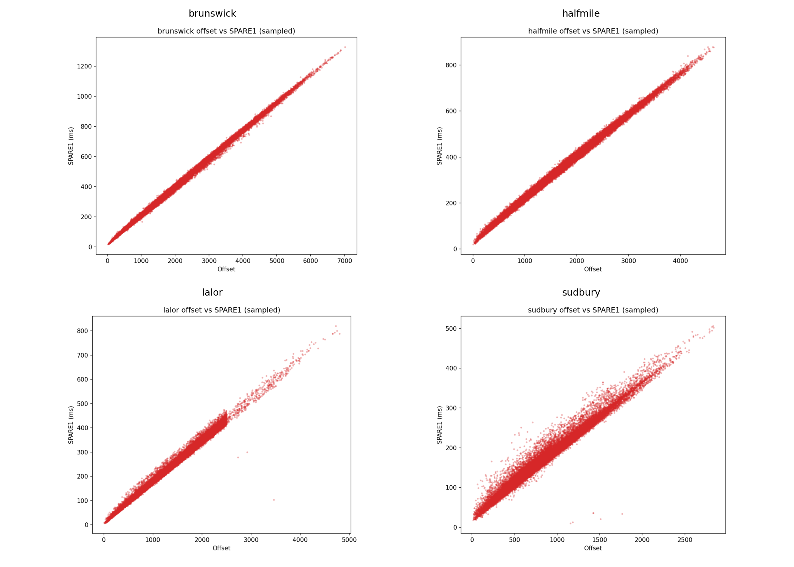

### `receiver_duplicate_stats_all_assets.csv`
- Path: `outputs/eda/receiver_duplicate_stats_all_assets.csv`
- Size: `149` bytes
- Produced by stage/script: `scripts/01_eda.py`
- Consumed by: Human QA and dataset understanding; not required by training runtime.
- Purpose: structured tabular artifact for downstream QA/metrics/reporting
- Rows: `4`
- Columns: `3`
- Exact column list:
```text
asset, receiver_unique_xy_count, receiver_duplicate_xy_count
```
- Inferred dtypes:
| column                      | inferred_dtype   |
|:----------------------------|:-----------------|
| asset                       | str              |
| receiver_unique_xy_count    | int64            |
| receiver_duplicate_xy_count | int64            |
- Null profile:
| column                      |   null_count |   null_pct |
|:----------------------------|-------------:|-----------:|
| asset                       |            0 |          0 |
| receiver_unique_xy_count    |            0 |          0 |
| receiver_duplicate_xy_count |            0 |          0 |
- Sample preview (first rows, summarized):
| asset     |   receiver_unique_xy_count |   receiver_duplicate_xy_count |
|:----------|---------------------------:|------------------------------:|
| brunswick |                       6063 |                       4490477 |
| halfmile  |                       2378 |                       1097181 |
| lalor     |                       2685 |                       2422238 |
- Caveats: dtype inference is from parsed chunks; mixed-type columns are shown with combined dtype signatures.

### `sampling_stats_all_assets.csv`
- Path: `outputs/eda/sampling_stats_all_assets.csv`
- Size: `475` bytes
- Produced by stage/script: `scripts/01_eda.py`
- Consumed by: Human QA and dataset understanding; not required by training runtime.
- Purpose: structured tabular artifact for downstream QA/metrics/reporting
- Rows: `4`
- Columns: `10`
- Exact column list:
```text
asset, samp_rate_unique_count, samp_rate_unique_values_us, samp_num_unique_count, samp_num_unique_values, total_recording_time_ms_median, recording_time_min_ms, recording_time_max_ms, samp_rate_varies_flag, samp_num_varies_flag
```
- Inferred dtypes:
| column                         | inferred_dtype   |
|:-------------------------------|:-----------------|
| asset                          | str              |
| samp_rate_unique_count         | int64            |
| samp_rate_unique_values_us     | str              |
| samp_num_unique_count          | int64            |
| samp_num_unique_values         | str              |
| total_recording_time_ms_median | float64          |
| recording_time_min_ms          | float64          |
| recording_time_max_ms          | float64          |
| samp_rate_varies_flag          | bool             |
| samp_num_varies_flag           | bool             |
- Null profile:
| column                         |   null_count |   null_pct |
|:-------------------------------|-------------:|-----------:|
| asset                          |            0 |          0 |
| samp_rate_unique_count         |            0 |          0 |
| samp_rate_unique_values_us     |            0 |          0 |
| samp_num_unique_count          |            0 |          0 |
| samp_num_unique_values         |            0 |          0 |
| total_recording_time_ms_median |            0 |          0 |
| recording_time_min_ms          |            0 |          0 |
| recording_time_max_ms          |            0 |          0 |
| samp_rate_varies_flag          |            0 |          0 |
| samp_num_varies_flag           |            0 |          0 |
- Sample preview (first rows, summarized):
| asset     |   samp_rate_unique_count | samp_rate_unique_values_us   |   samp_num_unique_count | samp_num_unique_values   |   total_recording_time_ms_median |   recording_time_min_ms |   recording_time_max_ms | samp_rate_varies_flag   | samp_num_varies_flag   |
|:----------|-------------------------:|:-----------------------------|------------------------:|:-------------------------|---------------------------------:|------------------------:|------------------------:|:------------------------|:-----------------------|
| brunswick |                        1 | [2000.0]                     |                       1 | [751.0]                  |                             1502 |                    1502 |                    1502 | False                   | False                  |
| halfmile  |                        1 | [2000.0]                     |                       1 | [751.0]                  |                             1502 |                    1502 |                    1502 | False                   | False                  |
| lalor     |                        1 | [1000.0]                     |                       1 | [1501.0]                 |                             1501 |                    1501 |                    1501 | False                   | False                  |
- Caveats: dtype inference is from parsed chunks; mixed-type columns are shown with combined dtype signatures.

### `shot_stats_all_assets.csv`
- Path: `outputs/eda/shot_stats_all_assets.csv`
- Size: `479` bytes
- Produced by stage/script: `scripts/01_eda.py`
- Consumed by: Human QA and dataset understanding; not required by training runtime.
- Purpose: structured tabular artifact for downstream QA/metrics/reporting
- Rows: `4`
- Columns: `10`
- Exact column list:
```text
asset, unique_shot_count, traces_per_shot_mean, traces_per_shot_min, traces_per_shot_max, traces_per_shot_std, shotid_null_count, shotid_negative_count, shot_peg_unique_count, rec_peg_unique_count
```
- Inferred dtypes:
| column                | inferred_dtype   |
|:----------------------|:-----------------|
| asset                 | str              |
| unique_shot_count     | int64            |
| traces_per_shot_mean  | float64          |
| traces_per_shot_min   | int64            |
| traces_per_shot_max   | int64            |
| traces_per_shot_std   | float64          |
| shotid_null_count     | int64            |
| shotid_negative_count | int64            |
| shot_peg_unique_count | int64            |
| rec_peg_unique_count  | int64            |
- Null profile:
| column                |   null_count |   null_pct |
|:----------------------|-------------:|-----------:|
| asset                 |            0 |          0 |
| unique_shot_count     |            0 |          0 |
| traces_per_shot_mean  |            0 |          0 |
| traces_per_shot_min   |            0 |          0 |
| traces_per_shot_max   |            0 |          0 |
| traces_per_shot_std   |            0 |          0 |
| shotid_null_count     |            0 |          0 |
| shotid_negative_count |            0 |          0 |
| shot_peg_unique_count |            0 |          0 |
| rec_peg_unique_count  |            0 |          0 |
- Sample preview (first rows, summarized):
| asset     |   unique_shot_count |   traces_per_shot_mean |   traces_per_shot_min |   traces_per_shot_max |   traces_per_shot_std |   shotid_null_count |   shotid_negative_count |   shot_peg_unique_count |   rec_peg_unique_count |
|:----------|--------------------:|-----------------------:|----------------------:|----------------------:|----------------------:|--------------------:|------------------------:|------------------------:|-----------------------:|
| brunswick |                1541 |                2917.94 |                  2135 |                  3355 |               363.781 |                   0 |                       0 |                    1541 |                   6063 |
| halfmile  |                 690 |                1593.56 |                  1575 |                  1604 |                12.434 |                   0 |                       0 |                     690 |                   2378 |
| lalor     |                 907 |                2673.56 |                     1 |                  2685 |               159.148 |                   0 |                       0 |                     907 |                   2685 |
- Caveats: dtype inference is from parsed chunks; mixed-type columns are shown with combined dtype signatures.

### `spare1_hist_all_assets.png`
- Path: `outputs/eda/spare1_hist_all_assets.png`
- Size: `157,913` bytes
- Produced by stage/script: `scripts/01_eda.py`
- Consumed by: Human QA and dataset understanding; not required by training runtime.
- Purpose: visualization artifact (`SPARE1 label-value histogram`).
- How to read: SPARE1 label-value histogram.
- Common failure signatures: Large zero spikes or implausible long tails may indicate unlabeled contamination or unit mismatch.
- Embedded image:
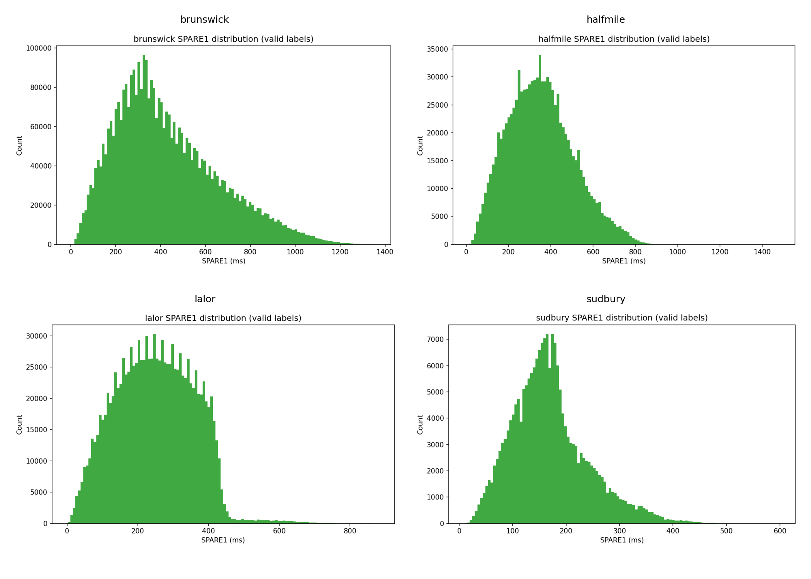

### `spare1_stats_all_assets.csv`
- Path: `outputs/eda/spare1_stats_all_assets.csv`
- Size: `565` bytes
- Produced by stage/script: `scripts/01_eda.py`
- Consumed by: Human QA and dataset understanding; not required by training runtime.
- Purpose: structured tabular artifact for downstream QA/metrics/reporting
- Rows: `4`
- Columns: `11`
- Exact column list:
```text
asset, count_zero, count_minus_one, count_valid_positive, valid_min, valid_max, valid_mean, valid_median, valid_std, labeled_percentage, count_corrupted_gt_recording_time
```
- Inferred dtypes:
| column                            | inferred_dtype   |
|:----------------------------------|:-----------------|
| asset                             | str              |
| count_zero                        | int64            |
| count_minus_one                   | int64            |
| count_valid_positive              | int64            |
| valid_min                         | float64          |
| valid_max                         | float64          |
| valid_mean                        | float64          |
| valid_median                      | float64          |
| valid_std                         | float64          |
| labeled_percentage                | float64          |
| count_corrupted_gt_recording_time | int64            |
- Null profile:
| column                            |   null_count |   null_pct |
|:----------------------------------|-------------:|-----------:|
| asset                             |            0 |          0 |
| count_zero                        |            0 |          0 |
| count_minus_one                   |            0 |          0 |
| count_valid_positive              |            0 |          0 |
| valid_min                         |            0 |          0 |
| valid_max                         |            0 |          0 |
| valid_mean                        |            0 |          0 |
| valid_median                      |            0 |          0 |
| valid_std                         |            0 |          0 |
| labeled_percentage                |            0 |          0 |
| count_corrupted_gt_recording_time |            0 |          0 |
- Sample preview (first rows, summarized):
| asset     |   count_zero |   count_minus_one |   count_valid_positive |   valid_min |   valid_max |   valid_mean |   valid_median |   valid_std |   labeled_percentage |   count_corrupted_gt_recording_time |
|:----------|-------------:|------------------:|-----------------------:|------------:|------------:|-------------:|---------------:|------------:|---------------------:|------------------------------------:|
| brunswick |            0 |            763319 |                3733221 |           4 |        1358 |      429.272 |            384 |     229.564 |              83.0243 |                                   0 |
| halfmile  |            0 |            106370 |                 993189 |          11 |        1482 |      353.139 |            344 |     154.918 |              90.3261 |                                   0 |
| lalor     |            0 |           1213066 |                1211857 |           2 |         881 |      249.218 |            248 |     109.295 |              49.9751 |                                   0 |
- Caveats: dtype inference is from parsed chunks; mixed-type columns are shown with combined dtype signatures.

### `time_order_checks_all_assets.csv`
- Path: `outputs/eda/time_order_checks_all_assets.csv`
- Size: `235` bytes
- Produced by stage/script: `scripts/01_eda.py`
- Consumed by: Human QA and dataset understanding; not required by training runtime.
- Purpose: structured tabular artifact for downstream QA/metrics/reporting
- Rows: `4`
- Columns: `6`
- Exact column list:
```text
asset, shotid_monotonic_non_decreasing, gathers_checked, offset_sorted_fraction, rec_x_sorted_fraction, rec_y_sorted_fraction
```
- Inferred dtypes:
| column                          | inferred_dtype   |
|:--------------------------------|:-----------------|
| asset                           | str              |
| shotid_monotonic_non_decreasing | bool             |
| gathers_checked                 | int64            |
| offset_sorted_fraction          | float64          |
| rec_x_sorted_fraction           | float64          |
| rec_y_sorted_fraction           | float64          |
- Null profile:
| column                          |   null_count |   null_pct |
|:--------------------------------|-------------:|-----------:|
| asset                           |            0 |          0 |
| shotid_monotonic_non_decreasing |            0 |          0 |
| gathers_checked                 |            0 |          0 |
| offset_sorted_fraction          |            0 |          0 |
| rec_x_sorted_fraction           |            0 |          0 |
| rec_y_sorted_fraction           |            0 |          0 |
- Sample preview (first rows, summarized):
| asset     | shotid_monotonic_non_decreasing   |   gathers_checked |   offset_sorted_fraction |   rec_x_sorted_fraction |   rec_y_sorted_fraction |
|:----------|:----------------------------------|------------------:|-------------------------:|------------------------:|------------------------:|
| brunswick | True                              |                 1 |                        1 |                       1 |                       1 |
| halfmile  | True                              |                 1 |                        1 |                       1 |                       1 |
| lalor     | True                              |                 1 |                        1 |                       1 |                       1 |
- Caveats: dtype inference is from parsed chunks; mixed-type columns are shown with combined dtype signatures.
