# Evaluation Output Documentation

## Scope
Prediction-level outputs, metrics tables, ROC plots, gather overlays, and A/B/baseline comparison artifacts.

## Producer Scripts
- `scripts/05_hyperbolic_smoothing.py`
- `scripts/07_evaluate.py`
- `scripts/08_visualize_predictions.py`

## Consumer Scripts
- `Human reporting/presentation`
- `cross-run experiment comparison workflows`

## Naming Rules and Lineage
- `_experimentb`: artifact generated for Experiment B (domain adaptation split behavior).
- `_smoothed`: post-processed prediction file produced by hyperbolic smoothing stage.
- `_latest`: convenience naming for current default track metrics in evaluation outputs.
- `stalta_*`: baseline-only evaluation artifacts (pure STA/LTA method, no LightGBM).
- `predictions_{split}*.csv`: row-level per-trace prediction artifacts (`train`, `val`, `test`).
- `metrics_*_global_threshold*.csv`: classification/regression summary under one global threshold.
- `metrics_*_asset_threshold*.csv`: same metrics with per-asset thresholds.
- `holdout_report_by_asset*.csv`: per-asset holdout-focused summary diagnostics.

## A/B/Baseline Side-by-Side
This table is built from currently available test global-threshold artifacts and focuses on `test_all` when present.
| track              | source_file   | asset   |   mae_ms |   rmse_ms |   within_50ms_pct |   precision |   recall |   f1_score |   auc_roc |
|:-------------------|:--------------|:--------|---------:|----------:|------------------:|------------:|---------:|-----------:|----------:|
| Experiment A       | available     | n/a     | 33.3239  |   36.6431 |           85.9213 |    0.999987 | 0.893043 |   0.943495 |  0.995438 |
| Experiment B       | available     | n/a     |  6.37562 |   14.0051 |           99.521  |    0.99656  | 0.990614 |   0.993578 |  0.997985 |
| STA/LTA Baseline A | available     | n/a     | 25.3414  |   59.9799 |           94.848  |    0.961668 | 0.9974   |   0.979208 |  0.956017 |
| STA/LTA Baseline B | available     | n/a     | 30.6763  |   79.7818 |           92.6977 |    0.966248 | 0.990967 |   0.978451 |  0.942389 |

## Threshold Family Semantics
- Global threshold metrics: one decision threshold is used across all assets; useful for deployment simplicity and consistent operating point.
- Asset threshold metrics: each asset gets its own threshold; useful for best achievable per-domain performance and fairness checks.
- Holdout report by asset: summarizes per-asset held-out behavior; use to identify transfer gaps and domain-specific drift.


## Artifact Inventory
- Total files documented: `51`
- Source directory: `outputs/evaluation`

### `evaluation_config.json`
- Path: `outputs/evaluation/evaluation_config.json`
- Size: `464` bytes
- Produced by stage/script: `scripts/07_evaluate.py`
- Consumed by: Reporting and A/B/baseline comparisons.
- Purpose: structured configuration/summary payload.
- Top-level type: `dict`
- Top-level keys (4): `experiment_tag, classification_threshold_ms_global, evaluation_tolerance_ms, notes`
- Key type preview:
```json
{
  "experiment_tag": "str",
  "classification_threshold_ms_global": "float",
  "evaluation_tolerance_ms": "float",
  "notes": "list"
}
```
- Content preview (truncated):
```json
{
  "experiment_tag": "latest",
  "classification_threshold_ms_global": 372.0,
  "evaluation_tolerance_ms": 10.0,
  "notes": [
    "Binary classification is defined as early-arrival prediction: label_ms <= threshold_ms.",
    "AUC/ROC is computed from score = -predicted_ms.",
    "Per-asset threshold metrics are written to metrics_test_asset_threshold_<tag>.csv.",
    "Rows with prediction_status != predicted_labeled are excluded from metrics."
  ]
}
```

### `evaluation_config_experimentb.json`
- Path: `outputs/evaluation/evaluation_config_experimentb.json`
- Size: `469` bytes
- Produced by stage/script: `scripts/07_evaluate.py`
- Consumed by: Reporting and A/B/baseline comparisons.
- Purpose: structured configuration/summary payload.
- Top-level type: `dict`
- Top-level keys (4): `experiment_tag, classification_threshold_ms_global, evaluation_tolerance_ms, notes`
- Key type preview:
```json
{
  "experiment_tag": "str",
  "classification_threshold_ms_global": "float",
  "evaluation_tolerance_ms": "float",
  "notes": "list"
}
```
- Content preview (truncated):
```json
{
  "experiment_tag": "experimentb",
  "classification_threshold_ms_global": 340.0,
  "evaluation_tolerance_ms": 10.0,
  "notes": [
    "Binary classification is defined as early-arrival prediction: label_ms <= threshold_ms.",
    "AUC/ROC is computed from score = -predicted_ms.",
    "Per-asset threshold metrics are written to metrics_test_asset_threshold_<tag>.csv.",
    "Rows with prediction_status != predicted_labeled are excluded from metrics."
  ]
}
```

### `evaluation_summary.md`
- Path: `outputs/evaluation/evaluation_summary.md`
- Size: `8,398` bytes
- Produced by stage/script: `scripts/07_evaluate.py`
- Consumed by: Reporting and A/B/baseline comparisons.
- Purpose: narrative report or runtime log artifact.
- Line count: `124`
- Content preview:
```text
# Evaluation Summary

Experiment tag: latest

Binary target for ROC/classification is derived by thresholding arrival time (`label_ms <= threshold_ms`), with score = `-predicted_ms`.

## Training Metrics (Global Threshold)

```

### `evaluation_summary_experimentb.md`
- Path: `outputs/evaluation/evaluation_summary_experimentb.md`
- Size: `9,382` bytes
- Produced by stage/script: `scripts/07_evaluate.py`
- Consumed by: Reporting and A/B/baseline comparisons.
- Purpose: narrative report or runtime log artifact.
- Line count: `136`
- Content preview:
```text
# Evaluation Summary

Experiment tag: experimentb

Binary target for ROC/classification is derived by thresholding arrival time (`label_ms <= threshold_ms`), with score = `-predicted_ms`.

## Training Metrics (Global Threshold)

```

### `gather_overlay_brunswick.png`
- Path: `outputs/evaluation/gather_overlay_brunswick.png`
- Size: `1,440,883` bytes
- Produced by stage/script: `scripts/08_visualize_predictions.py`
- Consumed by: Presentation/reporting only.
- Purpose: visualization artifact (`Per-asset gather overlay`).
- How to read: Per-asset gather overlay.
- Common failure signatures: Systematic curve offsets imply timing bias; noisy cyan trajectories imply unstable picks.
- Embedded image:
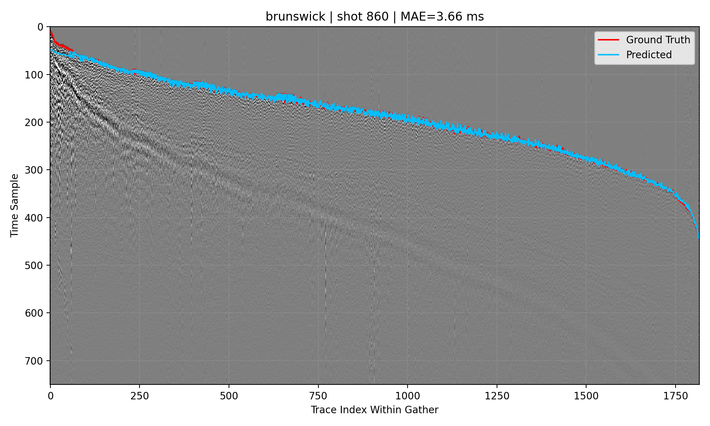

### `gather_overlay_brunswick_experimentb.png`
- Path: `outputs/evaluation/gather_overlay_brunswick_experimentb.png`
- Size: `1,440,164` bytes
- Produced by stage/script: `scripts/08_visualize_predictions.py`
- Consumed by: Presentation/reporting only.
- Purpose: visualization artifact (`Per-asset gather overlay`).
- How to read: Per-asset gather overlay.
- Common failure signatures: Systematic curve offsets imply timing bias; noisy cyan trajectories imply unstable picks.
- Embedded image:
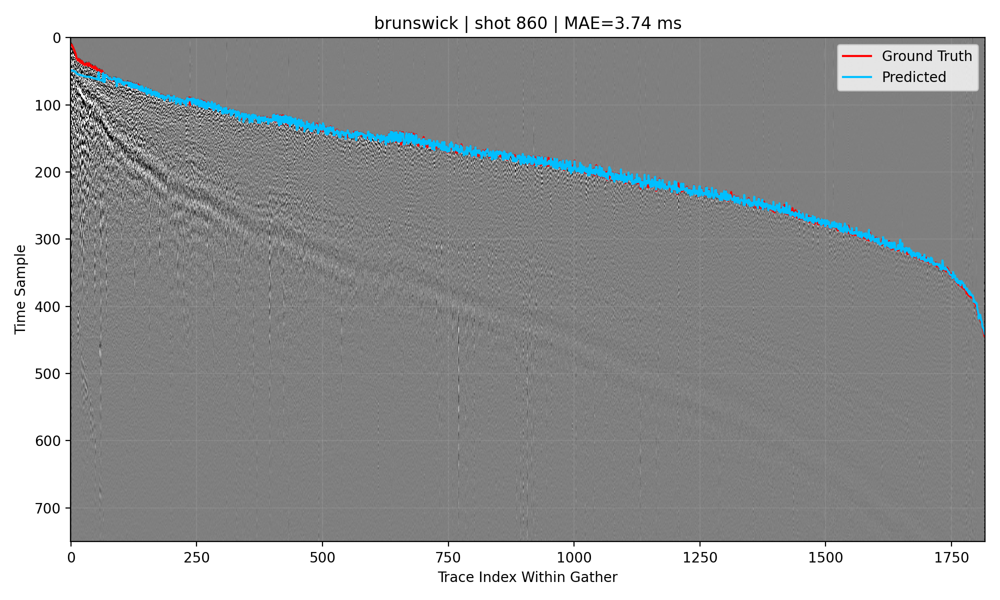

### `gather_overlay_halfmile.png`
- Path: `outputs/evaluation/gather_overlay_halfmile.png`
- Size: `1,217,840` bytes
- Produced by stage/script: `scripts/08_visualize_predictions.py`
- Consumed by: Presentation/reporting only.
- Purpose: visualization artifact (`Per-asset gather overlay`).
- How to read: Per-asset gather overlay.
- Common failure signatures: Systematic curve offsets imply timing bias; noisy cyan trajectories imply unstable picks.
- Embedded image:
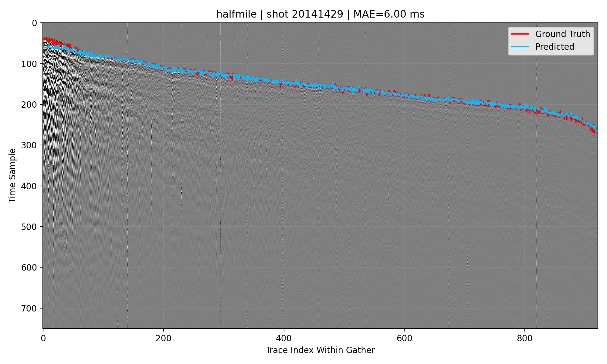

### `gather_overlay_halfmile_experimentb.png`
- Path: `outputs/evaluation/gather_overlay_halfmile_experimentb.png`
- Size: `1,217,691` bytes
- Produced by stage/script: `scripts/08_visualize_predictions.py`
- Consumed by: Presentation/reporting only.
- Purpose: visualization artifact (`Per-asset gather overlay`).
- How to read: Per-asset gather overlay.
- Common failure signatures: Systematic curve offsets imply timing bias; noisy cyan trajectories imply unstable picks.
- Embedded image:


### `gather_overlay_lalor.png`
- Path: `outputs/evaluation/gather_overlay_lalor.png`
- Size: `1,072,402` bytes
- Produced by stage/script: `scripts/08_visualize_predictions.py`
- Consumed by: Presentation/reporting only.
- Purpose: visualization artifact (`Per-asset gather overlay`).
- How to read: Per-asset gather overlay.
- Common failure signatures: Systematic curve offsets imply timing bias; noisy cyan trajectories imply unstable picks.
- Embedded image:
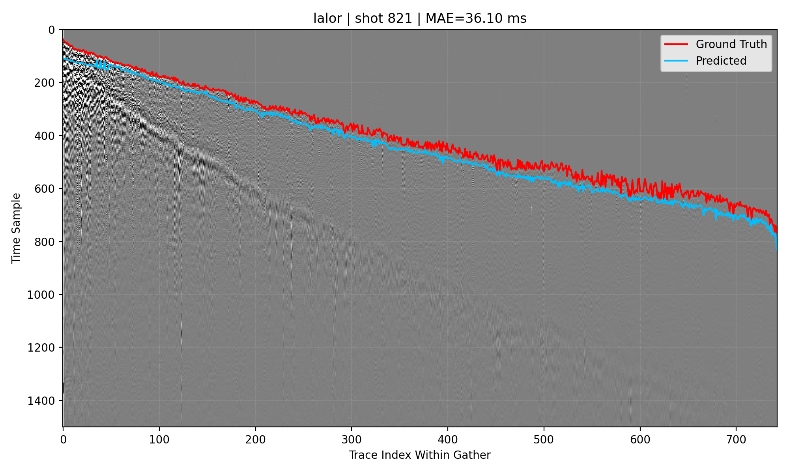

### `gather_overlay_lalor_experimentb.png`
- Path: `outputs/evaluation/gather_overlay_lalor_experimentb.png`
- Size: `1,260,345` bytes
- Produced by stage/script: `scripts/08_visualize_predictions.py`
- Consumed by: Presentation/reporting only.
- Purpose: visualization artifact (`Per-asset gather overlay`).
- How to read: Per-asset gather overlay.
- Common failure signatures: Systematic curve offsets imply timing bias; noisy cyan trajectories imply unstable picks.
- Embedded image:
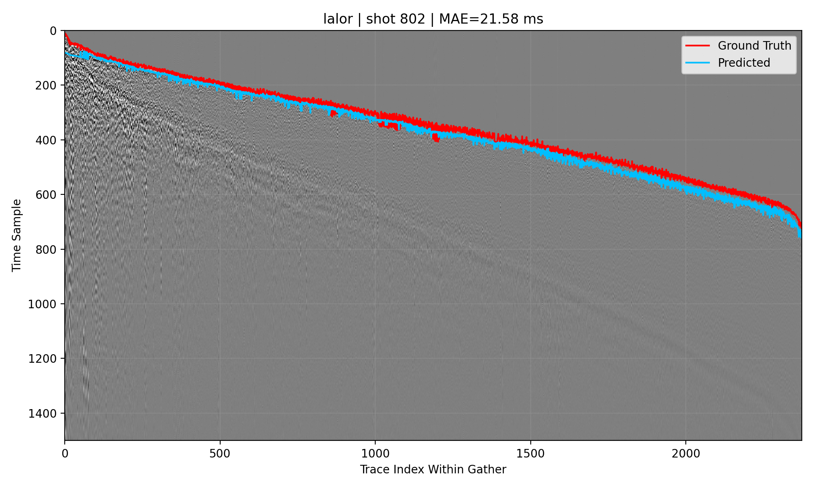

### `gather_overlay_sudbury.png`
- Path: `outputs/evaluation/gather_overlay_sudbury.png`
- Size: `611,410` bytes
- Produced by stage/script: `scripts/08_visualize_predictions.py`
- Consumed by: Presentation/reporting only.
- Purpose: visualization artifact (`Per-asset gather overlay`).
- How to read: Per-asset gather overlay.
- Common failure signatures: Systematic curve offsets imply timing bias; noisy cyan trajectories imply unstable picks.
- Embedded image:
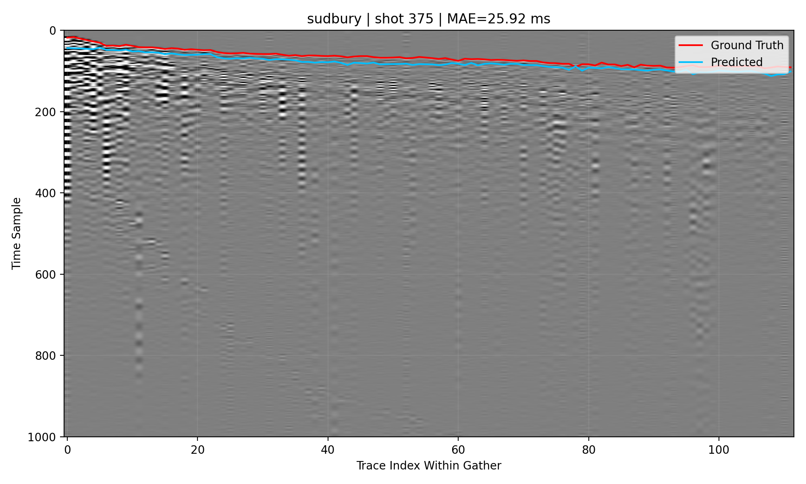

### `gather_overlay_sudbury_experimentb.png`
- Path: `outputs/evaluation/gather_overlay_sudbury_experimentb.png`
- Size: `926,861` bytes
- Produced by stage/script: `scripts/08_visualize_predictions.py`
- Consumed by: Presentation/reporting only.
- Purpose: visualization artifact (`Per-asset gather overlay`).
- How to read: Per-asset gather overlay.
- Common failure signatures: Systematic curve offsets imply timing bias; noisy cyan trajectories imply unstable picks.
- Embedded image:
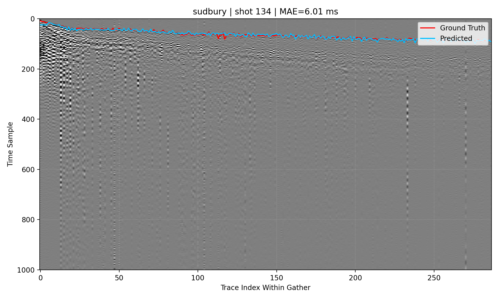

### `holdout_report_by_asset_experimentb.csv`
- Path: `outputs/evaluation/holdout_report_by_asset_experimentb.csv`
- Size: `686` bytes
- Produced by stage/script: `scripts/07_evaluate.py`
- Consumed by: Reporting and A/B/baseline comparisons.
- Purpose: structured tabular artifact for downstream QA/metrics/reporting
- Rows: `2`
- Columns: `17`
- Exact column list:
```text
asset, rows, mae_ms, rmse_ms, median_ae_ms, within_50ms_pct, accuracy, precision, recall, f1_score, auc_roc, true_positive, false_positive, true_negative, false_negative, mae_gap_vs_train_all_ms, mae_ratio_vs_train_all
```
- Inferred dtypes:
| column                  | inferred_dtype   |
|:------------------------|:-----------------|
| asset                   | str              |
| rows                    | int64            |
| mae_ms                  | float64          |
| rmse_ms                 | float64          |
| median_ae_ms            | float64          |
| within_50ms_pct         | float64          |
| accuracy                | float64          |
| precision               | float64          |
| recall                  | float64          |
| f1_score                | float64          |
| auc_roc                 | float64          |
| true_positive           | int64            |
| false_positive          | int64            |
| true_negative           | int64            |
| false_negative          | int64            |
| mae_gap_vs_train_all_ms | float64          |
| mae_ratio_vs_train_all  | float64          |
- Null profile:
| column                  |   null_count |   null_pct |
|:------------------------|-------------:|-----------:|
| asset                   |            0 |          0 |
| rows                    |            0 |          0 |
| mae_ms                  |            0 |          0 |
| rmse_ms                 |            0 |          0 |
| median_ae_ms            |            0 |          0 |
| within_50ms_pct         |            0 |          0 |
| accuracy                |            0 |          0 |
| precision               |            0 |          0 |
| recall                  |            0 |          0 |
| f1_score                |            0 |          0 |
| auc_roc                 |            0 |          0 |
| true_positive           |            0 |          0 |
| false_positive          |            0 |          0 |
| true_negative           |            0 |          0 |
| false_negative          |            0 |          0 |
| mae_gap_vs_train_all_ms |            0 |          0 |
| mae_ratio_vs_train_all  |            0 |          0 |
- Sample preview (first rows, summarized):
  - Note: preview shows first `12` columns only; `5` additional columns are omitted from preview.
| asset   |   rows |   mae_ms |   rmse_ms |   median_ae_ms |   within_50ms_pct |   accuracy |   precision |   recall |   f1_score |   auc_roc |   true_positive |
|:--------|-------:|---------:|----------:|---------------:|------------------:|-----------:|------------:|---------:|-----------:|----------:|----------------:|
| lalor   | 215257 |  3.78168 |   13.9294 |        1.45924 |           99.8407 |   0.989153 |    0.995277 | 0.990805 |   0.993036 |  0.998002 |          166481 |
| sudbury | 184743 |  9.398   |   14.0927 |        6.20899 |           99.1485 |   0.988514 |    0.997762 | 0.990435 |   0.994085 |  0.997468 |          178306 |
- Caveats: dtype inference is from parsed chunks; mixed-type columns are shown with combined dtype signatures.

### `holdout_report_by_asset_latest.csv`
- Path: `outputs/evaluation/holdout_report_by_asset_latest.csv`
- Size: `682` bytes
- Produced by stage/script: `scripts/07_evaluate.py`
- Consumed by: Reporting and A/B/baseline comparisons.
- Purpose: structured tabular artifact for downstream QA/metrics/reporting
- Rows: `2`
- Columns: `17`
- Exact column list:
```text
asset, rows, mae_ms, rmse_ms, median_ae_ms, within_50ms_pct, accuracy, precision, recall, f1_score, auc_roc, true_positive, false_positive, true_negative, false_negative, mae_gap_vs_train_all_ms, mae_ratio_vs_train_all
```
- Inferred dtypes:
| column                  | inferred_dtype   |
|:------------------------|:-----------------|
| asset                   | str              |
| rows                    | int64            |
| mae_ms                  | float64          |
| rmse_ms                 | float64          |
| median_ae_ms            | float64          |
| within_50ms_pct         | float64          |
| accuracy                | float64          |
| precision               | float64          |
| recall                  | float64          |
| f1_score                | float64          |
| auc_roc                 | float64          |
| true_positive           | int64            |
| false_positive          | int64            |
| true_negative           | int64            |
| false_negative          | int64            |
| mae_gap_vs_train_all_ms | float64          |
| mae_ratio_vs_train_all  | float64          |
- Null profile:
| column                  |   null_count |   null_pct |
|:------------------------|-------------:|-----------:|
| asset                   |            0 |          0 |
| rows                    |            0 |          0 |
| mae_ms                  |            0 |          0 |
| rmse_ms                 |            0 |          0 |
| median_ae_ms            |            0 |          0 |
| within_50ms_pct         |            0 |          0 |
| accuracy                |            0 |          0 |
| precision               |            0 |          0 |
| recall                  |            0 |          0 |
| f1_score                |            0 |          0 |
| auc_roc                 |            0 |          0 |
| true_positive           |            0 |          0 |
| false_positive          |            0 |          0 |
| true_negative           |            0 |          0 |
| false_negative          |            0 |          0 |
| mae_gap_vs_train_all_ms |            0 |          0 |
| mae_ratio_vs_train_all  |            0 |          0 |
- Sample preview (first rows, summarized):
  - Note: preview shows first `12` columns only; `5` additional columns are omitted from preview.
| asset   |   rows |   mae_ms |   rmse_ms |   median_ae_ms |   within_50ms_pct |   accuracy |   precision |   recall |   f1_score |   auc_roc |   true_positive |
|:--------|-------:|---------:|----------:|---------------:|------------------:|-----------:|------------:|---------:|-----------:|----------:|----------------:|
| lalor   | 343322 |  35.1062 |   38.2333 |        33.9552 |           83.7846 |   0.892961 |    0.999988 | 0.874817 |   0.933224 |  0.994708 |          256792 |
| sudbury |  56678 |  22.5276 |   24.929  |        22.1719 |           98.8638 |   0.988532 |    0.999982 | 0.988429 |   0.994172 |  0.999316 |           55441 |
- Caveats: dtype inference is from parsed chunks; mixed-type columns are shown with combined dtype signatures.

### `holdout_report_by_asset_stalta_a.csv`
- Path: `outputs/evaluation/holdout_report_by_asset_stalta_a.csv`
- Size: `659` bytes
- Produced by stage/script: `scripts/07_evaluate.py baseline mode`
- Consumed by: Comparison against model-based metrics in docs and decision-making.
- Purpose: structured tabular artifact for downstream QA/metrics/reporting
- Rows: `2`
- Columns: `17`
- Exact column list:
```text
asset, rows, mae_ms, rmse_ms, median_ae_ms, within_50ms_pct, accuracy, precision, recall, f1_score, auc_roc, true_positive, false_positive, true_negative, false_negative, mae_gap_vs_train_all_ms, mae_ratio_vs_train_all
```
- Inferred dtypes:
| column                  | inferred_dtype   |
|:------------------------|:-----------------|
| asset                   | str              |
| rows                    | int64            |
| mae_ms                  | float64          |
| rmse_ms                 | float64          |
| median_ae_ms            | float64          |
| within_50ms_pct         | float64          |
| accuracy                | float64          |
| precision               | float64          |
| recall                  | float64          |
| f1_score                | float64          |
| auc_roc                 | float64          |
| true_positive           | int64            |
| false_positive          | int64            |
| true_negative           | int64            |
| false_negative          | int64            |
| mae_gap_vs_train_all_ms | float64          |
| mae_ratio_vs_train_all  | float64          |
- Null profile:
| column                  |   null_count |   null_pct |
|:------------------------|-------------:|-----------:|
| asset                   |            0 |          0 |
| rows                    |            0 |          0 |
| mae_ms                  |            0 |          0 |
| rmse_ms                 |            0 |          0 |
| median_ae_ms            |            0 |          0 |
| within_50ms_pct         |            0 |          0 |
| accuracy                |            0 |          0 |
| precision               |            0 |          0 |
| recall                  |            0 |          0 |
| f1_score                |            0 |          0 |
| auc_roc                 |            0 |          0 |
| true_positive           |            0 |          0 |
| false_positive          |            0 |          0 |
| true_negative           |            0 |          0 |
| false_negative          |            0 |          0 |
| mae_gap_vs_train_all_ms |            0 |          0 |
| mae_ratio_vs_train_all  |            0 |          0 |
- Sample preview (first rows, summarized):
  - Note: preview shows first `12` columns only; `5` additional columns are omitted from preview.
| asset   |   rows |   mae_ms |   rmse_ms |   median_ae_ms |   within_50ms_pct |   accuracy |   precision |   recall |   f1_score |   auc_roc |   true_positive |
|:--------|-------:|---------:|----------:|---------------:|------------------:|-----------:|------------:|---------:|-----------:|----------:|----------------:|
| lalor   | 343322 |  23.0301 |   48.6999 |             16 |           95.7865 |   0.960003 |    0.955574 | 0.999697 |   0.977137 |  0.958478 |          293449 |
| sudbury |  56678 |  39.3419 |  104.993  |             19 |           89.1633 |   0.980998 |    0.995372 | 0.985381 |   0.990351 |  0.788876 |           55270 |
- Caveats: dtype inference is from parsed chunks; mixed-type columns are shown with combined dtype signatures.

### `holdout_report_by_asset_stalta_b.csv`
- Path: `outputs/evaluation/holdout_report_by_asset_stalta_b.csv`
- Size: `662` bytes
- Produced by stage/script: `scripts/07_evaluate.py baseline mode`
- Consumed by: Comparison against model-based metrics in docs and decision-making.
- Purpose: structured tabular artifact for downstream QA/metrics/reporting
- Rows: `2`
- Columns: `17`
- Exact column list:
```text
asset, rows, mae_ms, rmse_ms, median_ae_ms, within_50ms_pct, accuracy, precision, recall, f1_score, auc_roc, true_positive, false_positive, true_negative, false_negative, mae_gap_vs_train_all_ms, mae_ratio_vs_train_all
```
- Inferred dtypes:
| column                  | inferred_dtype   |
|:------------------------|:-----------------|
| asset                   | str              |
| rows                    | int64            |
| mae_ms                  | float64          |
| rmse_ms                 | float64          |
| median_ae_ms            | float64          |
| within_50ms_pct         | float64          |
| accuracy                | float64          |
| precision               | float64          |
| recall                  | float64          |
| f1_score                | float64          |
| auc_roc                 | float64          |
| true_positive           | int64            |
| false_positive          | int64            |
| true_negative           | int64            |
| false_negative          | int64            |
| mae_gap_vs_train_all_ms | float64          |
| mae_ratio_vs_train_all  | float64          |
- Null profile:
| column                  |   null_count |   null_pct |
|:------------------------|-------------:|-----------:|
| asset                   |            0 |          0 |
| rows                    |            0 |          0 |
| mae_ms                  |            0 |          0 |
| rmse_ms                 |            0 |          0 |
| median_ae_ms            |            0 |          0 |
| within_50ms_pct         |            0 |          0 |
| accuracy                |            0 |          0 |
| precision               |            0 |          0 |
| recall                  |            0 |          0 |
| f1_score                |            0 |          0 |
| auc_roc                 |            0 |          0 |
| true_positive           |            0 |          0 |
| false_positive          |            0 |          0 |
| true_negative           |            0 |          0 |
| false_negative          |            0 |          0 |
| mae_gap_vs_train_all_ms |            0 |          0 |
| mae_ratio_vs_train_all  |            0 |          0 |
- Sample preview (first rows, summarized):
  - Note: preview shows first `12` columns only; `5` additional columns are omitted from preview.
| asset   |   rows |   mae_ms |   rmse_ms |   median_ae_ms |   within_50ms_pct |   accuracy |   precision |   recall |   f1_score |   auc_roc |   true_positive |
|:--------|-------:|---------:|----------:|---------------:|------------------:|-----------:|------------:|---------:|-----------:|----------:|----------------:|
| lalor   | 215257 |  23.0658 |   49.1117 |             16 |           95.8064 |   0.952215 |    0.943259 | 0.998869 |   0.970268 |  0.959083 |          167836 |
| sudbury | 184743 |  39.5438 |  104.744  |             19 |           89.0756 |   0.973444 |    0.989097 | 0.983591 |   0.986336 |  0.801993 |          177074 |
- Caveats: dtype inference is from parsed chunks; mixed-type columns are shown with combined dtype signatures.

### `metrics_test.csv`
- Path: `outputs/evaluation/metrics_test.csv`
- Size: `1,070` bytes
- Produced by stage/script: `scripts/07_evaluate.py`
- Consumed by: Reporting and A/B/baseline comparisons.
- Purpose: structured tabular artifact for downstream QA/metrics/reporting
- Rows: `3`
- Columns: `20`
- Exact column list:
```text
split, rows, loss_l1_mae_ms, mae_ms, rmse_ms, median_ae_ms, within_5ms_pct, within_10ms_pct, within_20ms_pct, within_50ms_pct, classification_threshold_ms, accuracy, precision, recall, f1_score, false_positive, false_negative, true_positive, true_negative, auc_roc
```
- Inferred dtypes:
| column                      | inferred_dtype   |
|:----------------------------|:-----------------|
| split                       | str              |
| rows                        | int64            |
| loss_l1_mae_ms              | float64          |
| mae_ms                      | float64          |
| rmse_ms                     | float64          |
| median_ae_ms                | float64          |
| within_5ms_pct              | float64          |
| within_10ms_pct             | float64          |
| within_20ms_pct             | float64          |
| within_50ms_pct             | float64          |
| classification_threshold_ms | float64          |
| accuracy                    | float64          |
| precision                   | float64          |
| recall                      | float64          |
| f1_score                    | float64          |
| false_positive              | int64            |
| false_negative              | int64            |
| true_positive               | int64            |
| true_negative               | int64            |
| auc_roc                     | float64          |
- Null profile:
| column                      |   null_count |   null_pct |
|:----------------------------|-------------:|-----------:|
| split                       |            0 |          0 |
| rows                        |            0 |          0 |
| loss_l1_mae_ms              |            0 |          0 |
| mae_ms                      |            0 |          0 |
| rmse_ms                     |            0 |          0 |
| median_ae_ms                |            0 |          0 |
| within_5ms_pct              |            0 |          0 |
| within_10ms_pct             |            0 |          0 |
| within_20ms_pct             |            0 |          0 |
| within_50ms_pct             |            0 |          0 |
| classification_threshold_ms |            0 |          0 |
| accuracy                    |            0 |          0 |
| precision                   |            0 |          0 |
| recall                      |            0 |          0 |
| f1_score                    |            0 |          0 |
| false_positive              |            0 |          0 |
| false_negative              |            0 |          0 |
| true_positive               |            0 |          0 |
| true_negative               |            0 |          0 |
| auc_roc                     |            0 |          0 |
- Sample preview (first rows, summarized):
  - Note: preview shows first `12` columns only; `8` additional columns are omitted from preview.
| split        |   rows |   loss_l1_mae_ms |   mae_ms |   rmse_ms |   median_ae_ms |   within_5ms_pct |   within_10ms_pct |   within_20ms_pct |   within_50ms_pct |   classification_threshold_ms |   accuracy |
|:-------------|-------:|-----------------:|---------:|----------:|---------------:|-----------------:|------------------:|------------------:|------------------:|------------------------------:|-----------:|
| test_all     | 400000 |          33.3239 |  33.3239 |   36.6431 |        31.7054 |         1.10775  |           3.568   |           18.372  |           85.9213 |                           372 |   0.906502 |
| test_lalor   | 343322 |          35.1062 |  35.1062 |   38.2333 |        33.9552 |         0.649245 |           2.45804 |           14.789  |           83.7846 |                           372 |   0.892961 |
| test_sudbury |  56678 |          22.5276 |  22.5276 |   24.929  |        22.1719 |         3.88511  |          10.2915  |           40.0755 |           98.8638 |                           372 |   0.988532 |
- Caveats: dtype inference is from parsed chunks; mixed-type columns are shown with combined dtype signatures.

### `metrics_test_asset_threshold_experimentb.csv`
- Path: `outputs/evaluation/metrics_test_asset_threshold_experimentb.csv`
- Size: `858` bytes
- Produced by stage/script: `scripts/07_evaluate.py`
- Consumed by: Reporting and A/B/baseline comparisons.
- Purpose: structured tabular artifact for downstream QA/metrics/reporting
- Rows: `2`
- Columns: `21`
- Exact column list:
```text
split, rows, loss_l1_mae_ms, mae_ms, rmse_ms, median_ae_ms, within_5ms_pct, within_10ms_pct, within_20ms_pct, within_50ms_pct, classification_threshold_ms, accuracy, precision, recall, f1_score, false_positive, false_negative, true_positive, true_negative, auc_roc, threshold_kind
```
- Inferred dtypes:
| column                      | inferred_dtype   |
|:----------------------------|:-----------------|
| split                       | str              |
| rows                        | int64            |
| loss_l1_mae_ms              | float64          |
| mae_ms                      | float64          |
| rmse_ms                     | float64          |
| median_ae_ms                | float64          |
| within_5ms_pct              | float64          |
| within_10ms_pct             | float64          |
| within_20ms_pct             | float64          |
| within_50ms_pct             | float64          |
| classification_threshold_ms | float64          |
| accuracy                    | float64          |
| precision                   | float64          |
| recall                      | float64          |
| f1_score                    | float64          |
| false_positive              | int64            |
| false_negative              | int64            |
| true_positive               | int64            |
| true_negative               | int64            |
| auc_roc                     | float64          |
| threshold_kind              | str              |
- Null profile:
| column                      |   null_count |   null_pct |
|:----------------------------|-------------:|-----------:|
| split                       |            0 |          0 |
| rows                        |            0 |          0 |
| loss_l1_mae_ms              |            0 |          0 |
| mae_ms                      |            0 |          0 |
| rmse_ms                     |            0 |          0 |
| median_ae_ms                |            0 |          0 |
| within_5ms_pct              |            0 |          0 |
| within_10ms_pct             |            0 |          0 |
| within_20ms_pct             |            0 |          0 |
| within_50ms_pct             |            0 |          0 |
| classification_threshold_ms |            0 |          0 |
| accuracy                    |            0 |          0 |
| precision                   |            0 |          0 |
| recall                      |            0 |          0 |
| f1_score                    |            0 |          0 |
| false_positive              |            0 |          0 |
| false_negative              |            0 |          0 |
| true_positive               |            0 |          0 |
| true_negative               |            0 |          0 |
| auc_roc                     |            0 |          0 |
| threshold_kind              |            0 |          0 |
- Sample preview (first rows, summarized):
  - Note: preview shows first `12` columns only; `9` additional columns are omitted from preview.
| split        |   rows |   loss_l1_mae_ms |   mae_ms |   rmse_ms |   median_ae_ms |   within_5ms_pct |   within_10ms_pct |   within_20ms_pct |   within_50ms_pct |   classification_threshold_ms |   accuracy |
|:-------------|-------:|-----------------:|---------:|----------:|---------------:|-----------------:|------------------:|------------------:|------------------:|------------------------------:|-----------:|
| test_lalor   | 215257 |          3.78168 |  3.78168 |   13.9294 |        1.45924 |          85.3705 |           92.5582 |           96.0136 |           99.8407 |                           244 |   0.990458 |
| test_sudbury | 184743 |          9.398   |  9.398   |   14.0927 |        6.20899 |          41.522  |           69.4381 |           88.1365 |           99.1485 |                           162 |   0.947684 |
- Caveats: dtype inference is from parsed chunks; mixed-type columns are shown with combined dtype signatures.

### `metrics_test_asset_threshold_latest.csv`
- Path: `outputs/evaluation/metrics_test_asset_threshold_latest.csv`
- Size: `863` bytes
- Produced by stage/script: `scripts/07_evaluate.py`
- Consumed by: Reporting and A/B/baseline comparisons.
- Purpose: structured tabular artifact for downstream QA/metrics/reporting
- Rows: `2`
- Columns: `21`
- Exact column list:
```text
split, rows, loss_l1_mae_ms, mae_ms, rmse_ms, median_ae_ms, within_5ms_pct, within_10ms_pct, within_20ms_pct, within_50ms_pct, classification_threshold_ms, accuracy, precision, recall, f1_score, false_positive, false_negative, true_positive, true_negative, auc_roc, threshold_kind
```
- Inferred dtypes:
| column                      | inferred_dtype   |
|:----------------------------|:-----------------|
| split                       | str              |
| rows                        | int64            |
| loss_l1_mae_ms              | float64          |
| mae_ms                      | float64          |
| rmse_ms                     | float64          |
| median_ae_ms                | float64          |
| within_5ms_pct              | float64          |
| within_10ms_pct             | float64          |
| within_20ms_pct             | float64          |
| within_50ms_pct             | float64          |
| classification_threshold_ms | float64          |
| accuracy                    | float64          |
| precision                   | float64          |
| recall                      | float64          |
| f1_score                    | float64          |
| false_positive              | int64            |
| false_negative              | int64            |
| true_positive               | int64            |
| true_negative               | int64            |
| auc_roc                     | float64          |
| threshold_kind              | str              |
- Null profile:
| column                      |   null_count |   null_pct |
|:----------------------------|-------------:|-----------:|
| split                       |            0 |          0 |
| rows                        |            0 |          0 |
| loss_l1_mae_ms              |            0 |          0 |
| mae_ms                      |            0 |          0 |
| rmse_ms                     |            0 |          0 |
| median_ae_ms                |            0 |          0 |
| within_5ms_pct              |            0 |          0 |
| within_10ms_pct             |            0 |          0 |
| within_20ms_pct             |            0 |          0 |
| within_50ms_pct             |            0 |          0 |
| classification_threshold_ms |            0 |          0 |
| accuracy                    |            0 |          0 |
| precision                   |            0 |          0 |
| recall                      |            0 |          0 |
| f1_score                    |            0 |          0 |
| false_positive              |            0 |          0 |
| false_negative              |            0 |          0 |
| true_positive               |            0 |          0 |
| true_negative               |            0 |          0 |
| auc_roc                     |            0 |          0 |
| threshold_kind              |            0 |          0 |
- Sample preview (first rows, summarized):
  - Note: preview shows first `12` columns only; `9` additional columns are omitted from preview.
| split        |   rows |   loss_l1_mae_ms |   mae_ms |   rmse_ms |   median_ae_ms |   within_5ms_pct |   within_10ms_pct |   within_20ms_pct |   within_50ms_pct |   classification_threshold_ms |   accuracy |
|:-------------|-------:|-----------------:|---------:|----------:|---------------:|-----------------:|------------------:|------------------:|------------------:|------------------------------:|-----------:|
| test_lalor   | 343322 |          35.1062 |  35.1062 |   38.2333 |        33.9552 |         0.649245 |           2.45804 |           14.789  |           83.7846 |                           248 |   0.894064 |
| test_sudbury |  56678 |          22.5276 |  22.5276 |   24.929  |        22.1719 |         3.88511  |          10.2915  |           40.0755 |           98.8638 |                           162 |   0.84052  |
- Caveats: dtype inference is from parsed chunks; mixed-type columns are shown with combined dtype signatures.

### `metrics_test_asset_threshold_stalta_a.csv`
- Path: `outputs/evaluation/metrics_test_asset_threshold_stalta_a.csv`
- Size: `833` bytes
- Produced by stage/script: `scripts/07_evaluate.py baseline mode`
- Consumed by: Comparison against model-based metrics in docs and decision-making.
- Purpose: structured tabular artifact for downstream QA/metrics/reporting
- Rows: `2`
- Columns: `21`
- Exact column list:
```text
split, rows, loss_l1_mae_ms, mae_ms, rmse_ms, median_ae_ms, within_5ms_pct, within_10ms_pct, within_20ms_pct, within_50ms_pct, classification_threshold_ms, accuracy, precision, recall, f1_score, false_positive, false_negative, true_positive, true_negative, auc_roc, threshold_kind
```
- Inferred dtypes:
| column                      | inferred_dtype   |
|:----------------------------|:-----------------|
| split                       | str              |
| rows                        | int64            |
| loss_l1_mae_ms              | float64          |
| mae_ms                      | float64          |
| rmse_ms                     | float64          |
| median_ae_ms                | float64          |
| within_5ms_pct              | float64          |
| within_10ms_pct             | float64          |
| within_20ms_pct             | float64          |
| within_50ms_pct             | float64          |
| classification_threshold_ms | float64          |
| accuracy                    | float64          |
| precision                   | float64          |
| recall                      | float64          |
| f1_score                    | float64          |
| false_positive              | int64            |
| false_negative              | int64            |
| true_positive               | int64            |
| true_negative               | int64            |
| auc_roc                     | float64          |
| threshold_kind              | str              |
- Null profile:
| column                      |   null_count |   null_pct |
|:----------------------------|-------------:|-----------:|
| split                       |            0 |          0 |
| rows                        |            0 |          0 |
| loss_l1_mae_ms              |            0 |          0 |
| mae_ms                      |            0 |          0 |
| rmse_ms                     |            0 |          0 |
| median_ae_ms                |            0 |          0 |
| within_5ms_pct              |            0 |          0 |
| within_10ms_pct             |            0 |          0 |
| within_20ms_pct             |            0 |          0 |
| within_50ms_pct             |            0 |          0 |
| classification_threshold_ms |            0 |          0 |
| accuracy                    |            0 |          0 |
| precision                   |            0 |          0 |
| recall                      |            0 |          0 |
| f1_score                    |            0 |          0 |
| false_positive              |            0 |          0 |
| false_negative              |            0 |          0 |
| true_positive               |            0 |          0 |
| true_negative               |            0 |          0 |
| auc_roc                     |            0 |          0 |
| threshold_kind              |            0 |          0 |
- Sample preview (first rows, summarized):
  - Note: preview shows first `12` columns only; `9` additional columns are omitted from preview.
| split        |   rows |   loss_l1_mae_ms |   mae_ms |   rmse_ms |   median_ae_ms |   within_5ms_pct |   within_10ms_pct |   within_20ms_pct |   within_50ms_pct |   classification_threshold_ms |   accuracy |
|:-------------|-------:|-----------------:|---------:|----------:|---------------:|-----------------:|------------------:|------------------:|------------------:|------------------------------:|-----------:|
| test_lalor   | 343322 |          23.0301 |  23.0301 |   48.6999 |             16 |          1.97657 |           9.1637  |           95.423  |           95.7865 |                           248 |   0.931403 |
| test_sudbury |  56678 |          39.3419 |  39.3419 |  104.993  |             19 |          3.47754 |           9.53986 |           69.1697 |           89.1633 |                           162 |   0.832916 |
- Caveats: dtype inference is from parsed chunks; mixed-type columns are shown with combined dtype signatures.

### `metrics_test_asset_threshold_stalta_b.csv`
- Path: `outputs/evaluation/metrics_test_asset_threshold_stalta_b.csv`
- Size: `830` bytes
- Produced by stage/script: `scripts/07_evaluate.py baseline mode`
- Consumed by: Comparison against model-based metrics in docs and decision-making.
- Purpose: structured tabular artifact for downstream QA/metrics/reporting
- Rows: `2`
- Columns: `21`
- Exact column list:
```text
split, rows, loss_l1_mae_ms, mae_ms, rmse_ms, median_ae_ms, within_5ms_pct, within_10ms_pct, within_20ms_pct, within_50ms_pct, classification_threshold_ms, accuracy, precision, recall, f1_score, false_positive, false_negative, true_positive, true_negative, auc_roc, threshold_kind
```
- Inferred dtypes:
| column                      | inferred_dtype   |
|:----------------------------|:-----------------|
| split                       | str              |
| rows                        | int64            |
| loss_l1_mae_ms              | float64          |
| mae_ms                      | float64          |
| rmse_ms                     | float64          |
| median_ae_ms                | float64          |
| within_5ms_pct              | float64          |
| within_10ms_pct             | float64          |
| within_20ms_pct             | float64          |
| within_50ms_pct             | float64          |
| classification_threshold_ms | float64          |
| accuracy                    | float64          |
| precision                   | float64          |
| recall                      | float64          |
| f1_score                    | float64          |
| false_positive              | int64            |
| false_negative              | int64            |
| true_positive               | int64            |
| true_negative               | int64            |
| auc_roc                     | float64          |
| threshold_kind              | str              |
- Null profile:
| column                      |   null_count |   null_pct |
|:----------------------------|-------------:|-----------:|
| split                       |            0 |          0 |
| rows                        |            0 |          0 |
| loss_l1_mae_ms              |            0 |          0 |
| mae_ms                      |            0 |          0 |
| rmse_ms                     |            0 |          0 |
| median_ae_ms                |            0 |          0 |
| within_5ms_pct              |            0 |          0 |
| within_10ms_pct             |            0 |          0 |
| within_20ms_pct             |            0 |          0 |
| within_50ms_pct             |            0 |          0 |
| classification_threshold_ms |            0 |          0 |
| accuracy                    |            0 |          0 |
| precision                   |            0 |          0 |
| recall                      |            0 |          0 |
| f1_score                    |            0 |          0 |
| false_positive              |            0 |          0 |
| false_negative              |            0 |          0 |
| true_positive               |            0 |          0 |
| true_negative               |            0 |          0 |
| auc_roc                     |            0 |          0 |
| threshold_kind              |            0 |          0 |
- Sample preview (first rows, summarized):
  - Note: preview shows first `12` columns only; `9` additional columns are omitted from preview.
| split        |   rows |   loss_l1_mae_ms |   mae_ms |   rmse_ms |   median_ae_ms |   within_5ms_pct |   within_10ms_pct |   within_20ms_pct |   within_50ms_pct |   classification_threshold_ms |   accuracy |
|:-------------|-------:|-----------------:|---------:|----------:|---------------:|-----------------:|------------------:|------------------:|------------------:|------------------------------:|-----------:|
| test_lalor   | 215257 |          23.0658 |  23.0658 |   49.1117 |             16 |          1.94372 |           9.11051 |           95.4375 |           95.8064 |                           244 |   0.931849 |
| test_sudbury | 184743 |          39.5438 |  39.5438 |  104.744  |             19 |          3.42692 |           9.32268 |           68.7371 |           89.0756 |                           162 |   0.832854 |
- Caveats: dtype inference is from parsed chunks; mixed-type columns are shown with combined dtype signatures.

### `metrics_test_global_threshold_experimentb.csv`
- Path: `outputs/evaluation/metrics_test_global_threshold_experimentb.csv`
- Size: `1,054` bytes
- Produced by stage/script: `scripts/07_evaluate.py`
- Consumed by: Reporting and A/B/baseline comparisons.
- Purpose: structured tabular artifact for downstream QA/metrics/reporting
- Rows: `3`
- Columns: `20`
- Exact column list:
```text
split, rows, loss_l1_mae_ms, mae_ms, rmse_ms, median_ae_ms, within_5ms_pct, within_10ms_pct, within_20ms_pct, within_50ms_pct, classification_threshold_ms, accuracy, precision, recall, f1_score, false_positive, false_negative, true_positive, true_negative, auc_roc
```
- Inferred dtypes:
| column                      | inferred_dtype   |
|:----------------------------|:-----------------|
| split                       | str              |
| rows                        | int64            |
| loss_l1_mae_ms              | float64          |
| mae_ms                      | float64          |
| rmse_ms                     | float64          |
| median_ae_ms                | float64          |
| within_5ms_pct              | float64          |
| within_10ms_pct             | float64          |
| within_20ms_pct             | float64          |
| within_50ms_pct             | float64          |
| classification_threshold_ms | float64          |
| accuracy                    | float64          |
| precision                   | float64          |
| recall                      | float64          |
| f1_score                    | float64          |
| false_positive              | int64            |
| false_negative              | int64            |
| true_positive               | int64            |
| true_negative               | int64            |
| auc_roc                     | float64          |
- Null profile:
| column                      |   null_count |   null_pct |
|:----------------------------|-------------:|-----------:|
| split                       |            0 |          0 |
| rows                        |            0 |          0 |
| loss_l1_mae_ms              |            0 |          0 |
| mae_ms                      |            0 |          0 |
| rmse_ms                     |            0 |          0 |
| median_ae_ms                |            0 |          0 |
| within_5ms_pct              |            0 |          0 |
| within_10ms_pct             |            0 |          0 |
| within_20ms_pct             |            0 |          0 |
| within_50ms_pct             |            0 |          0 |
| classification_threshold_ms |            0 |          0 |
| accuracy                    |            0 |          0 |
| precision                   |            0 |          0 |
| recall                      |            0 |          0 |
| f1_score                    |            0 |          0 |
| false_positive              |            0 |          0 |
| false_negative              |            0 |          0 |
| true_positive               |            0 |          0 |
| true_negative               |            0 |          0 |
| auc_roc                     |            0 |          0 |
- Sample preview (first rows, summarized):
  - Note: preview shows first `12` columns only; `8` additional columns are omitted from preview.
| split        |   rows |   loss_l1_mae_ms |   mae_ms |   rmse_ms |   median_ae_ms |   within_5ms_pct |   within_10ms_pct |   within_20ms_pct |   within_50ms_pct |   classification_threshold_ms |   accuracy |
|:-------------|-------:|-----------------:|---------:|----------:|---------------:|-----------------:|------------------:|------------------:|------------------:|------------------------------:|-----------:|
| test_all     | 400000 |          6.37562 |  6.37562 |   14.0051 |        2.78085 |          65.1188 |           81.88   |           92.3755 |           99.521  |                           340 |   0.988857 |
| test_lalor   | 215257 |          3.78168 |  3.78168 |   13.9294 |        1.45924 |          85.3705 |           92.5582 |           96.0136 |           99.8407 |                           340 |   0.989153 |
| test_sudbury | 184743 |          9.398   |  9.398   |   14.0927 |        6.20899 |          41.522  |           69.4381 |           88.1365 |           99.1485 |                           340 |   0.988514 |
- Caveats: dtype inference is from parsed chunks; mixed-type columns are shown with combined dtype signatures.

### `metrics_test_global_threshold_latest.csv`
- Path: `outputs/evaluation/metrics_test_global_threshold_latest.csv`
- Size: `1,070` bytes
- Produced by stage/script: `scripts/07_evaluate.py`
- Consumed by: Reporting and A/B/baseline comparisons.
- Purpose: structured tabular artifact for downstream QA/metrics/reporting
- Rows: `3`
- Columns: `20`
- Exact column list:
```text
split, rows, loss_l1_mae_ms, mae_ms, rmse_ms, median_ae_ms, within_5ms_pct, within_10ms_pct, within_20ms_pct, within_50ms_pct, classification_threshold_ms, accuracy, precision, recall, f1_score, false_positive, false_negative, true_positive, true_negative, auc_roc
```
- Inferred dtypes:
| column                      | inferred_dtype   |
|:----------------------------|:-----------------|
| split                       | str              |
| rows                        | int64            |
| loss_l1_mae_ms              | float64          |
| mae_ms                      | float64          |
| rmse_ms                     | float64          |
| median_ae_ms                | float64          |
| within_5ms_pct              | float64          |
| within_10ms_pct             | float64          |
| within_20ms_pct             | float64          |
| within_50ms_pct             | float64          |
| classification_threshold_ms | float64          |
| accuracy                    | float64          |
| precision                   | float64          |
| recall                      | float64          |
| f1_score                    | float64          |
| false_positive              | int64            |
| false_negative              | int64            |
| true_positive               | int64            |
| true_negative               | int64            |
| auc_roc                     | float64          |
- Null profile:
| column                      |   null_count |   null_pct |
|:----------------------------|-------------:|-----------:|
| split                       |            0 |          0 |
| rows                        |            0 |          0 |
| loss_l1_mae_ms              |            0 |          0 |
| mae_ms                      |            0 |          0 |
| rmse_ms                     |            0 |          0 |
| median_ae_ms                |            0 |          0 |
| within_5ms_pct              |            0 |          0 |
| within_10ms_pct             |            0 |          0 |
| within_20ms_pct             |            0 |          0 |
| within_50ms_pct             |            0 |          0 |
| classification_threshold_ms |            0 |          0 |
| accuracy                    |            0 |          0 |
| precision                   |            0 |          0 |
| recall                      |            0 |          0 |
| f1_score                    |            0 |          0 |
| false_positive              |            0 |          0 |
| false_negative              |            0 |          0 |
| true_positive               |            0 |          0 |
| true_negative               |            0 |          0 |
| auc_roc                     |            0 |          0 |
- Sample preview (first rows, summarized):
  - Note: preview shows first `12` columns only; `8` additional columns are omitted from preview.
| split        |   rows |   loss_l1_mae_ms |   mae_ms |   rmse_ms |   median_ae_ms |   within_5ms_pct |   within_10ms_pct |   within_20ms_pct |   within_50ms_pct |   classification_threshold_ms |   accuracy |
|:-------------|-------:|-----------------:|---------:|----------:|---------------:|-----------------:|------------------:|------------------:|------------------:|------------------------------:|-----------:|
| test_all     | 400000 |          33.3239 |  33.3239 |   36.6431 |        31.7054 |         1.10775  |           3.568   |           18.372  |           85.9213 |                           372 |   0.906502 |
| test_lalor   | 343322 |          35.1062 |  35.1062 |   38.2333 |        33.9552 |         0.649245 |           2.45804 |           14.789  |           83.7846 |                           372 |   0.892961 |
| test_sudbury |  56678 |          22.5276 |  22.5276 |   24.929  |        22.1719 |         3.88511  |          10.2915  |           40.0755 |           98.8638 |                           372 |   0.988532 |
- Caveats: dtype inference is from parsed chunks; mixed-type columns are shown with combined dtype signatures.

### `metrics_test_global_threshold_stalta_a.csv`
- Path: `outputs/evaluation/metrics_test_global_threshold_stalta_a.csv`
- Size: `994` bytes
- Produced by stage/script: `scripts/07_evaluate.py baseline mode`
- Consumed by: Comparison against model-based metrics in docs and decision-making.
- Purpose: structured tabular artifact for downstream QA/metrics/reporting
- Rows: `3`
- Columns: `20`
- Exact column list:
```text
split, rows, loss_l1_mae_ms, mae_ms, rmse_ms, median_ae_ms, within_5ms_pct, within_10ms_pct, within_20ms_pct, within_50ms_pct, classification_threshold_ms, accuracy, precision, recall, f1_score, false_positive, false_negative, true_positive, true_negative, auc_roc
```
- Inferred dtypes:
| column                      | inferred_dtype   |
|:----------------------------|:-----------------|
| split                       | str              |
| rows                        | int64            |
| loss_l1_mae_ms              | float64          |
| mae_ms                      | float64          |
| rmse_ms                     | float64          |
| median_ae_ms                | float64          |
| within_5ms_pct              | float64          |
| within_10ms_pct             | float64          |
| within_20ms_pct             | float64          |
| within_50ms_pct             | float64          |
| classification_threshold_ms | float64          |
| accuracy                    | float64          |
| precision                   | float64          |
| recall                      | float64          |
| f1_score                    | float64          |
| false_positive              | int64            |
| false_negative              | int64            |
| true_positive               | int64            |
| true_negative               | int64            |
| auc_roc                     | float64          |
- Null profile:
| column                      |   null_count |   null_pct |
|:----------------------------|-------------:|-----------:|
| split                       |            0 |          0 |
| rows                        |            0 |          0 |
| loss_l1_mae_ms              |            0 |          0 |
| mae_ms                      |            0 |          0 |
| rmse_ms                     |            0 |          0 |
| median_ae_ms                |            0 |          0 |
| within_5ms_pct              |            0 |          0 |
| within_10ms_pct             |            0 |          0 |
| within_20ms_pct             |            0 |          0 |
| within_50ms_pct             |            0 |          0 |
| classification_threshold_ms |            0 |          0 |
| accuracy                    |            0 |          0 |
| precision                   |            0 |          0 |
| recall                      |            0 |          0 |
| f1_score                    |            0 |          0 |
| false_positive              |            0 |          0 |
| false_negative              |            0 |          0 |
| true_positive               |            0 |          0 |
| true_negative               |            0 |          0 |
| auc_roc                     |            0 |          0 |
- Sample preview (first rows, summarized):
  - Note: preview shows first `12` columns only; `8` additional columns are omitted from preview.
| split        |   rows |   loss_l1_mae_ms |   mae_ms |   rmse_ms |   median_ae_ms |   within_5ms_pct |   within_10ms_pct |   within_20ms_pct |   within_50ms_pct |   classification_threshold_ms |   accuracy |
|:-------------|-------:|-----------------:|---------:|----------:|---------------:|-----------------:|------------------:|------------------:|------------------:|------------------------------:|-----------:|
| test_all     | 400000 |          25.3414 |  25.3414 |   59.9799 |             17 |          2.18925 |           9.217   |           91.703  |           94.848  |                           372 |   0.962978 |
| test_lalor   | 343322 |          23.0301 |  23.0301 |   48.6999 |             16 |          1.97657 |           9.1637  |           95.423  |           95.7865 |                           372 |   0.960003 |
| test_sudbury |  56678 |          39.3419 |  39.3419 |  104.993  |             19 |          3.47754 |           9.53986 |           69.1697 |           89.1633 |                           372 |   0.980998 |
- Caveats: dtype inference is from parsed chunks; mixed-type columns are shown with combined dtype signatures.

### `metrics_test_global_threshold_stalta_b.csv`
- Path: `outputs/evaluation/metrics_test_global_threshold_stalta_b.csv`
- Size: `1,012` bytes
- Produced by stage/script: `scripts/07_evaluate.py baseline mode`
- Consumed by: Comparison against model-based metrics in docs and decision-making.
- Purpose: structured tabular artifact for downstream QA/metrics/reporting
- Rows: `3`
- Columns: `20`
- Exact column list:
```text
split, rows, loss_l1_mae_ms, mae_ms, rmse_ms, median_ae_ms, within_5ms_pct, within_10ms_pct, within_20ms_pct, within_50ms_pct, classification_threshold_ms, accuracy, precision, recall, f1_score, false_positive, false_negative, true_positive, true_negative, auc_roc
```
- Inferred dtypes:
| column                      | inferred_dtype   |
|:----------------------------|:-----------------|
| split                       | str              |
| rows                        | int64            |
| loss_l1_mae_ms              | float64          |
| mae_ms                      | float64          |
| rmse_ms                     | float64          |
| median_ae_ms                | float64          |
| within_5ms_pct              | float64          |
| within_10ms_pct             | float64          |
| within_20ms_pct             | float64          |
| within_50ms_pct             | float64          |
| classification_threshold_ms | float64          |
| accuracy                    | float64          |
| precision                   | float64          |
| recall                      | float64          |
| f1_score                    | float64          |
| false_positive              | int64            |
| false_negative              | int64            |
| true_positive               | int64            |
| true_negative               | int64            |
| auc_roc                     | float64          |
- Null profile:
| column                      |   null_count |   null_pct |
|:----------------------------|-------------:|-----------:|
| split                       |            0 |          0 |
| rows                        |            0 |          0 |
| loss_l1_mae_ms              |            0 |          0 |
| mae_ms                      |            0 |          0 |
| rmse_ms                     |            0 |          0 |
| median_ae_ms                |            0 |          0 |
| within_5ms_pct              |            0 |          0 |
| within_10ms_pct             |            0 |          0 |
| within_20ms_pct             |            0 |          0 |
| within_50ms_pct             |            0 |          0 |
| classification_threshold_ms |            0 |          0 |
| accuracy                    |            0 |          0 |
| precision                   |            0 |          0 |
| recall                      |            0 |          0 |
| f1_score                    |            0 |          0 |
| false_positive              |            0 |          0 |
| false_negative              |            0 |          0 |
| true_positive               |            0 |          0 |
| true_negative               |            0 |          0 |
| auc_roc                     |            0 |          0 |
- Sample preview (first rows, summarized):
  - Note: preview shows first `12` columns only; `8` additional columns are omitted from preview.
| split        |   rows |   loss_l1_mae_ms |   mae_ms |   rmse_ms |   median_ae_ms |   within_5ms_pct |   within_10ms_pct |   within_20ms_pct |   within_50ms_pct |   classification_threshold_ms |   accuracy |
|:-------------|-------:|-----------------:|---------:|----------:|---------------:|-----------------:|------------------:|------------------:|------------------:|------------------------------:|-----------:|
| test_all     | 400000 |          30.6763 |  30.6763 |   79.7818 |             17 |          2.62875 |           9.2085  |           83.1058 |           92.6977 |                           340 |   0.96202  |
| test_lalor   | 215257 |          23.0658 |  23.0658 |   49.1117 |             16 |          1.94372 |           9.11051 |           95.4375 |           95.8064 |                           340 |   0.952215 |
| test_sudbury | 184743 |          39.5438 |  39.5438 |  104.744  |             19 |          3.42692 |           9.32268 |           68.7371 |           89.0756 |                           340 |   0.973444 |
- Caveats: dtype inference is from parsed chunks; mixed-type columns are shown with combined dtype signatures.

### `metrics_train.csv`
- Path: `outputs/evaluation/metrics_train.csv`
- Size: `1,076` bytes
- Produced by stage/script: `scripts/07_evaluate.py`
- Consumed by: Reporting and A/B/baseline comparisons.
- Purpose: structured tabular artifact for downstream QA/metrics/reporting
- Rows: `3`
- Columns: `20`
- Exact column list:
```text
split, rows, loss_l1_mae_ms, mae_ms, rmse_ms, median_ae_ms, within_5ms_pct, within_10ms_pct, within_20ms_pct, within_50ms_pct, classification_threshold_ms, accuracy, precision, recall, f1_score, false_positive, false_negative, true_positive, true_negative, auc_roc
```
- Inferred dtypes:
| column                      | inferred_dtype   |
|:----------------------------|:-----------------|
| split                       | str              |
| rows                        | int64            |
| loss_l1_mae_ms              | float64          |
| mae_ms                      | float64          |
| rmse_ms                     | float64          |
| median_ae_ms                | float64          |
| within_5ms_pct              | float64          |
| within_10ms_pct             | float64          |
| within_20ms_pct             | float64          |
| within_50ms_pct             | float64          |
| classification_threshold_ms | float64          |
| accuracy                    | float64          |
| precision                   | float64          |
| recall                      | float64          |
| f1_score                    | float64          |
| false_positive              | int64            |
| false_negative              | int64            |
| true_positive               | int64            |
| true_negative               | int64            |
| auc_roc                     | float64          |
- Null profile:
| column                      |   null_count |   null_pct |
|:----------------------------|-------------:|-----------:|
| split                       |            0 |          0 |
| rows                        |            0 |          0 |
| loss_l1_mae_ms              |            0 |          0 |
| mae_ms                      |            0 |          0 |
| rmse_ms                     |            0 |          0 |
| median_ae_ms                |            0 |          0 |
| within_5ms_pct              |            0 |          0 |
| within_10ms_pct             |            0 |          0 |
| within_20ms_pct             |            0 |          0 |
| within_50ms_pct             |            0 |          0 |
| classification_threshold_ms |            0 |          0 |
| accuracy                    |            0 |          0 |
| precision                   |            0 |          0 |
| recall                      |            0 |          0 |
| f1_score                    |            0 |          0 |
| false_positive              |            0 |          0 |
| false_negative              |            0 |          0 |
| true_positive               |            0 |          0 |
| true_negative               |            0 |          0 |
| auc_roc                     |            0 |          0 |
- Sample preview (first rows, summarized):
  - Note: preview shows first `12` columns only; `8` additional columns are omitted from preview.
| split           |   rows |   loss_l1_mae_ms |   mae_ms |   rmse_ms |   median_ae_ms |   within_5ms_pct |   within_10ms_pct |   within_20ms_pct |   within_50ms_pct |   classification_threshold_ms |   accuracy |
|:----------------|-------:|-----------------:|---------:|----------:|---------------:|-----------------:|------------------:|------------------:|------------------:|------------------------------:|-----------:|
| train_all       | 800000 |          4.99564 |  4.99564 |   11.1084 |        1.75929 |          77.5451 |           88.3649 |           94.1661 |           98.8023 |                           372 |   0.993633 |
| train_brunswick | 632054 |          4.82701 |  4.82701 |   11.0582 |        1.65112 |          79.2057 |           89.043  |           94.2268 |           98.7982 |                           372 |   0.994673 |
| train_halfmile  | 167946 |          5.63026 |  5.63026 |   11.2955 |        2.30784 |          71.2955 |           85.8127 |           93.9379 |           98.8175 |                           372 |   0.989717 |
- Caveats: dtype inference is from parsed chunks; mixed-type columns are shown with combined dtype signatures.

### `metrics_train_global_threshold_experimentb.csv`
- Path: `outputs/evaluation/metrics_train_global_threshold_experimentb.csv`
- Size: `1,374` bytes
- Produced by stage/script: `scripts/07_evaluate.py`
- Consumed by: Reporting and A/B/baseline comparisons.
- Purpose: structured tabular artifact for downstream QA/metrics/reporting
- Rows: `4`
- Columns: `20`
- Exact column list:
```text
split, rows, loss_l1_mae_ms, mae_ms, rmse_ms, median_ae_ms, within_5ms_pct, within_10ms_pct, within_20ms_pct, within_50ms_pct, classification_threshold_ms, accuracy, precision, recall, f1_score, false_positive, false_negative, true_positive, true_negative, auc_roc
```
- Inferred dtypes:
| column                      | inferred_dtype   |
|:----------------------------|:-----------------|
| split                       | str              |
| rows                        | int64            |
| loss_l1_mae_ms              | float64          |
| mae_ms                      | float64          |
| rmse_ms                     | float64          |
| median_ae_ms                | float64          |
| within_5ms_pct              | float64          |
| within_10ms_pct             | float64          |
| within_20ms_pct             | float64          |
| within_50ms_pct             | float64          |
| classification_threshold_ms | float64          |
| accuracy                    | float64          |
| precision                   | float64          |
| recall                      | float64          |
| f1_score                    | float64          |
| false_positive              | int64            |
| false_negative              | int64            |
| true_positive               | int64            |
| true_negative               | int64            |
| auc_roc                     | float64          |
- Null profile:
| column                      |   null_count |   null_pct |
|:----------------------------|-------------:|-----------:|
| split                       |            0 |          0 |
| rows                        |            0 |          0 |
| loss_l1_mae_ms              |            0 |          0 |
| mae_ms                      |            0 |          0 |
| rmse_ms                     |            0 |          0 |
| median_ae_ms                |            0 |          0 |
| within_5ms_pct              |            0 |          0 |
| within_10ms_pct             |            0 |          0 |
| within_20ms_pct             |            0 |          0 |
| within_50ms_pct             |            0 |          0 |
| classification_threshold_ms |            0 |          0 |
| accuracy                    |            0 |          0 |
| precision                   |            0 |          0 |
| recall                      |            0 |          0 |
| f1_score                    |            0 |          0 |
| false_positive              |            0 |          0 |
| false_negative              |            0 |          0 |
| true_positive               |            0 |          0 |
| true_negative               |            0 |          0 |
| auc_roc                     |            0 |          0 |
- Sample preview (first rows, summarized):
  - Note: preview shows first `12` columns only; `8` additional columns are omitted from preview.
| split           |   rows |   loss_l1_mae_ms |   mae_ms |   rmse_ms |   median_ae_ms |   within_5ms_pct |   within_10ms_pct |   within_20ms_pct |   within_50ms_pct |   classification_threshold_ms |   accuracy |
|:----------------|-------:|-----------------:|---------:|----------:|---------------:|-----------------:|------------------:|------------------:|------------------:|------------------------------:|-----------:|
| train_all       | 800000 |          4.726   |  4.726   |   10.5435 |        1.65654 |          78.5909 |           88.888  |           94.4791 |           99.0321 |                           340 |   0.99266  |
| train_brunswick | 508385 |          4.92987 |  4.92987 |   11.2182 |        1.67083 |          78.3377 |           88.5964 |           94.1045 |           98.7944 |                           340 |   0.994136 |
| train_halfmile  | 135361 |          5.80396 |  5.80396 |   11.4314 |        2.37785 |          70.1775 |           84.9528 |           93.5373 |           98.8623 |                           340 |   0.989391 |
- Caveats: dtype inference is from parsed chunks; mixed-type columns are shown with combined dtype signatures.

### `metrics_train_global_threshold_latest.csv`
- Path: `outputs/evaluation/metrics_train_global_threshold_latest.csv`
- Size: `1,076` bytes
- Produced by stage/script: `scripts/07_evaluate.py`
- Consumed by: Reporting and A/B/baseline comparisons.
- Purpose: structured tabular artifact for downstream QA/metrics/reporting
- Rows: `3`
- Columns: `20`
- Exact column list:
```text
split, rows, loss_l1_mae_ms, mae_ms, rmse_ms, median_ae_ms, within_5ms_pct, within_10ms_pct, within_20ms_pct, within_50ms_pct, classification_threshold_ms, accuracy, precision, recall, f1_score, false_positive, false_negative, true_positive, true_negative, auc_roc
```
- Inferred dtypes:
| column                      | inferred_dtype   |
|:----------------------------|:-----------------|
| split                       | str              |
| rows                        | int64            |
| loss_l1_mae_ms              | float64          |
| mae_ms                      | float64          |
| rmse_ms                     | float64          |
| median_ae_ms                | float64          |
| within_5ms_pct              | float64          |
| within_10ms_pct             | float64          |
| within_20ms_pct             | float64          |
| within_50ms_pct             | float64          |
| classification_threshold_ms | float64          |
| accuracy                    | float64          |
| precision                   | float64          |
| recall                      | float64          |
| f1_score                    | float64          |
| false_positive              | int64            |
| false_negative              | int64            |
| true_positive               | int64            |
| true_negative               | int64            |
| auc_roc                     | float64          |
- Null profile:
| column                      |   null_count |   null_pct |
|:----------------------------|-------------:|-----------:|
| split                       |            0 |          0 |
| rows                        |            0 |          0 |
| loss_l1_mae_ms              |            0 |          0 |
| mae_ms                      |            0 |          0 |
| rmse_ms                     |            0 |          0 |
| median_ae_ms                |            0 |          0 |
| within_5ms_pct              |            0 |          0 |
| within_10ms_pct             |            0 |          0 |
| within_20ms_pct             |            0 |          0 |
| within_50ms_pct             |            0 |          0 |
| classification_threshold_ms |            0 |          0 |
| accuracy                    |            0 |          0 |
| precision                   |            0 |          0 |
| recall                      |            0 |          0 |
| f1_score                    |            0 |          0 |
| false_positive              |            0 |          0 |
| false_negative              |            0 |          0 |
| true_positive               |            0 |          0 |
| true_negative               |            0 |          0 |
| auc_roc                     |            0 |          0 |
- Sample preview (first rows, summarized):
  - Note: preview shows first `12` columns only; `8` additional columns are omitted from preview.
| split           |   rows |   loss_l1_mae_ms |   mae_ms |   rmse_ms |   median_ae_ms |   within_5ms_pct |   within_10ms_pct |   within_20ms_pct |   within_50ms_pct |   classification_threshold_ms |   accuracy |
|:----------------|-------:|-----------------:|---------:|----------:|---------------:|-----------------:|------------------:|------------------:|------------------:|------------------------------:|-----------:|
| train_all       | 800000 |          4.99564 |  4.99564 |   11.1084 |        1.75929 |          77.5451 |           88.3649 |           94.1661 |           98.8023 |                           372 |   0.993633 |
| train_brunswick | 632054 |          4.82701 |  4.82701 |   11.0582 |        1.65112 |          79.2057 |           89.043  |           94.2268 |           98.7982 |                           372 |   0.994673 |
| train_halfmile  | 167946 |          5.63026 |  5.63026 |   11.2955 |        2.30784 |          71.2955 |           85.8127 |           93.9379 |           98.8175 |                           372 |   0.989717 |
- Caveats: dtype inference is from parsed chunks; mixed-type columns are shown with combined dtype signatures.

### `metrics_train_global_threshold_stalta_a.csv`
- Path: `outputs/evaluation/metrics_train_global_threshold_stalta_a.csv`
- Size: `1,023` bytes
- Produced by stage/script: `scripts/07_evaluate.py baseline mode`
- Consumed by: Comparison against model-based metrics in docs and decision-making.
- Purpose: structured tabular artifact for downstream QA/metrics/reporting
- Rows: `3`
- Columns: `20`
- Exact column list:
```text
split, rows, loss_l1_mae_ms, mae_ms, rmse_ms, median_ae_ms, within_5ms_pct, within_10ms_pct, within_20ms_pct, within_50ms_pct, classification_threshold_ms, accuracy, precision, recall, f1_score, false_positive, false_negative, true_positive, true_negative, auc_roc
```
- Inferred dtypes:
| column                      | inferred_dtype   |
|:----------------------------|:-----------------|
| split                       | str              |
| rows                        | int64            |
| loss_l1_mae_ms              | float64          |
| mae_ms                      | float64          |
| rmse_ms                     | float64          |
| median_ae_ms                | float64          |
| within_5ms_pct              | float64          |
| within_10ms_pct             | float64          |
| within_20ms_pct             | float64          |
| within_50ms_pct             | float64          |
| classification_threshold_ms | float64          |
| accuracy                    | float64          |
| precision                   | float64          |
| recall                      | float64          |
| f1_score                    | float64          |
| false_positive              | int64            |
| false_negative              | int64            |
| true_positive               | int64            |
| true_negative               | int64            |
| auc_roc                     | float64          |
- Null profile:
| column                      |   null_count |   null_pct |
|:----------------------------|-------------:|-----------:|
| split                       |            0 |          0 |
| rows                        |            0 |          0 |
| loss_l1_mae_ms              |            0 |          0 |
| mae_ms                      |            0 |          0 |
| rmse_ms                     |            0 |          0 |
| median_ae_ms                |            0 |          0 |
| within_5ms_pct              |            0 |          0 |
| within_10ms_pct             |            0 |          0 |
| within_20ms_pct             |            0 |          0 |
| within_50ms_pct             |            0 |          0 |
| classification_threshold_ms |            0 |          0 |
| accuracy                    |            0 |          0 |
| precision                   |            0 |          0 |
| recall                      |            0 |          0 |
| f1_score                    |            0 |          0 |
| false_positive              |            0 |          0 |
| false_negative              |            0 |          0 |
| true_positive               |            0 |          0 |
| true_negative               |            0 |          0 |
| auc_roc                     |            0 |          0 |
- Sample preview (first rows, summarized):
  - Note: preview shows first `12` columns only; `8` additional columns are omitted from preview.
| split           |   rows |   loss_l1_mae_ms |   mae_ms |   rmse_ms |   median_ae_ms |   within_5ms_pct |   within_10ms_pct |   within_20ms_pct |   within_50ms_pct |   classification_threshold_ms |   accuracy |
|:----------------|-------:|-----------------:|---------:|----------:|---------------:|-----------------:|------------------:|------------------:|------------------:|------------------------------:|-----------:|
| train_all       | 800000 |          83.7053 |  83.7053 |   198.382 |             20 |          2.89812 |           9.91788 |           65.2391 |           83.056  |                           372 |   0.877604 |
| train_brunswick | 632054 |          84.4025 |  84.4025 |   205.393 |             20 |          2.56956 |           8.68818 |           66.3125 |           84.1645 |                           372 |   0.880972 |
| train_halfmile  | 167946 |          81.0818 |  81.0818 |   169.417 |             20 |          4.13466 |          14.5457  |           61.1994 |           78.8843 |                           372 |   0.864927 |
- Caveats: dtype inference is from parsed chunks; mixed-type columns are shown with combined dtype signatures.

### `metrics_train_global_threshold_stalta_b.csv`
- Path: `outputs/evaluation/metrics_train_global_threshold_stalta_b.csv`
- Size: `1,313` bytes
- Produced by stage/script: `scripts/07_evaluate.py baseline mode`
- Consumed by: Comparison against model-based metrics in docs and decision-making.
- Purpose: structured tabular artifact for downstream QA/metrics/reporting
- Rows: `4`
- Columns: `20`
- Exact column list:
```text
split, rows, loss_l1_mae_ms, mae_ms, rmse_ms, median_ae_ms, within_5ms_pct, within_10ms_pct, within_20ms_pct, within_50ms_pct, classification_threshold_ms, accuracy, precision, recall, f1_score, false_positive, false_negative, true_positive, true_negative, auc_roc
```
- Inferred dtypes:
| column                      | inferred_dtype   |
|:----------------------------|:-----------------|
| split                       | str              |
| rows                        | int64            |
| loss_l1_mae_ms              | float64          |
| mae_ms                      | float64          |
| rmse_ms                     | float64          |
| median_ae_ms                | float64          |
| within_5ms_pct              | float64          |
| within_10ms_pct             | float64          |
| within_20ms_pct             | float64          |
| within_50ms_pct             | float64          |
| classification_threshold_ms | float64          |
| accuracy                    | float64          |
| precision                   | float64          |
| recall                      | float64          |
| f1_score                    | float64          |
| false_positive              | int64            |
| false_negative              | int64            |
| true_positive               | int64            |
| true_negative               | int64            |
| auc_roc                     | float64          |
- Null profile:
| column                      |   null_count |   null_pct |
|:----------------------------|-------------:|-----------:|
| split                       |            0 |          0 |
| rows                        |            0 |          0 |
| loss_l1_mae_ms              |            0 |          0 |
| mae_ms                      |            0 |          0 |
| rmse_ms                     |            0 |          0 |
| median_ae_ms                |            0 |          0 |
| within_5ms_pct              |            0 |          0 |
| within_10ms_pct             |            0 |          0 |
| within_20ms_pct             |            0 |          0 |
| within_50ms_pct             |            0 |          0 |
| classification_threshold_ms |            0 |          0 |
| accuracy                    |            0 |          0 |
| precision                   |            0 |          0 |
| recall                      |            0 |          0 |
| f1_score                    |            0 |          0 |
| false_positive              |            0 |          0 |
| false_negative              |            0 |          0 |
| true_positive               |            0 |          0 |
| true_negative               |            0 |          0 |
| auc_roc                     |            0 |          0 |
- Sample preview (first rows, summarized):
  - Note: preview shows first `12` columns only; `8` additional columns are omitted from preview.
| split           |   rows |   loss_l1_mae_ms |   mae_ms |   rmse_ms |   median_ae_ms |   within_5ms_pct |   within_10ms_pct |   within_20ms_pct |   within_50ms_pct |   classification_threshold_ms |   accuracy |
|:----------------|-------:|-----------------:|---------:|----------:|---------------:|-----------------:|------------------:|------------------:|------------------:|------------------------------:|-----------:|
| train_all       | 800000 |          72.2372 |  72.2372 |   179.857 |             18 |          2.70788 |           9.732   |           71.014  |           85.4755 |                           340 |   0.883255 |
| train_brunswick | 508385 |          84.744  |  84.744  |   205.821 |             20 |          2.57148 |           8.68122 |           66.259  |           84.1    |                           340 |   0.871558 |
| train_halfmile  | 135361 |          81.8132 |  81.8132 |   171.045 |             20 |          4.05213 |          14.3247  |           60.7642 |           78.8285 |                           340 |   0.849041 |
- Caveats: dtype inference is from parsed chunks; mixed-type columns are shown with combined dtype signatures.

### `predictions_test.csv`
- Path: `outputs/evaluation/predictions_test.csv`
- Size: `198,576,924` bytes
- Produced by stage/script: `scripts/06_train.py`
- Consumed by: scripts/05_hyperbolic_smoothing.py, scripts/07_evaluate.py, scripts/08_visualize_predictions.py.
- Purpose: structured tabular artifact for downstream QA/metrics/reporting
- Rows: `3,222,948`
- Columns: `8`
- Exact column list:
```text
asset, shot_id, trace_index, label_ms, offset, predicted_ms, prediction_status, split
```
- Inferred dtypes:
| column            | inferred_dtype   |
|:------------------|:-----------------|
| asset             | str              |
| shot_id           | int64            |
| trace_index       | int64            |
| label_ms          | float64          |
| offset            | float64          |
| predicted_ms      | float64          |
| prediction_status | str              |
| split             | str              |
- Null profile:
| column            |   null_count |   null_pct |
|:------------------|-------------:|-----------:|
| asset             |            0 |      0     |
| shot_id           |            0 |      0     |
| trace_index       |            0 |      0     |
| label_ms          |            0 |      0     |
| offset            |            0 |      0     |
| predicted_ms      |      2822948 |     87.589 |
| prediction_status |            0 |      0     |
| split             |            0 |      0     |
- Sample preview (first rows, summarized):
| asset   |   shot_id |   trace_index |   label_ms |   offset |   predicted_ms | prediction_status   | split   |
|:--------|----------:|--------------:|-----------:|---------:|---------------:|:--------------------|:--------|
| lalor   |       574 |       1418050 |        198 | 1092.9   |        220.889 | predicted_labeled   | test    |
| sudbury |       463 |        696202 |        132 |  613.401 |        167.035 | predicted_labeled   | test    |
| lalor   |       149 |        327593 |        287 | 1675.1   |        325.806 | predicted_labeled   | test    |
- Caveats: dtype inference is from parsed chunks; mixed-type columns are shown with combined dtype signatures.

### `predictions_test_experimentb.csv`
- Path: `outputs/evaluation/predictions_test_experimentb.csv`
- Size: `143,195,243` bytes
- Produced by stage/script: `scripts/06_train.py`
- Consumed by: scripts/05_hyperbolic_smoothing.py, scripts/07_evaluate.py, scripts/08_visualize_predictions.py.
- Purpose: structured tabular artifact for downstream QA/metrics/reporting
- Rows: `2,261,144`
- Columns: `8`
- Exact column list:
```text
asset, shot_id, trace_index, label_ms, offset, predicted_ms, prediction_status, split
```
- Inferred dtypes:
| column            | inferred_dtype   |
|:------------------|:-----------------|
| asset             | str              |
| shot_id           | int64            |
| trace_index       | int64            |
| label_ms          | float64          |
| offset            | float64          |
| predicted_ms      | float64          |
| prediction_status | str              |
| split             | str              |
- Null profile:
| column            |   null_count |   null_pct |
|:------------------|-------------:|-----------:|
| asset             |            0 |     0      |
| shot_id           |            0 |     0      |
| trace_index       |            0 |     0      |
| label_ms          |            0 |     0      |
| offset            |            0 |     0      |
| predicted_ms      |      1861144 |    82.3098 |
| prediction_status |            0 |     0      |
| split             |            0 |     0      |
- Sample preview (first rows, summarized):
| asset   |   shot_id |   trace_index |   label_ms |   offset |   predicted_ms | prediction_status   | split   |
|:--------|----------:|--------------:|-----------:|---------:|---------------:|:--------------------|:--------|
| sudbury |       301 |        425048 |        172 |  902.105 |        194.683 | predicted_labeled   | test    |
| lalor   |       308 |        737456 |        156 |  858.647 |        154.17  | predicted_labeled   | test    |
| sudbury |       724 |       1174397 |        173 |  860.161 |        172.17  | predicted_labeled   | test    |
- Caveats: dtype inference is from parsed chunks; mixed-type columns are shown with combined dtype signatures.

### `predictions_test_experimentb_smoothed.csv`
- Path: `outputs/evaluation/predictions_test_experimentb_smoothed.csv`
- Size: `156,863,901` bytes
- Produced by stage/script: `scripts/05_hyperbolic_smoothing.py`
- Consumed by: scripts/07_evaluate.py and scripts/08_visualize_predictions.py.
- Purpose: structured tabular artifact for downstream QA/metrics/reporting
- Rows: `2,261,144`
- Columns: `10`
- Exact column list:
```text
asset, shot_id, trace_index, label_ms, offset, predicted_ms, prediction_status, split, predicted_ms_smoothed, replaced_by_hyperbola
```
- Inferred dtypes:
| column                | inferred_dtype   |
|:----------------------|:-----------------|
| asset                 | str              |
| shot_id               | int64            |
| trace_index           | int64            |
| label_ms              | float64          |
| offset                | float64          |
| predicted_ms          | float64          |
| prediction_status     | str              |
| split                 | str              |
| predicted_ms_smoothed | float64          |
| replaced_by_hyperbola | int64            |
- Null profile:
| column                |   null_count |   null_pct |
|:----------------------|-------------:|-----------:|
| asset                 |            0 |     0      |
| shot_id               |            0 |     0      |
| trace_index           |            0 |     0      |
| label_ms              |            0 |     0      |
| offset                |            0 |     0      |
| predicted_ms          |      1861144 |    82.3098 |
| prediction_status     |            0 |     0      |
| split                 |            0 |     0      |
| predicted_ms_smoothed |      1861144 |    82.3098 |
| replaced_by_hyperbola |            0 |     0      |
- Sample preview (first rows, summarized):
| asset   |   shot_id |   trace_index |   label_ms |   offset |   predicted_ms | prediction_status   | split   |   predicted_ms_smoothed |   replaced_by_hyperbola |
|:--------|----------:|--------------:|-----------:|---------:|---------------:|:--------------------|:--------|------------------------:|------------------------:|
| sudbury |       301 |        425048 |        172 | 902.105  |       194.683  | predicted_labeled   | test    |                194.683  |                       0 |
| sudbury |       301 |        425588 |         48 |  25.8828 |        43.8795 | predicted_labeled   | test    |                 43.8795 |                       0 |
| sudbury |       301 |        425956 |        125 | 549.818  |       122.061  | predicted_labeled   | test    |                122.061  |                       0 |
- Caveats: dtype inference is from parsed chunks; mixed-type columns are shown with combined dtype signatures.

### `predictions_test_smoothed.csv`
- Path: `outputs/evaluation/predictions_test_smoothed.csv`
- Size: `215,079,610` bytes
- Produced by stage/script: `scripts/05_hyperbolic_smoothing.py`
- Consumed by: scripts/07_evaluate.py and scripts/08_visualize_predictions.py.
- Purpose: structured tabular artifact for downstream QA/metrics/reporting
- Rows: `3,222,948`
- Columns: `10`
- Exact column list:
```text
asset, shot_id, trace_index, label_ms, offset, predicted_ms, prediction_status, split, predicted_ms_smoothed, replaced_by_hyperbola
```
- Inferred dtypes:
| column                | inferred_dtype   |
|:----------------------|:-----------------|
| asset                 | str              |
| shot_id               | int64            |
| trace_index           | int64            |
| label_ms              | float64          |
| offset                | float64          |
| predicted_ms          | float64          |
| prediction_status     | str              |
| split                 | str              |
| predicted_ms_smoothed | float64          |
| replaced_by_hyperbola | int64            |
- Null profile:
| column                |   null_count |   null_pct |
|:----------------------|-------------:|-----------:|
| asset                 |            0 |      0     |
| shot_id               |            0 |      0     |
| trace_index           |            0 |      0     |
| label_ms              |            0 |      0     |
| offset                |            0 |      0     |
| predicted_ms          |      2822948 |     87.589 |
| prediction_status     |            0 |      0     |
| split                 |            0 |      0     |
| predicted_ms_smoothed |      2822948 |     87.589 |
| replaced_by_hyperbola |            0 |      0     |
- Sample preview (first rows, summarized):
| asset   |   shot_id |   trace_index |   label_ms |   offset |   predicted_ms | prediction_status   | split   |   predicted_ms_smoothed |   replaced_by_hyperbola |
|:--------|----------:|--------------:|-----------:|---------:|---------------:|:--------------------|:--------|------------------------:|------------------------:|
| lalor   |       574 |       1418050 |        198 | 1092.9   |        220.889 | predicted_labeled   | test    |                 220.889 |                       0 |
| lalor   |       574 |       1418865 |        136 |  770.263 |        163.406 | predicted_labeled   | test    |                 163.406 |                       0 |
| lalor   |       574 |       1418401 |        183 |  979.902 |        201.596 | predicted_labeled   | test    |                 201.596 |                       0 |
- Caveats: dtype inference is from parsed chunks; mixed-type columns are shown with combined dtype signatures.

### `predictions_train.csv`
- Path: `outputs/evaluation/predictions_train.csv`
- Size: `72,299,917` bytes
- Produced by stage/script: `scripts/06_train.py`
- Consumed by: scripts/05_hyperbolic_smoothing.py, scripts/07_evaluate.py, scripts/08_visualize_predictions.py.
- Purpose: structured tabular artifact for downstream QA/metrics/reporting
- Rows: `800,000`
- Columns: `8`
- Exact column list:
```text
asset, shot_id, trace_index, label_ms, offset, predicted_ms, prediction_status, split
```
- Inferred dtypes:
| column            | inferred_dtype   |
|:------------------|:-----------------|
| asset             | str              |
| shot_id           | int64            |
| trace_index       | int64            |
| label_ms          | float64          |
| offset            | float64          |
| predicted_ms      | float64          |
| prediction_status | str              |
| split             | str              |
- Null profile:
| column            |   null_count |   null_pct |
|:------------------|-------------:|-----------:|
| asset             |            0 |          0 |
| shot_id           |            0 |          0 |
| trace_index       |            0 |          0 |
| label_ms          |            0 |          0 |
| offset            |            0 |          0 |
| predicted_ms      |            0 |          0 |
| prediction_status |            0 |          0 |
| split             |            0 |          0 |
- Sample preview (first rows, summarized):
| asset     |   shot_id |   trace_index |   label_ms |   offset |   predicted_ms | prediction_status   | split   |
|:----------|----------:|--------------:|-----------:|---------:|---------------:|:--------------------|:--------|
| brunswick |       911 |       2262922 |        676 |  3427.81 |        677.1   | predicted_labeled   | train   |
| halfmile  |  20241126 |        818052 |        342 |  1699.49 |        351.137 | predicted_labeled   | train   |
| brunswick |       399 |        909869 |        428 |  2080.32 |        427.889 | predicted_labeled   | train   |
- Caveats: dtype inference is from parsed chunks; mixed-type columns are shown with combined dtype signatures.

### `predictions_train_experimentb.csv`
- Path: `outputs/evaluation/predictions_train_experimentb.csv`
- Size: `71,489,952` bytes
- Produced by stage/script: `scripts/06_train.py`
- Consumed by: scripts/05_hyperbolic_smoothing.py, scripts/07_evaluate.py, scripts/08_visualize_predictions.py.
- Purpose: structured tabular artifact for downstream QA/metrics/reporting
- Rows: `800,000`
- Columns: `8`
- Exact column list:
```text
asset, shot_id, trace_index, label_ms, offset, predicted_ms, prediction_status, split
```
- Inferred dtypes:
| column            | inferred_dtype   |
|:------------------|:-----------------|
| asset             | str              |
| shot_id           | int64            |
| trace_index       | int64            |
| label_ms          | float64          |
| offset            | float64          |
| predicted_ms      | float64          |
| prediction_status | str              |
| split             | str              |
- Null profile:
| column            |   null_count |   null_pct |
|:------------------|-------------:|-----------:|
| asset             |            0 |          0 |
| shot_id           |            0 |          0 |
| trace_index       |            0 |          0 |
| label_ms          |            0 |          0 |
| offset            |            0 |          0 |
| predicted_ms      |            0 |          0 |
| prediction_status |            0 |          0 |
| split             |            0 |          0 |
- Sample preview (first rows, summarized):
| asset     |   shot_id |   trace_index |   label_ms |   offset |   predicted_ms | prediction_status   | split   |
|:----------|----------:|--------------:|-----------:|---------:|---------------:|:--------------------|:--------|
| halfmile  |  20121541 |        392728 |        504 |  2505.11 |       509.951  | predicted_labeled   | train   |
| lalor     |       321 |        771141 |         71 |   354.49 |        71.0172 | predicted_labeled   | train   |
| brunswick |       835 |       2081655 |        406 |  2111.51 |       405.789  | predicted_labeled   | train   |
- Caveats: dtype inference is from parsed chunks; mixed-type columns are shown with combined dtype signatures.

### `predictions_train_experimentb_smoothed.csv`
- Path: `outputs/evaluation/predictions_train_experimentb_smoothed.csv`
- Size: `87,587,999` bytes
- Produced by stage/script: `scripts/05_hyperbolic_smoothing.py`
- Consumed by: scripts/07_evaluate.py and scripts/08_visualize_predictions.py.
- Purpose: structured tabular artifact for downstream QA/metrics/reporting
- Rows: `800,000`
- Columns: `10`
- Exact column list:
```text
asset, shot_id, trace_index, label_ms, offset, predicted_ms, prediction_status, split, predicted_ms_smoothed, replaced_by_hyperbola
```
- Inferred dtypes:
| column                | inferred_dtype   |
|:----------------------|:-----------------|
| asset                 | str              |
| shot_id               | int64            |
| trace_index           | int64            |
| label_ms              | float64          |
| offset                | float64          |
| predicted_ms          | float64          |
| prediction_status     | str              |
| split                 | str              |
| predicted_ms_smoothed | float64          |
| replaced_by_hyperbola | int64            |
- Null profile:
| column                |   null_count |   null_pct |
|:----------------------|-------------:|-----------:|
| asset                 |            0 |          0 |
| shot_id               |            0 |          0 |
| trace_index           |            0 |          0 |
| label_ms              |            0 |          0 |
| offset                |            0 |          0 |
| predicted_ms          |            0 |          0 |
| prediction_status     |            0 |          0 |
| split                 |            0 |          0 |
| predicted_ms_smoothed |            0 |          0 |
| replaced_by_hyperbola |            0 |          0 |
- Sample preview (first rows, summarized):
| asset    |   shot_id |   trace_index |   label_ms |   offset |   predicted_ms | prediction_status   | split   |   predicted_ms_smoothed |   replaced_by_hyperbola |
|:---------|----------:|--------------:|-----------:|---------:|---------------:|:--------------------|:--------|------------------------:|------------------------:|
| halfmile |  20121541 |        392728 |        504 |  2505.11 |        509.951 | predicted_labeled   | train   |                 509.951 |                       0 |
| halfmile |  20121541 |        392465 |        294 |  1361.5  |        296.465 | predicted_labeled   | train   |                 296.465 |                       0 |
| halfmile |  20121541 |        392896 |        476 |  2341.73 |        476.138 | predicted_labeled   | train   |                 476.138 |                       0 |
- Caveats: dtype inference is from parsed chunks; mixed-type columns are shown with combined dtype signatures.

### `predictions_train_smoothed.csv`
- Path: `outputs/evaluation/predictions_train_smoothed.csv`
- Size: `88,377,378` bytes
- Produced by stage/script: `scripts/05_hyperbolic_smoothing.py`
- Consumed by: scripts/07_evaluate.py and scripts/08_visualize_predictions.py.
- Purpose: structured tabular artifact for downstream QA/metrics/reporting
- Rows: `800,000`
- Columns: `10`
- Exact column list:
```text
asset, shot_id, trace_index, label_ms, offset, predicted_ms, prediction_status, split, predicted_ms_smoothed, replaced_by_hyperbola
```
- Inferred dtypes:
| column                | inferred_dtype   |
|:----------------------|:-----------------|
| asset                 | str              |
| shot_id               | int64            |
| trace_index           | int64            |
| label_ms              | float64          |
| offset                | float64          |
| predicted_ms          | float64          |
| prediction_status     | str              |
| split                 | str              |
| predicted_ms_smoothed | float64          |
| replaced_by_hyperbola | int64            |
- Null profile:
| column                |   null_count |   null_pct |
|:----------------------|-------------:|-----------:|
| asset                 |            0 |          0 |
| shot_id               |            0 |          0 |
| trace_index           |            0 |          0 |
| label_ms              |            0 |          0 |
| offset                |            0 |          0 |
| predicted_ms          |            0 |          0 |
| prediction_status     |            0 |          0 |
| split                 |            0 |          0 |
| predicted_ms_smoothed |            0 |          0 |
| replaced_by_hyperbola |            0 |          0 |
- Sample preview (first rows, summarized):
| asset     |   shot_id |   trace_index |   label_ms |   offset |   predicted_ms | prediction_status   | split   |   predicted_ms_smoothed |   replaced_by_hyperbola |
|:----------|----------:|--------------:|-----------:|---------:|---------------:|:--------------------|:--------|------------------------:|------------------------:|
| brunswick |       911 |       2262922 |        676 | 3427.81  |        677.1   | predicted_labeled   | train   |                 677.1   |                       0 |
| brunswick |       911 |       2261980 |        156 |  736.848 |        160.588 | predicted_labeled   | train   |                 160.588 |                       0 |
| brunswick |       911 |       2261322 |        410 | 1991.57  |        407.322 | predicted_labeled   | train   |                 407.322 |                       0 |
- Caveats: dtype inference is from parsed chunks; mixed-type columns are shown with combined dtype signatures.

### `predictions_val.csv`
- Path: `outputs/evaluation/predictions_val.csv`
- Size: `35,348,914` bytes
- Produced by stage/script: `scripts/06_train.py`
- Consumed by: scripts/05_hyperbolic_smoothing.py, scripts/07_evaluate.py, scripts/08_visualize_predictions.py.
- Purpose: structured tabular artifact for downstream QA/metrics/reporting
- Rows: `400,000`
- Columns: `8`
- Exact column list:
```text
asset, shot_id, trace_index, label_ms, offset, predicted_ms, prediction_status, split
```
- Inferred dtypes:
| column            | inferred_dtype   |
|:------------------|:-----------------|
| asset             | str              |
| shot_id           | int64            |
| trace_index       | int64            |
| label_ms          | float64          |
| offset            | float64          |
| predicted_ms      | float64          |
| prediction_status | str              |
| split             | str              |
- Null profile:
| column            |   null_count |   null_pct |
|:------------------|-------------:|-----------:|
| asset             |            0 |          0 |
| shot_id           |            0 |          0 |
| trace_index       |            0 |          0 |
| label_ms          |            0 |          0 |
| offset            |            0 |          0 |
| predicted_ms      |            0 |          0 |
| prediction_status |            0 |          0 |
| split             |            0 |          0 |
- Sample preview (first rows, summarized):
| asset     |   shot_id |   trace_index |   label_ms |   offset |   predicted_ms | prediction_status   | split   |
|:----------|----------:|--------------:|-----------:|---------:|---------------:|:--------------------|:--------|
| brunswick |      1045 |       2671088 |        234 |  1107.15 |        233.37  | predicted_labeled   | val     |
| halfmile  |  20141443 |        475888 |        488 |  2397.89 |        484.677 | predicted_labeled   | val     |
| brunswick |       341 |        765249 |        786 |  4047.51 |        786.804 | predicted_labeled   | val     |
- Caveats: dtype inference is from parsed chunks; mixed-type columns are shown with combined dtype signatures.

### `predictions_val_experimentb.csv`
- Path: `outputs/evaluation/predictions_val_experimentb.csv`
- Size: `35,349,313` bytes
- Produced by stage/script: `scripts/06_train.py`
- Consumed by: scripts/05_hyperbolic_smoothing.py, scripts/07_evaluate.py, scripts/08_visualize_predictions.py.
- Purpose: structured tabular artifact for downstream QA/metrics/reporting
- Rows: `400,000`
- Columns: `8`
- Exact column list:
```text
asset, shot_id, trace_index, label_ms, offset, predicted_ms, prediction_status, split
```
- Inferred dtypes:
| column            | inferred_dtype   |
|:------------------|:-----------------|
| asset             | str              |
| shot_id           | int64            |
| trace_index       | int64            |
| label_ms          | float64          |
| offset            | float64          |
| predicted_ms      | float64          |
| prediction_status | str              |
| split             | str              |
- Null profile:
| column            |   null_count |   null_pct |
|:------------------|-------------:|-----------:|
| asset             |            0 |          0 |
| shot_id           |            0 |          0 |
| trace_index       |            0 |          0 |
| label_ms          |            0 |          0 |
| offset            |            0 |          0 |
| predicted_ms      |            0 |          0 |
| prediction_status |            0 |          0 |
| split             |            0 |          0 |
- Sample preview (first rows, summarized):
| asset     |   shot_id |   trace_index |   label_ms |   offset |   predicted_ms | prediction_status   | split   |
|:----------|----------:|--------------:|-----------:|---------:|---------------:|:--------------------|:--------|
| brunswick |      1045 |       2671088 |        234 |  1107.15 |        233.527 | predicted_labeled   | val     |
| halfmile  |  20141443 |        475888 |        488 |  2397.89 |        487.436 | predicted_labeled   | val     |
| brunswick |       341 |        765249 |        786 |  4047.51 |        787.28  | predicted_labeled   | val     |
- Caveats: dtype inference is from parsed chunks; mixed-type columns are shown with combined dtype signatures.

### `predictions_val_experimentb_smoothed.csv`
- Path: `outputs/evaluation/predictions_val_experimentb_smoothed.csv`
- Size: `43,387,970` bytes
- Produced by stage/script: `scripts/05_hyperbolic_smoothing.py`
- Consumed by: scripts/07_evaluate.py and scripts/08_visualize_predictions.py.
- Purpose: structured tabular artifact for downstream QA/metrics/reporting
- Rows: `400,000`
- Columns: `10`
- Exact column list:
```text
asset, shot_id, trace_index, label_ms, offset, predicted_ms, prediction_status, split, predicted_ms_smoothed, replaced_by_hyperbola
```
- Inferred dtypes:
| column                | inferred_dtype   |
|:----------------------|:-----------------|
| asset                 | str              |
| shot_id               | int64            |
| trace_index           | int64            |
| label_ms              | float64          |
| offset                | float64          |
| predicted_ms          | float64          |
| prediction_status     | str              |
| split                 | str              |
| predicted_ms_smoothed | float64          |
| replaced_by_hyperbola | int64            |
- Null profile:
| column                |   null_count |   null_pct |
|:----------------------|-------------:|-----------:|
| asset                 |            0 |          0 |
| shot_id               |            0 |          0 |
| trace_index           |            0 |          0 |
| label_ms              |            0 |          0 |
| offset                |            0 |          0 |
| predicted_ms          |            0 |          0 |
| prediction_status     |            0 |          0 |
| split                 |            0 |          0 |
| predicted_ms_smoothed |            0 |          0 |
| replaced_by_hyperbola |            0 |          0 |
- Sample preview (first rows, summarized):
| asset     |   shot_id |   trace_index |   label_ms |   offset |   predicted_ms | prediction_status   | split   |   predicted_ms_smoothed |   replaced_by_hyperbola |
|:----------|----------:|--------------:|-----------:|---------:|---------------:|:--------------------|:--------|------------------------:|------------------------:|
| brunswick |      1045 |       2671088 |        234 |  1107.15 |        233.527 | predicted_labeled   | val     |                 233.527 |                       0 |
| brunswick |      1045 |       2670663 |        698 |  3524.96 |        696.273 | predicted_labeled   | val     |                 696.273 |                       0 |
| brunswick |      1045 |       2672640 |        402 |  1956.66 |        401.16  | predicted_labeled   | val     |                 401.16  |                       0 |
- Caveats: dtype inference is from parsed chunks; mixed-type columns are shown with combined dtype signatures.

### `predictions_val_smoothed.csv`
- Path: `outputs/evaluation/predictions_val_smoothed.csv`
- Size: `43,387,472` bytes
- Produced by stage/script: `scripts/05_hyperbolic_smoothing.py`
- Consumed by: scripts/07_evaluate.py and scripts/08_visualize_predictions.py.
- Purpose: structured tabular artifact for downstream QA/metrics/reporting
- Rows: `400,000`
- Columns: `10`
- Exact column list:
```text
asset, shot_id, trace_index, label_ms, offset, predicted_ms, prediction_status, split, predicted_ms_smoothed, replaced_by_hyperbola
```
- Inferred dtypes:
| column                | inferred_dtype   |
|:----------------------|:-----------------|
| asset                 | str              |
| shot_id               | int64            |
| trace_index           | int64            |
| label_ms              | float64          |
| offset                | float64          |
| predicted_ms          | float64          |
| prediction_status     | str              |
| split                 | str              |
| predicted_ms_smoothed | float64          |
| replaced_by_hyperbola | int64            |
- Null profile:
| column                |   null_count |   null_pct |
|:----------------------|-------------:|-----------:|
| asset                 |            0 |          0 |
| shot_id               |            0 |          0 |
| trace_index           |            0 |          0 |
| label_ms              |            0 |          0 |
| offset                |            0 |          0 |
| predicted_ms          |            0 |          0 |
| prediction_status     |            0 |          0 |
| split                 |            0 |          0 |
| predicted_ms_smoothed |            0 |          0 |
| replaced_by_hyperbola |            0 |          0 |
- Sample preview (first rows, summarized):
| asset     |   shot_id |   trace_index |   label_ms |   offset |   predicted_ms | prediction_status   | split   |   predicted_ms_smoothed |   replaced_by_hyperbola |
|:----------|----------:|--------------:|-----------:|---------:|---------------:|:--------------------|:--------|------------------------:|------------------------:|
| brunswick |      1045 |       2671088 |        234 |  1107.15 |        233.37  | predicted_labeled   | val     |                 233.37  |                       0 |
| brunswick |      1045 |       2670663 |        698 |  3524.96 |        694.788 | predicted_labeled   | val     |                 694.788 |                       0 |
| brunswick |      1045 |       2672640 |        402 |  1956.66 |        400.122 | predicted_labeled   | val     |                 400.122 |                       0 |
- Caveats: dtype inference is from parsed chunks; mixed-type columns are shown with combined dtype signatures.

### `presentation_gather_comparison_all_assets.png`
- Path: `outputs/evaluation/presentation_gather_comparison_all_assets.png`
- Size: `2,996,865` bytes
- Produced by stage/script: `scripts/08_visualize_predictions.py`
- Consumed by: Presentation/reporting only.
- Purpose: visualization artifact (`2x2 multi-asset presentation panel`).
- How to read: 2x2 multi-asset presentation panel.
- Common failure signatures: Missing panels or NaN MAE placeholders indicate absent predictions for some assets/splits.
- Embedded image:
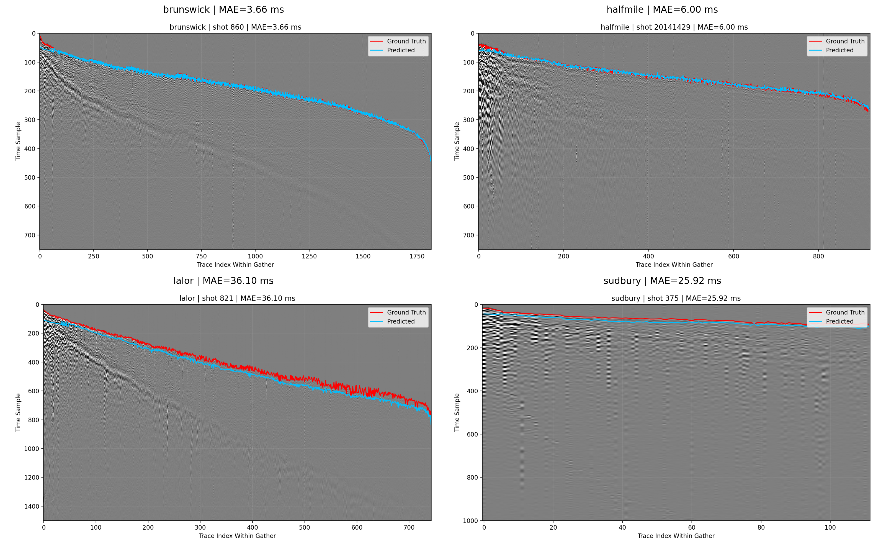

### `presentation_gather_comparison_all_assets_experimentb.png`
- Path: `outputs/evaluation/presentation_gather_comparison_all_assets_experimentb.png`
- Size: `3,245,136` bytes
- Produced by stage/script: `scripts/08_visualize_predictions.py`
- Consumed by: Presentation/reporting only.
- Purpose: visualization artifact (`2x2 multi-asset presentation panel`).
- How to read: 2x2 multi-asset presentation panel.
- Common failure signatures: Missing panels or NaN MAE placeholders indicate absent predictions for some assets/splits.
- Embedded image:
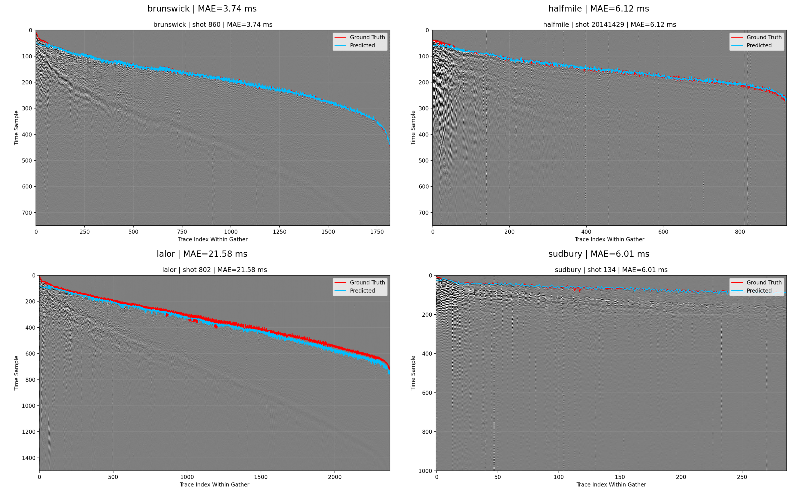

### `roc_curve_test.png`
- Path: `outputs/evaluation/roc_curve_test.png`
- Size: `46,978` bytes
- Produced by stage/script: `scripts/07_evaluate.py`
- Consumed by: Reporting and A/B/baseline comparisons.
- Purpose: visualization artifact (`ROC curve`).
- How to read: ROC curve.
- Common failure signatures: Near-diagonal behavior indicates weak discrimination; sudden steps can indicate thresholding granularity issues.
- Embedded image:
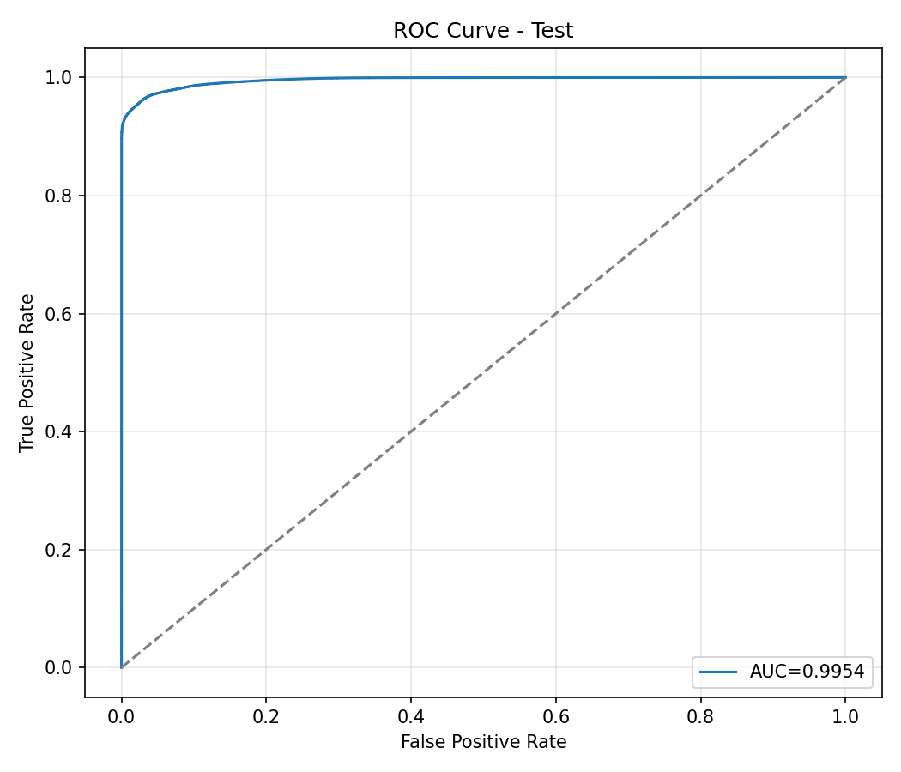

### `roc_curve_test_experimentb.png`
- Path: `outputs/evaluation/roc_curve_test_experimentb.png`
- Size: `49,203` bytes
- Produced by stage/script: `scripts/07_evaluate.py`
- Consumed by: Reporting and A/B/baseline comparisons.
- Purpose: visualization artifact (`ROC curve`).
- How to read: ROC curve.
- Common failure signatures: Near-diagonal behavior indicates weak discrimination; sudden steps can indicate thresholding granularity issues.
- Embedded image:
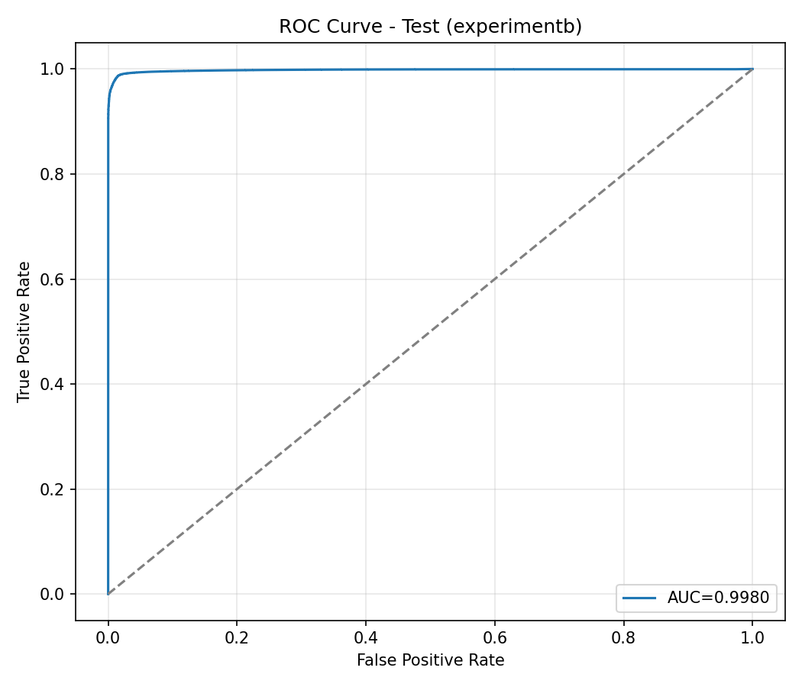

### `roc_curve_test_latest.png`
- Path: `outputs/evaluation/roc_curve_test_latest.png`
- Size: `47,990` bytes
- Produced by stage/script: `scripts/07_evaluate.py`
- Consumed by: Reporting and A/B/baseline comparisons.
- Purpose: visualization artifact (`ROC curve`).
- How to read: ROC curve.
- Common failure signatures: Near-diagonal behavior indicates weak discrimination; sudden steps can indicate thresholding granularity issues.
- Embedded image:
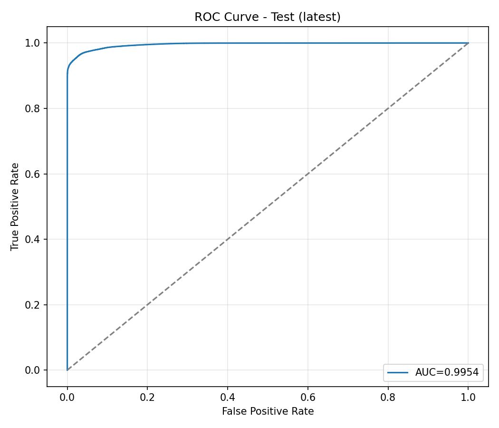

### `roc_curve_train.png`
- Path: `outputs/evaluation/roc_curve_train.png`
- Size: `45,329` bytes
- Produced by stage/script: `scripts/07_evaluate.py`
- Consumed by: Reporting and A/B/baseline comparisons.
- Purpose: visualization artifact (`ROC curve`).
- How to read: ROC curve.
- Common failure signatures: Near-diagonal behavior indicates weak discrimination; sudden steps can indicate thresholding granularity issues.
- Embedded image:
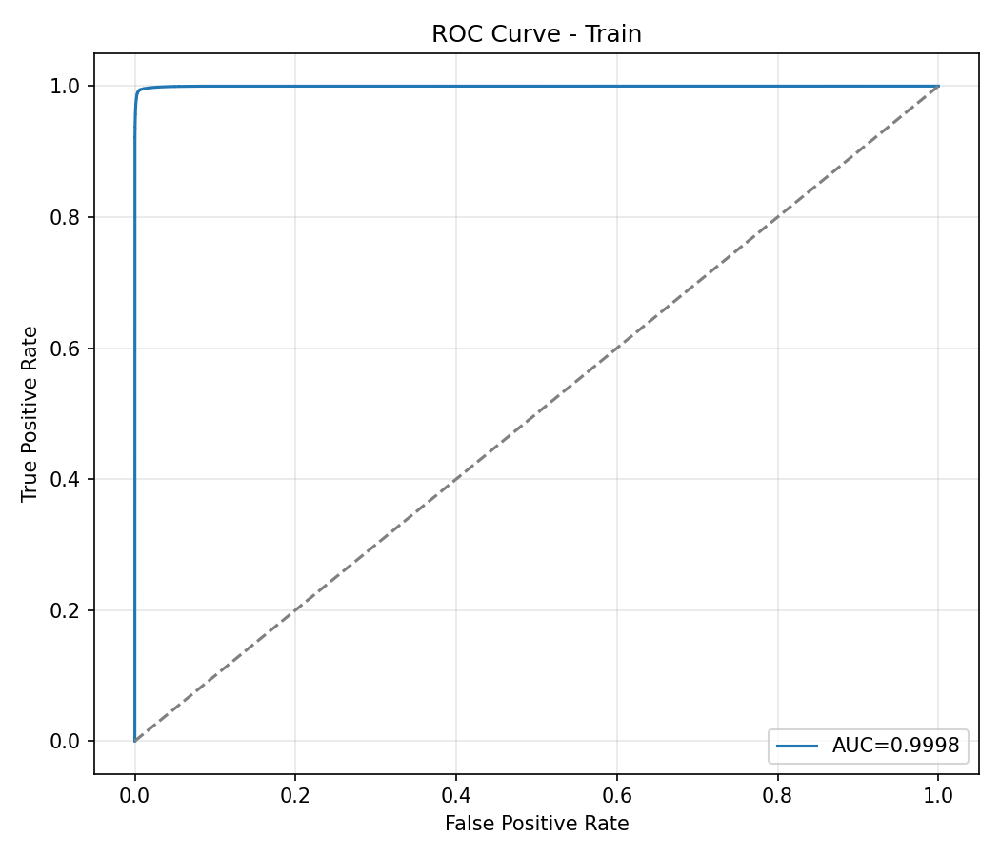

### `roc_curve_train_experimentb.png`
- Path: `outputs/evaluation/roc_curve_train_experimentb.png`
- Size: `47,901` bytes
- Produced by stage/script: `scripts/07_evaluate.py`
- Consumed by: Reporting and A/B/baseline comparisons.
- Purpose: visualization artifact (`ROC curve`).
- How to read: ROC curve.
- Common failure signatures: Near-diagonal behavior indicates weak discrimination; sudden steps can indicate thresholding granularity issues.
- Embedded image:


### `roc_curve_train_latest.png`
- Path: `outputs/evaluation/roc_curve_train_latest.png`
- Size: `46,997` bytes
- Produced by stage/script: `scripts/07_evaluate.py`
- Consumed by: Reporting and A/B/baseline comparisons.
- Purpose: visualization artifact (`ROC curve`).
- How to read: ROC curve.
- Common failure signatures: Near-diagonal behavior indicates weak discrimination; sudden steps can indicate thresholding granularity issues.
- Embedded image:
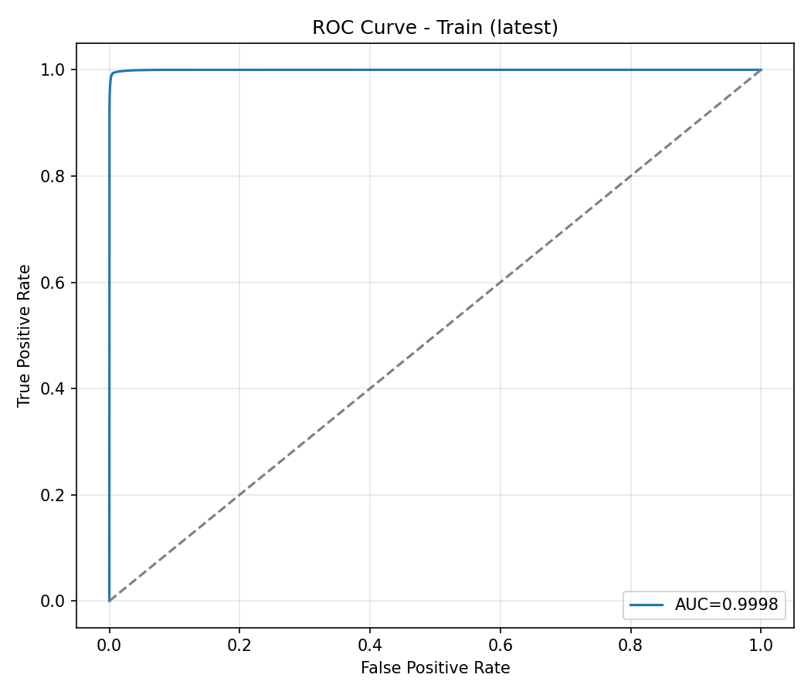

### `stalta_baseline_summary.json`
- Path: `outputs/evaluation/stalta_baseline_summary.json`
- Size: `822` bytes
- Produced by stage/script: `scripts/07_evaluate.py baseline mode`
- Consumed by: Comparison against model-based metrics in docs and decision-making.
- Purpose: structured configuration/summary payload.
- Top-level type: `dict`
- Top-level keys (2): `a, b`
- Key type preview:
```json
{
  "a": "dict",
  "b": "dict"
}
```
- Content preview (truncated):
```json
{
  "a": {
    "threshold_global_ms": 372.0,
    "train_rows": 800000,
    "test_rows": 400000,
    "test_all": {
      "mae_ms": 25.34144,
      "rmse_ms": 59.97988650372723,
      "within_50ms_pct": 94.848,
      "accuracy": 0.9629775,
      "precision": 0.961667755964249,
      "recall": 0.9974000938139966,
      "f1_score": 0.979208055632386,
      "auc_roc": 0.9560172478929132
    }
  },
  "b": {
    "threshold_global_ms": 340.0,
    "train_rows": 800000,
    "test_rows": 400000,
    "test_all": {
      "mae_ms": 30.67627,
      "rmse_ms": 79.78182208373033,
      "within_50ms_pct": 92.69775,
      "accuracy": 0.96202,
      "precision": 0.9662481300321046,
      "recall": 0.9909669189263735,
      "f1_score": 0.978451430613947,
      "auc_roc": 0.9423886623775852
    }
  }
}
```
